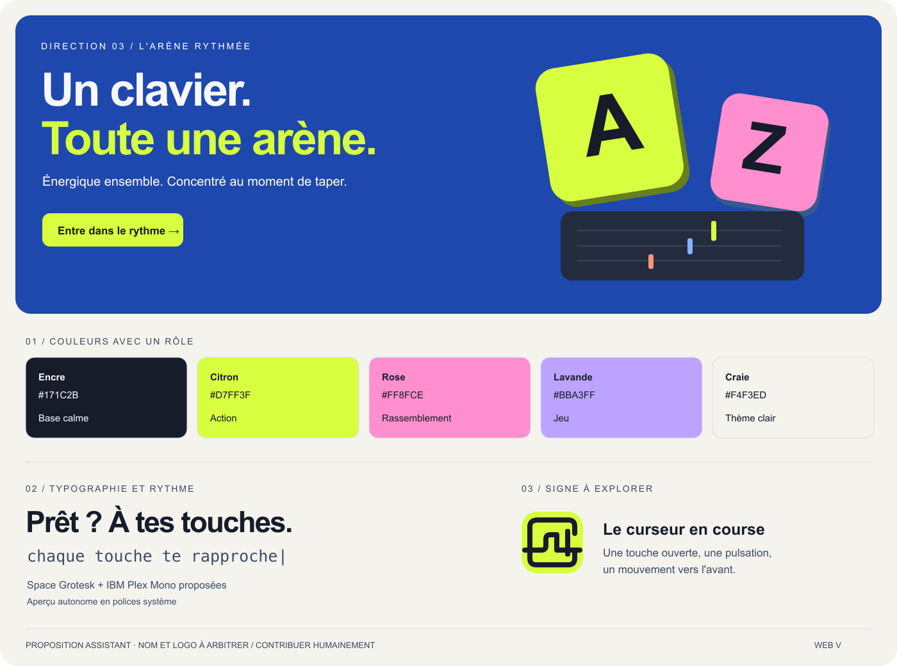

# Typulso

**Auteur : YANN CEDRICK KOUEKAM TELEWOU**

> **Authentification actuelle :** j’ai limité la connexion aux comptes au **pseudonyme et au mot de passe**. Les options **OAuth GitHub/Discord sont prévues pour la suite**; le code préparatoire ne constitue pas une connexion externe livrée. L’accès invité reste distinct de l’authentification d’un compte.

**Un clavier. Toute une arène.**

Je développe **Typulso**, un projet individuel de courses de frappe pour jouer ensemble et progresser. J’ai retenu une direction colorée, vibrante et ludique, avec une identité de clavier/pulsation. Je présente mes choix, les retours qui ont guidé les itérations et le rôle de l’assistance de l’IA dans ma démarche.

[Jouer en production](https://typulso-production.up.railway.app/) · [Dépôt GitHub](https://github.com/Cedrickkouek/typulso) · [CI vérifiée](https://github.com/Cedrickkouek/typulso/actions/runs/37648917231) · Dossier du checkpoint 1

**État vérifié le 7 octobre 2026 :** inscription et connexion locales, PostgreSQL et salon rejoint par code contrôlés sur Railway avec deux sessions HTTP/Socket.IO indépendantes. Les modes classique/arcade, les sons optionnels, les statistiques et la frappe directe sont intégrés au code; les contrôles de parties détaillés restent des preuves locales et de CI. Le dépôt est privé : sa consultation demande les droits GitHub appropriés.



Le projet propose inscription/connexion, salles publiques ou par code, salon partagé, courses classique/arcade, entraînement et statistiques personnelles. Le serveur arbitre les permissions, le départ, la progression et les résultats; PostgreSQL conserve les comptes, sessions et données du jeu.

## Stack

React **19.3.0** dans Next.js **16.3.8** avec App Router et React Compiler, TypeScript strict **6.0.2**, Tailwind CSS **4.3.3**, PostgreSQL **18**, Drizzle et Socket.IO. Le dépôt utilise Bun **1.4.1**; la production cible Node.js **24 LTS**. Les dépendances sont verrouillées dans `bun.lock`. TypeScript 6 est retenu parce que l'analyseur ESLint de cette version ne prend pas encore TypeScript 7 en charge.

## Démarrage local

Avec Bun, Node.js 24 et Docker Desktop démarré :

```bash
bun install --frozen-lockfile
cp .env.example .env.local
docker compose up -d postgres
bun run db:migrate
bun run dev
```

Ouvrir [l'application locale](http://127.0.0.1:3000). Le service de course écoute sur le port 3001. Avec PostgreSQL déjà installé, remplacer `DATABASE_URL` dans `.env.local` et créer une base vide dédiée avant les migrations. Ne pas pointer les tests sur une base de production.

L’authentification actuellement livrée se limite au **pseudonyme et au mot de passe**, sans courriel ni récupération. Les options **OAuth GitHub et Discord sont prévues pour une évolution ultérieure**. Le code préparatoire et les variables de fournisseurs peuvent déjà exister; ils ne font pas partie du périmètre fonctionnel actuel.

## Organisation

```text
app/                 Pages App Router et routes HTTP
components/          Interface React et composants réutilisés
lib/client/          Préférences, session et connexion temps réel
lib/domain/          Règles pures du jeu et génération du contenu
lib/server/          Authentification et opérations PostgreSQL
server/              Service Socket.IO persistant
db/                  Schéma et migrations SQL
types/game.ts        Contrat partagé
tests/               Tests du moteur, du serveur et d'intégration
e2e/                 Parcours navigateur exécutés dans la CI
docs/                Direction artistique, architecture, exigences, ADR
.agents/skills/      Méthode de développement du projet
skills/              Copies portables des skills
```

La structure reprend le projet de cours `cours-next-js` : `app/`, `lib/`, TypeScript et Bun à la racine. PostgreSQL remplace sa base SQLite de démonstration. Le serveur temps réel est un processus distinct.

## Vérifications

```bash
bun run check
# Avec PostgreSQL migré et les deux services lancés :
bun run test:integration
```

GitHub Actions a exécuté avec succès les contrôles, les migrations, l’intégration avec PostgreSQL et les trois scénarios navigateur au [commit applicatif 4d23075](https://github.com/Cedrickkouek/typulso/commit/4d23075557799c02acbb8253bd830409f8ebe446). La [CI consultable](https://github.com/Cedrickkouek/typulso/actions/runs/37648917231) utilise une base isolée; elle ne teste pas le site Railway. Le rapport de vérification distingue ces preuves des contrôles réalisés en production.

## Checkpoint 1 · état du 7 octobre 2026

Les six critères et leurs preuves sont reliés aux documents et au commit applicatif vérifié. L’échéance annoncée était le 5 octobre; ce dossier actualisé ne constitue pas une preuve de remise à cette date. Je distingue mes décisions personnelles des propositions réalisées avec l’IA; mes éventuels croquis originaux restent à ajouter si je souhaite les présenter. Le test de charge à 30 personnes, l’ajout ultérieur d’OAuth et la restauration des sauvegardes ne sont pas déclarés vérifiés.
