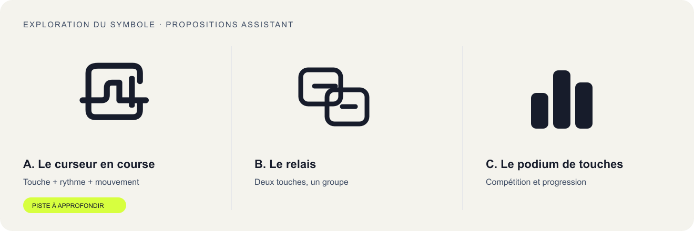

# Direction artistique

> **Dossier de proposition · 1er octobre 2026 · v0.4**  
> Public : 12–17 ans · Produit : courses de frappe · Nom et logo : en exploration

## 1. L'idée qui tient l'ensemble

**Une arène de frappe rythmée : expressive quand le groupe se rassemble, précise quand les doigts jouent.**

Le clavier devient un terrain de jeu. Les curseurs deviennent des concurrents, les touches des repères et les pistes des lignes de progression. La personnalité confirmée par l’utilisateur est **colorée, vibrante, amusante et ludique**. Elle se traduit par des aplats citron, rose et lavande, de grandes lettres, des touches illustrées et un rythme accueillant. Elle doit donner envie de participer sans ridiculiser les débutants ni distraire la personne qui lit et tape.

| Moment | Sensation recherchée | Traduction visuelle |
|---|---|---|
| Rejoindre | « Je peux entrer tout de suite. » | Code très visible, action directe, peu de choix. |
| Attendre | « On est ensemble, ça va partir. » | Pseudonymes, état prêt, touches expressives, rythme collectif. |
| Taper | « Je trouve mon rythme. » | Texte stable, monospace, retour immédiat, périphérie discrète. |
| Terminer | « J'ai progressé, je peux recommencer. » | Podium, record personnel et une piste de progrès concrète. |

Ces choix sont des propositions de conception. Ils n'ont pas encore été testés auprès du public cible.

## 2. Références et transformation

L'inspiration porte sur des principes d'expérience. Notre identité repose sur un **curseur mobile et des touches rythmiques**, avec ses propres formes, couleurs et textes.

| Référence consultée | Ce qu'elle apporte | Application proposée |
|---|---|---|
| [Kahoot](https://kahoot.com/) | Jeu collectif, participation en direct et enthousiasme partagé. | Départ commun, salon vivant, résultats qui donnent envie de rejouer. |
| [Wooclap](https://www.wooclap.com/) | Entrée par code et participation à une session en direct. | Le code est l'accès principal au groupe; les réglages ont une hiérarchie claire. |
| [Monkeytype](https://github.com/monkeytypegame/monkeytype) | Frappe minimaliste, personnalisation et suivi de progression. | Le texte à saisir occupe le centre; les métriques restent secondaires pendant l'effort. |

**Interprétation de design :** ces références nous conduisent à alterner une ambiance collective et une phase de concentration. Cette alternance est notre proposition, pas une caractéristique revendiquée par les trois produits. Sources consultées le 1er octobre 2026; aucun actif de marque n'est repris.

La [recherche initiale de 51 sites supplémentaires](12-recherche-inspiration.md), lots A–C, explore la personnalité **colorée, vibrante, amusante et ludique** demandée ensuite par l'utilisateur. Une [deuxième exploration](13-recherche-composants.md), lots D–F, ajoute **51 nouvelles références**, soit **102 sites distincts cumulés**, hors des trois inspirations de départ. Elle approfondit les applications, jeux et systèmes de composants. Les registres distinguent contenu extrait, rendu réellement observé et transpositions proposées.

La v0.4 conserve cette personnalité, les accents citron/rose/lavande et les contrastes renforcés en v0.3. Elle affine la composition des contrôles et des surfaces : boutons cohérents, invitation lisible, états prêts explicites, métriques séparées, saisie stable et résultats hiérarchisés. La [spécification des composants](14-composants-interface.md) décrit les contrats à réaliser dans la future application React / Next.js / Tailwind ; la planche reste un aperçu local.

## 3. Recherche du nom

Le nom doit se dire facilement dans une classe, se retenir après une course, fonctionner en français et en anglais et ouvrir une identité visuelle. Les pistes ci-dessous ont été proposées par l'assistant. L'utilisateur a demandé une nouvelle exploration après Typulso et Frappiq; aucun nom n'est choisi.

### Pistes élargies

| Nom | Construction / intention | Force | Point à vérifier |
|---|---|---|---|
| **Rytapo** | Rythme + tap | Joueur, sonore, six lettres; bon lien avec une identité rythmique. | Orthographe après une première écoute; prononciation « ri-ta-po ». |
| **Typulso** | Type + pulsation | Énergie et précision; bon territoire de marque. | Compréhension de « type » et prononciation « ti-pul-so ». |
| **Frappiq** | Frappe + déclic | Direct en français, son vif. | Compréhension anglophone et terminaison « iq ». |
| **Keymigo** | Key + amigo | Compétition entre amis, ton accueillant. | Mot anglais « key »; usages existants du pseudonyme. |
| **Clavibe** | Clavier + vibe | Ambiance de groupe, nom facile à prononcer en français. | Usage existant par un créateur. |
| **Tapory** | Tap + sonorité de récit | Souple, permet un univers de personnages. | Lien avec la course moins évident; recherche à faire. |
| **Clavora** | Clavier + sonorité ouverte | Plus posé, crédible pour un outil durable. | Moins joueur; recherche à faire. |
| **Touchego** | Touche + go | Action immédiate, sens facile à comprendre. | Plus descriptif; prononciation anglophone à tester. |
| **Rafrap** | Rafale + frappe | Vitesse, son percussif. | Acronyme déjà rencontré dans un autre domaine. |
| **Claqo** | Claquement des touches | Très court, oral et visuel. | Organisme québécois portant déjà ce nom. |
| **Clavolt** | Clavier + volt | Énergie électrique. | Usage commercial déjà rencontré. |
| **Typuls** | Type + pulse | Compact. | Terme technique déjà rencontré et lecture moins fluide. |

**Mes favoris pour la prochaine discussion : Rytapo, Typulso et Frappiq.** Rytapo ouvre la piste la plus joueuse; Typulso exprime le mieux le rythme; Frappiq communique le plus vite l'activité en français. Ce classement est un jugement créatif, pas un résultat de test.

### Premier repérage des usages

Recherches ponctuelles le 1er octobre 2026 : `"Clavolt"`, `"Typuls"`, `"Frappiq"`, `"Typulso"`, `"Clavibe"`, `"Rytapo"`, `"Claqo"`, `"Rafrap"`, `"Keymigo"`, avec quelques variantes « typing » et « frappe ».

- **Claqo :** usage confirmé par [le Comité logement d'aide de Québec Ouest](https://www.claqo.org/histoire-et-mission/). Piste écartée de la sélection recommandée.
- **Clavibe :** usage confirmé par [un créateur sur Newgrounds](https://www.newgrounds.com/art/view/clavibe/ready-set-go). À garder comme référence de sonorité plutôt que favori.
- **Keymigo :** [pseudonyme Steam existant](https://steamcommunity.com/profiles/76561198433367511). L'usage ne suffit pas à conclure sur la disponibilité d'une marque.
- **Clavolt :** usage cité dans [un profil professionnel public](https://ng.linkedin.com/in/akinsunmola-james-12aa96180). À approfondir avant de retenir ce nom.
- **Rafrap :** acronyme rencontré dans [une publication de l'Institut royal supérieur de défense](https://www.defence-institute.be/wp-content/uploads/2020/04/ss-142.pdf). Association peu souhaitable pour ce produit.
- **Rytapo, Typulso, Frappiq :** aucun produit de frappe évident identifié dans cette recherche limitée. Cela ne démontre ni unicité, ni disponibilité d'un domaine ou d'une marque. Les autres pistes restent à rechercher.

**Étape de choix humain :** chaque membre de l'équipe ajoute ses idées, prononce les finalistes, justifie son choix et peut modifier le nom. Le journal doit conserver l'auteur réel de chaque contribution.

## 4. Exploration du logo

| Piste | Idée | Intérêt | Limite |
|---|---|---|---|
| **A — Le curseur en course** | Une touche ouverte traversée par un tracé de progression; le curseur termine le mouvement. | Relie clavier, rythme et déplacement dans un signe compact. | Vérifier la reconnaissance à 16 et 24 px. |
| **B — Le relais** | Deux touches décalées qui se répondent. | Souligne la dimension collective et le dépassement. | Plus proche d'un pictogramme de connexion. |
| **C — Le podium de touches** | Trois touches de hauteurs différentes. | Lecture immédiate de la compétition et des résultats. | Peut évoquer un graphique générique. |

**Piste recommandée pour exploration : A.** Le symbole est dessiné avec une géométrie SVG modifiable. L'aperçu emploie Typulso comme mot de travail pour comparer les proportions. Le symbole peut être associé aux autres noms depuis la planche interactive; le logo définitif sera adapté au nom retenu.

Actifs de proposition : [symbole couleur](assets/logo-symbol.svg), [symbole monochrome](assets/logo-mono.svg), [signature sur fond clair](assets/logo-light.svg), [signature sur fond sombre](assets/logo-dark.svg).

**Provenance et exigence humaine.** La transcription demande que le nom et le logo viennent de l'équipe. Les esquisses présentes sont des propositions de l'assistant; elles ne constituent pas la preuve d'une conception humaine. Le choix seul ne transforme pas cette provenance. Pour satisfaire cette exigence, l'équipe doit réaliser et documenter ses propres idées et transformations, puis vérifier l'interprétation attendue auprès du client si nécessaire. Aucune validation ni croquis humain n'est inventé dans ce dossier.

### Règles prévues pour une version retenue

- Symbole autonome pour favicon et avatar; signature complète dans l'accueil et les résultats.
- Zone de protection : un quart de la largeur du symbole autour de la signature.
- Version monochrome obligatoire; aucun effet indispensable à la reconnaissance.
- Petit format : contour simplifié, pas de slogan; test de lecture à 16/24/32 px.
- Mot-symbole provisoire typographique : vectoriser et ajuster les lettres après le choix du nom; vérifier les conditions de la police.

## 5. Moodboard : « touches en mouvement »

La [planche originale](assets/moodboard.png) rassemble nos propres motifs plutôt que des captures de concurrents. Elle traduit les références et les slides en éléments directement utilisables.

| Élément de la planche | Sens | Usage |
|---|---|---|
| Touches inclinées | L'élan de la frappe | Accueil et salon, hors de la zone de lecture. |
| Curseur vertical | L'endroit où l'action se passe | Saisie, symbole et repère du joueur. |
| Pistes horizontales | Progression partagée | Course et chargements courts. |
| Citron + rose + lavande | Énergie, groupe et jeu | Bouton principal citron; bandeaux de salon rose et lavande avec texte encre. |
| Encre + craie | Lisibilité | Texte et surfaces de frappe stables dans les deux thèmes. |
| Bleu et corail | Contraste entre concurrents | Repères identifiés aussi par pseudonyme et forme. |
| Typographie ample / monospace | Collectif / précision | Titres expressifs; frappe régulière. |

## 6. Palette par rôle

Le thème clair accueille le groupe avec des surfaces expressives; le thème sombre conserve les mêmes accents. Deux thèmes complets sont prévus. Le sombre n'est pas obligatoire pour jouer; chaque thème doit garder la même hiérarchie et le même contenu.

| Rôle | Sombre | Clair | Usage |
|---|---|---|---|
| Fond | `#171C2B` | `#F4F3ED` | Base de lecture. |
| Surface | `#232B3E` | `#FFFFFF` | Salon, menus, panneaux. |
| Texte principal | `#F6F7FB` | `#171C2B` | Titres et contenu. |
| Texte secondaire | `#C1CADE` | `#3E4C64` | Instructions et métadonnées. |
| Action citron | `#D7FF3F` | `#D7FF3F` | Bouton principal avec texte `#171C2B`. |
| Rose expressif | `#FF8FCE` | `#FF8FCE` | Salon, touches illustrées et deuxième place; texte encre. |
| Lavande expressive | `#BBA3FF` | `#BBA3FF` | Bandeau collectif, troisième place, progression; texte encre. |
| Bleu fonctionnel | `#A2C6FF` | `#1E48AD` | Focus, liens, repère secondaire. |
| Corail fonctionnel | `#FFAB91` | `#9A261D` | Erreur avec soulignement et message. |
| Bordure de contrôle | `#7E8FAE` | `#66748B` | Champs et contrôles qui ont besoin d'un contour identifiable. |
| Piste de course | `#7E8FAE` | `#66748B` | Ligne de progression visible à au moins 3:1. |
| Progression du joueur | `#D7FF3F` | `#425600` | Citron sur sombre; vert profond sur clair, avec badge citron et texte encre. |
| Texte à saisir | `#C7D1E4` | `#3E4C64` | Lecture soutenue; texte correct et erreur distincts. |
| Bleu de marque | `#1E48AD` | `#1E48AD` | Bandeau du studio avec texte blanc. |
| Bordure décorative | `#394258` | `#D9DEE7` | Séparation sans information essentielle. |

Les couleurs des concurrents complètent la palette sans multiplier les couleurs d'action. Toute position comprend un rang et un pseudonyme; toute erreur a un signe ou une explication. Le citron sur fond blanc sert d'aplat avec texte sombre, pas de texte clair ni de contour essentiel.

### Contrastes mesurés sur les aplats

Les rapports précis sont consignés dans [le rapport de vérification](11-verification.md). La révision v0.3 renforce les petits textes et vise au moins **7:1** pour les paires de texte fonctionnel; les repères essentiels et les focus au moins **3:1** contre leur fond immédiat. Le [critère W3C de contraste renforcé](https://www.w3.org/WAI/WCAG22/Understanding/contrast-enhanced.html) précise ce seuil pour le texte courant. Le [contraste non textuel](https://www.w3.org/WAI/WCAG22/Understanding/non-text-contrast.html) concerne notamment les repères essentiels. Ces mesures ne remplacent pas une vérification de l'application finale (états, opacité, superposition et tailles réelles).

La v0.3 donne aussi une plaque craie au symbole monochrome, emploie l’encre sur la carte lavande, fixe la couleur des placeholders et renforce les contours des champs. Les petits libellés de l’aperçu gagnent une taille de 12–13 px et un poids plus net. Les accents expressifs conservent leur rôle de surface et d’illustration.

## 7. Typographies

| Rôle | Police proposée | Comportement |
|---|---|---|
| Identité, titres et interface | **Space Grotesk**, 400/500/700 | Titres denses mais ouverts; boutons et libellés lisibles. |
| Texte de course et métriques | **IBM Plex Mono**, 400/500 | Largeur stable, chiffres alignés; ligatures désactivées dans l'exercice. |

Les dépôts officiels décrivent [Space Grotesk](https://github.com/floriankarsten/space-grotesk) et [IBM Plex](https://github.com/IBM/plex). Les licences accompagnent les fichiers de polices lors de leur intégration. Vérifier notamment `é è ê ë à â ç ù œ`, les majuscules, les chiffres et la distinction `I l 1` dans le corpus réel.

Repères appliqués dans la planche v0.4 ; l’intégration des polices choisies dans la future application reste à faire.

| Niveau | Bureau | Petit écran | Interligne |
|---|---|---|---|
| Titre de campagne | 56 px | 39 px | 1,02 |
| Titre de panneau | 22 px | 20 px | 1,2 |
| Titre de section | 14 px | 14 px | 1,5 |
| Texte de course | 27 px | 21 px | 1,85 |
| Corps / champ | 16 px | 16 px | 1,5 |
| Métadonnées | 12–13 px | 11–13 px selon le contexte | 1,5–1,6 |

L'aperçu local utilise Arial et Menlo comme polices de repli pour rester autonome. La sélection typographique reste à intégrer et à vérifier dans Next.js.

## 8. Formes, grille et illustration

- Échelle d'espacement : **4, 8, 12, 16, 24, 32, 48, 64 px**.
- Rayons de référence : **12 px** pour les contrôles, **24 px** pour les panneaux et dialogues, **16 px** pour les cartes de joueurs ; capsule pour état/rang. L’aperçu adapte les panneaux à 20 px sur petit écran. Les touches illustrées gardent une géométrie expressive distincte.
- Contrôles du futur produit : hauteur minimale **44 px**, iconographie régulière, focus visible et dimensions stables pendant une requête.
- Largeur maximale de la planche : **1232 px**, avec marges adaptées au bureau et au mobile ; le texte de course utilise l’espace disponible sans colonne étroite.
- Grille : 12 colonnes au bureau; une colonne sur mobile; pas de texte placé dans des blocs trop étroits.
- Illustration : touches, curseurs et pistes dessinés en vectoriel; pas de photographie de stock nécessaire pour expliquer le jeu.
- Rotation et profondeur légère autorisées dans les illustrations; contenu à saisir, champs et chiffres restent droits et fixes.
- L'ombre sert à différencier une touche ou un objet expressif; les panneaux de lecture se distinguent d'abord par leur surface et leur espacement.

## 9. Ton rédactionnel et mouvement

**Tutoiement, phrases courtes, encouragement concret.** On célèbre une performance et une amélioration sans attribuer une valeur à la personne.

| Situation | Français | Anglais |
|---|---|---|
| Entrée | Entre dans le rythme. | Find your rhythm. |
| Code | Rejoindre avec un code | Join with a code |
| Départ | Prêt ? À tes touches. | Ready? Keys set. |
| Erreur | Corrige ce caractère pour continuer. | Correct this character to continue. |
| Réseau | Reconnexion… Ta place est conservée. | Reconnecting… Your place is saved. |
| Progrès | 3 erreurs de moins. Bien joué. | 3 fewer errors. Nice work. |
| Fin | Une autre course ? | One more race? |

La planche v0.4 conserve les deux touches légèrement flottantes du salon, introduites en v0.3, avec des cycles de 4 et 4,6 secondes et un déplacement de 5–6 px. Elles s’arrêtent dans la vue Course et disparaissent sur petit écran ; la préférence de mouvement réduit coupe les animations. Les boutons donnent un retour de pression de 160 ms. Le texte de frappe garde une graisse et une géométrie constantes, y compris en cas d’erreur. Ces choix restent à tester avec le public.

Dans le produit, les animations apportent un sens : état prêt (120–180 ms), départ commun, déplacement interpolé des curseurs et célébration courte après la course. Pendant la frappe, le texte ne bouge pas. Le son est facultatif et soumis aux préférences du navigateur. Avec mouvement réduit, l'état change immédiatement ou par une transition discrète; aucune information ne dépend d'une animation.

## 10. Arbitrages de jeu qui influencent le design

La réponse client autorise des personnages et capacités, mais garde le besoin de rattrapage. Le système d'énergie n'est pas encore choisi. **Proposition à tester :** énergie gagnée par frappes correctes, aide bornée aux personnes en retard, activation explicite et indication visible; statistiques pédagogiques séparées du résultat arcade.

La v0.4 explorait une protection brève et un allègement de fin de texte. La v0.5 illustre **Tempo** (soutien temporaire à la progression de jeu) et **Relais** (atténuation ponctuelle d’une pénalité), avec mesures brutes conservées. Ces effets restent des propositions à équilibrer. **Au moins deux bonus sont essentiels dans le cahier final** : leur inclusion n’est pas facultative; leurs formules et leur attribution restent à décider. Le classique garde un exercice comparable; l’arcade annonce ses règles au départ.

## 11. Ce que nous décidons ensuite ensemble

1. Choisir le territoire du nom et produire les contributions humaines attendues.
2. Choisir ou redessiner le symbole; tester sa lecture en petit format.
3. Valider la structure salon → course → résultats avec quelques utilisateurs.
4. Affiner les durées, le classement et les capacités; conserver leur statut de proposition jusqu'à arbitrage.
5. Intégrer cette direction dans le projet Next.js après ce cadrage.

L’[atelier de marque v0.4](preview/atelier.html) permet de comparer les noms, les thèmes, le wireframe, le salon, la course et les résultats. Ses données sont simulées. Le dialogue d’invitation, les retours de copie, les états prêts, le tableau de bord, les pistes et le mode concentration rendent les propositions plus concrètes ; les [composants futurs](14-composants-interface.md) décrivent aussi leurs états chargement, indisponible, vide, erreur et hors ligne.

## 12. Historique et provenance des révisions

| Révision | Évolution | Portée |
|---|---|---|
| **v0.3** | Personnalité colorée et ludique, accents citron/rose/lavande, contrastes renforcés, première revue visuelle du corpus A–C | Propositions de l’assistant, mesures et observations documentées ; aucune identité finale ni contribution humaine inventée |
| **v0.4** | 51 nouvelles références D–F ; surfaces plus calmes, contrôles cohérents, invitation et états affinés, frappe sans déplacement, résultats hiérarchisés | Évolution de la planche locale et spécification de la future application ; nom, logo et validation auprès du public restent ouverts |
| **v0.5** | Même personnalité et même palette, déployées dans 20 écrans et 74 combinaisons d’états; contenus, création, accès, profil et heatmaps complétés depuis le PDF du 2 octobre | Conception navigable locale; aucun nouveau nom validé ni nouveau service réel revendiqué |

Les [sources et décisions](09-sources-et-decisions.md), les deux registres de recherche et le [rapport de vérification](11-verification.md) conservent la distinction entre source, interprétation, aperçu réalisé et comportement futur à tester.

## 13. Extension à chaque page

Le [site de conception v0.5](preview/index.html) conserve le contraste et les formes retenus. Les couleurs vives situent les moments de jeu; les champs, textes à reproduire et tableaux gardent des surfaces calmes. Les [spécifications des pages](16-design-pages-et-etats.md) définissent la hiérarchie avant les détails et réutilisent les [composants](14-composants-interface.md). Le [rapport de vérification v0.5](17-verification-pages.md) contient les contrôles et captures. Le skill général et sa copie du projet restent conservés à leurs emplacements.
