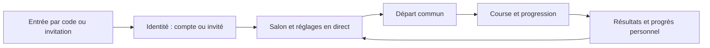

# Expérience utilisateur

**Auteur : YANN CEDRICK KOUEKAM TELEWOU**

> **Authentification actuelle :** j’ai limité la connexion aux comptes au **pseudonyme et au mot de passe**. Les options **OAuth GitHub/Discord sont prévues pour la suite**; le code préparatoire ne constitue pas une connexion externe livrée. L’accès invité reste distinct de l’authentification d’un compte.

> **Portée :** je conserve ici mes recherches, propositions ou observations à leur date. Ces éléments expliquent ma démarche de conception; une maquette ou un test prévu ne constitue pas une preuve de fonctionnement en production.

> **Structure proposée · v0.5 · 2 octobre 2026**  
> Fonctionnalités centrales d'abord : entrer dans une salle, comprendre le départ, taper et lire son progrès.

## Parcours principal



Un compte est nécessaire pour créer une salle. L'invité peut rejoindre. Si le client souhaite permettre le transfert de l'hôte à un invité déjà présent, ce droit temporaire ne devient pas une permission de créer d'autres salles. Voir les machines à états.

Le plan complet des pages et le design de chaque page prolongent ce parcours en 17 familles et 20 écrans de maquette, avec leurs permissions, états et contenus. L’aperçu v0.5 les rend navigables; le rapport de vérification distingue les interactions locales des comportements futurs du serveur.

## 1. Structure monochrome de la course

Ce wireframe précède les détails de style. La hiérarchie se lit dans cet ordre : **texte à saisir → emplacement courant → temps et état → progression des autres**.

```text
┌──────────────────────────────────────────────────────────────┐
│ Salle / état réseau                   Temps       Quitter    │
├──────────────────────────────────────────────────────────────┤
│ Langue · longueur · règle d'erreur · mode                     │
│                                                              │
│       Texte à reproduire, stable et largement espacé         │
│       Déjà tapé | caractère courant | texte restant          │
│                                                              │
│       Instruction / champ de saisie accessible               │
│                                                              │
├──────────────────────────────────────────────────────────────┤
│ Ma progression          Position       Vitesse / précision   │
│ Pistes des concurrents et accès au classement complet        │
└──────────────────────────────────────────────────────────────┘
```

Sur petit écran, le texte occupe toute la largeur et le classement vient ensuite. La cible responsive couvre l'affichage, le salon et le mode spectateur. L'ergonomie de participation au clavier virtuel reste à tester; aucune impossibilité technique n'est supposée.

## 2. Entrée et authentification

L'entrée propose d'abord un champ de code et une action explicite. Une invitation privée ouvre son propre parcours sans demander un code. Les liens et codes incorrects affichent un message près du champ. Un lien expiré ou consommé donne une issue claire : demander une nouvelle invitation à l'hôte, sans consommer à nouveau un jeton.

Dans la version actuelle, la connexion au compte utilise le pseudonyme et le mot de passe. Discord et GitHub correspondent aux options OAuth prévues pour la suite; leur mise en avant appartient à cette évolution. « Continuer en invité » indique les capacités et la durée de conservation de la session. Pour créer une salle, un invité est conduit vers la connexion avant de saisir toute une configuration.

L'action « Course rapide » rejoint une salle publique en attente. Si aucune n'est disponible, un compte peut créer une salle; un invité reçoit une invitation à se connecter. Cette restriction résout le conflit entre création automatique et interdiction de création par les invités.

## 3. Salon

| Zone | Contenu | Priorité |
|---|---|---|
| En-tête du salon | Nom, accès, état et hôte actuel | Situer l'activité. |
| Invitation | Code semi-public ou liens privés selon le mode | Permettre de rejoindre. |
| Groupe | Pseudonyme, état prêt, participant/spectateur, bot clairement identifié | Montrer qui est présent. |
| Réglages | Langue, contenu, longueur, temps, erreurs, mode | Comprendre l'exercice. |
| Action | « Je suis prêt » pour le membre; « Lancer » pour l'hôte | Préparer le départ. |

Les changements de réglages sont visibles immédiatement; seul l'hôte les modifie. La visibilité des boutons reflète les permissions du serveur. Le code QR est un raccourci facultatif pour le semi-public. Le privé conserve le lien individuel à usage unique comme seul mécanisme d'entrée.

Une courte interruption affiche « Reconnexion… » et conserve la place. Le départ volontaire de l'hôte propose de désigner un successeur; à défaut, le plus ancien participant éligible devient hôte. Une notification annonce le transfert et rend les commandes visibles à la bonne personne.

## 4. Course

Le compte à rebours utilise une heure de départ serveur commune. Le texte est normalisé et figé avant le départ. Le champ de frappe accepte les accents et les méthodes de saisie compatibles; `compositionstart`/`compositionend`, collage, correction et clavier doivent être évalués sur des navigateurs réels.

Le texte affiche trois états : déjà saisi, courant et restant. Une faute se signale aussi par un soulignement ou un marqueur. En mode bloquant, l'instruction précise le caractère à corriger. En mode non bloquant, les erreurs sont comptées et la pénalité de classement annoncée avant la course.

### Lisibilité avec une classe

Avec environ 30 personnes, l'écran principal montre **les trois premiers, le joueur et ses voisins**, sans doublons, puis un accès au classement complet. Le mode spectateur peut présenter tout le groupe. L'ordre du classement complet n'est pas continuellement déplacé sous un pointeur ou un focus clavier; l'évolution visuelle des pistes demeure fluide.

La course ne remplit pas l'écran de messages, de sons ou de statistiques. Le serveur calcule le résultat; l'aperçu local ne simule pas les garanties du futur moteur.

## 5. Résultats

Le podium présente les trois premiers selon la règle annoncée. Le panneau personnel suit immédiatement : vitesse, précision, erreurs, évolution comparable et une touche à travailler. Une heatmap inclut une légende et un tableau accessible; elle ne repose pas uniquement sur le rouge et le vert.

Un débutant peut recevoir un retour utile sans victoire : « 3 erreurs de moins » ou « Meilleure précision ». Ces messages nécessitent des données comparables réelles; aucune amélioration n'est inventée. L'invité conserve les statistiques de sa session; le compte peut accéder à son historique.

L'hôte peut lancer une revanche ou fermer la salle. Les autres membres attendent la décision ou quittent volontairement.

## 6. Pages prévues

| Page / route indicative | Fonction | Échéance |
|---|---|---|
| `/[locale]` | Code, invitation publique et accès aux comptes | CP1 |
| `/[locale]/connexion` | Première authentification; autres accès progressifs | CP1 / final |
| `/[locale]/salles/nouvelle` | Création avec contrôle de permissions | CP1 |
| `/[locale]/salles/[id]` | Salon synchronisé puis course/résultats selon état | Salon CP1; course finale |
| `/[locale]/invitation/[token]` | Admission privée, token masqué des journaux | Final |
| `/[locale]/entrainement` | Exercice avec bots | Final |
| `/[locale]/profil` | Historique et progression personnelle | Final |
| `/[locale]/preferences` | Langue, thème, son, mouvement | Bases CP1 |

Ces routes Next.js sont un plan; elles ne sont pas encore implémentées. Les chemins `#...` de l’aperçu HTML servent uniquement à naviguer dans les maquettes. Le document 15 contient l’inventaire complet des écrans supplémentaires, dont inscription, invité, historique et heatmap globale souhaitable. Le nom public de la plateforme reste indépendant des chemins techniques.

## 7. États à concevoir et vérifier

| État | Retour attendu | Issue |
|---|---|---|
| Code inconnu | « Ce code ne correspond à aucune salle active. » | Corriger le champ. |
| Invitation consommée | « Cette invitation a déjà été utilisée. » | Obtenir un nouveau lien. |
| Salle vide | Place prête et réglages lisibles | Inviter, ajouter un bot selon échéance. |
| Pas assez de concurrents | Explication près du départ | Attendre ou ajouter un bot. |
| Arrivée tardive | « La course est en cours. Tu peux la regarder. » | Spectateur jusqu'à la suivante. |
| Déconnexion courte | Place conservée, dernier état confirmé visible | Reconnexion et snapshot. |
| Hôte remplacé | Nom du nouvel hôte et commandes mises à jour | Continuer sans interrompre la frappe. |
| Course interrompue côté serveur | Statut annulé, aucune victoire attribuée | Retour au salon. |
| Aucun historique | Invitation à faire une première course | Éviter les chiffres fictifs. |

## 8. Critères de validation UX

- Faire suivre rejoindre → salon → départ → résultats à un petit groupe représentatif; relever les hésitations et les actions non comprises.
- Objectif exploratoire : rejoindre avec un code en moins de 20 secondes après arrivée sur l'écran, sans explication orale. Ce seuil n'est pas une performance mesurée.
- Tester les deux langues, les deux thèmes, le zoom 200 %, le clavier, le focus et le mouvement réduit.
- Vérifier les messages d'erreur et la reconnexion avec deux navigateurs distincts.
- Vérifier la course avec 30 entrées simulées puis une séance humaine; séparer capacité technique et lisibilité réelle.
- Justifier mon choix du nom et la provenance du logo avant de présenter une création originale personnelle.

L'aperçu sert à discuter cette structure; les interactions y sont locales et les personnes affichées fictives.
