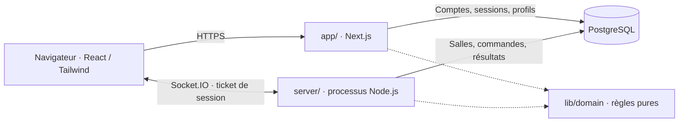

# Architecture du projet

> **Implémentation actuelle · actualisée le 7 octobre 2026 · version applicative vérifiée 4d23075.**

[← Documentation](README.md) · [Modèle](06-modele-donnees.md) · [États](07-machines-etats.md) · [ADR temps réel](adr/0001-temps-reel.md) · [Preuves CP1](08-plan-checkpoint.md)

## Deux processus et une base commune

Typulso utilise React dans Next.js App Router, TypeScript strict, Tailwind, Bun et PostgreSQL. Le site et le serveur Socket.IO sont deux processus Node.js persistants déployés sur Railway; ils partagent PostgreSQL et l’origine autorisée `APP_URL`. La structure à la racine remplace le monorepo proposé le 1er octobre, selon l’[ADR 0002](adr/0002-structure-app-router.md).

| Répertoire réel | Responsabilité | Frontière |
|---|---|---|
| `app/` | Pages/layouts App Router et routes HTTP : identité, tickets, salles publiques, profils et résultats. | Données de session et accès runtime isolés sous Suspense; pas de cache partagé des permissions. |
| `components/` | Interface, frappe native, clavier statistique, salon, pistes, résultats et préférences. | Présentation et interactions; aucune autorité sur le score ou le rôle d’hôte. |
| `lib/client/` | Session, préférences, sons et connexion temps réel. | Aucun accès à PostgreSQL ou secret serveur. |
| `lib/domain/` | Frappe, génération de textes, classement, bots et capacités arcade. | Fonctions testables, indépendantes du réseau; temps transmis explicitement. |
| `lib/server/` | Authentification, OAuth, limites de débit, permissions et transactions des salles. | Identité issue de la session, jamais d’un pseudonyme transmis librement. |
| `server/index.ts` | Socket.IO, tickets, connexions, commandes, diffusion et progression de l’horloge. | Processus persistant distinct du serveur web. |
| `db/` et `scripts/migrate.ts` | Schéma Drizzle, accès PostgreSQL et migrations SQL suivies. | Serveur uniquement; migrations exécutées avant l’usage de la base. |
| `types/game.ts` | Contrat partagé des commandes, états publics, résultats et profil. | Changement à répercuter sur tous les consommateurs. |
| `tests/`, `e2e/` | Domaine, PostgreSQL, réseau et parcours navigateur. | Données isolées des utilisateurs de production. |

## Authentification et admission

Un compte local associe pseudonyme et mot de passe haché; GitHub/Discord disposent de routes OAuth, opérationnelles seulement si les fournisseurs sont configurés. Un invité possède un acteur et une session, sans compte durable. Une session web émet un ticket temps réel à usage unique; Socket.IO le consomme pour retrouver l’acteur. Compte, session, acteur et hôte de salle sont donc distincts.

L’invité peut rejoindre une salle mais ne peut pas en créer. Le serveur applique à chaque commande l’origine, la session, la structure, la limite de débit, l’admission, l’état et les permissions. Les routes web gèrent comptes et consultation; le service temps réel arbitre création, admission et course. Voir [authentification](../lib/server/auth.ts), [tickets et sessions](../lib/server/auth.ts) et [salles](../lib/server/rooms.ts).

## Commandes, persistance et synchronisation

Une commande entre par Socket.IO et reçoit un acquittement. Sa transaction verrouille la salle, vérifie ses gardes, modifie l’état, écrit le reçu de dédoublonnage puis valide. La diffusion publie un **instantané complet filtré pour son destinataire** via `room:state`. Les données internes et la saisie privée des autres restent côté serveur. L’[ADR](adr/0001-temps-reel.md) décrit le contrat exact et l’exception des invitations.

PostgreSQL stocke l’état courant en `rooms.state`, les réglages de course et les résultats en JSONB, ainsi que les identités, membres et reçus relationnels. `room_events` conserve des projections versionnées; ce journal n’est pas une file de retransmission réseau garantie. Le ticker du serveur travaille toutes les **250 ms**; les animations interpolent une progression reconnue, sans créer de score.

## Course et sensations

Le serveur choisit le texte, le départ commun, la fin et le classement. Les entrées contiennent l’identifiant de course et une séquence; une frappe tardive ne rallonge pas une manche expirée. Le navigateur affiche la saisie immédiate puis se réconcilie avec l’état reconnu. Les repères des autres joueurs indiquent leur progression; ils ne diffusent pas leurs lettres privées.

Classique conserve les mesures réelles de frappe; arcade ajoute Pulsation, Bouclier et Virgule piégée selon les règles serveur. Les sons, le mouvement réduit et le volume sont des préférences. La [recherche sensations](22-sensations-et-competition.md) sépare les éléments intégrés des propositions encore ouvertes.

## Déconnexion et redémarrage

Une coupure client dispose de 60 secondes de grâce. La reprise recharge un état autorisé; les frappes classées hors ligne sont suspendues. Un départ volontaire déclenche immédiatement la succession de l’hôte. Les critères de succession et les phases figurent dans les [machines à états](07-machines-etats.md).

Au redémarrage du service, les courses en compte à rebours ou en cours sont interrompues; aucune victoire n’est inventée. Les données déjà validées et les salons sont conservés. Une reprise complète de course ou plusieurs instances Socket.IO nécessiteraient une évolution documentée et vérifiée; aucun cluster n’est revendiqué.

## Preuves et limites

Le [dossier CP1](08-plan-checkpoint.md) relie CI distante, tests locaux et recette Railway de salon à deux sessions. Le [guide](19-deploiement.md) précise les deux images et les migrations. La limite de 30 membres est configurée; **la capacité et la latence à 30 personnes ne sont pas mesurées**. Les objectifs de latence historiques ne sont pas des résultats acquis. La restauration PostgreSQL, les vrais retours OAuth et les essais avec le public restent à vérifier.
