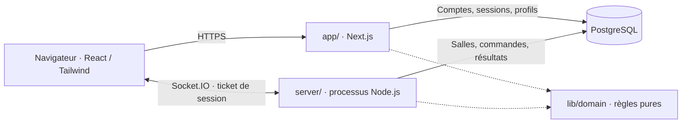

# Architecture du projet

**Auteur : YANN CEDRICK KOUEKAM TELEWOU**

> **Authentification actuelle :** j’ai limité la connexion aux comptes au **pseudonyme et au mot de passe**. Les options **OAuth GitHub/Discord sont prévues pour la suite**; le code préparatoire ne constitue pas une connexion externe livrée. L’accès invité reste distinct de l’authentification d’un compte.

> **Implémentation actuelle · actualisée le 7 octobre 2026 · version applicative vérifiée 4d23075.**

## Deux processus et une base commune

Typulso utilise React dans Next.js App Router, TypeScript strict, Tailwind, Bun et PostgreSQL. Le site et le serveur Socket.IO sont deux processus Node.js persistants déployés sur Railway; ils partagent PostgreSQL et l’origine autorisée `APP_URL`. J’ai retenu une structure à la racine (`app/`, `lib/`, `db/`, `server/`) plutôt qu’un monorepo : une installation et un lockfile suffisent pour les deux services.

| Répertoire réel | Responsabilité | Frontière |
|---|---|---|
| `app/` | Pages/layouts App Router et routes HTTP : identité, tickets, salles publiques, profils et résultats. | Données de session et accès runtime isolés sous Suspense; pas de cache partagé des permissions. |
| `components/` | Interface, frappe native, clavier statistique, salon, pistes, résultats et préférences. | Présentation et interactions; aucune autorité sur le score ou le rôle d’hôte. |
| `lib/client/` | Session, préférences, sons et connexion temps réel. | Aucun accès à PostgreSQL ou secret serveur. |
| `lib/domain/` | Frappe, génération de textes, classement, bots et capacités arcade. | Fonctions testables, indépendantes du réseau; temps transmis explicitement. |
| `lib/server/` | Authentification par pseudonyme/mot de passe, préparation OAuth pour la suite, limites de débit, permissions et transactions des salles. | Identité issue de la session, jamais d’un pseudonyme transmis librement. |
| `server/index.ts` | Socket.IO, tickets, connexions, commandes, diffusion et progression de l’horloge. | Processus persistant distinct du serveur web. |
| `db/` et `scripts/migrate.ts` | Schéma Drizzle, accès PostgreSQL et migrations SQL suivies. | Serveur uniquement; migrations exécutées avant l’usage de la base. |
| `types/game.ts` | Contrat partagé des commandes, états publics, résultats et profil. | Changement à répercuter sur tous les consommateurs. |
| `tests/`, `e2e/` | Domaine, PostgreSQL, réseau et parcours navigateur. | Données isolées des utilisateurs de production. |

## Chargements et validation · 9 octobre 2026

J’utilise maintenant des composants serveur asynchrones sous **Suspense** pour la session initiale, le catalogue public, le profil, l’historique et les résultats enregistrés. Leurs écrans d’attente sont de vrais fallbacks pendant la lecture des données. Le client reçoit ces données initiales et ne lance pas immédiatement une deuxième requête identique. Les actualisations explicites et la connexion persistante Socket.IO conservent leurs états d’attente propres. La déduplication React de la session est limitée à un rendu serveur; je ne partage ni identité ni permission entre visiteurs. Le client masque les anciennes données dès que l’identité change.

Les schémas **Zod 4** partagés dans `lib/validation.ts` vérifient les comptes et invités, les réglages complets ou partiels, les commandes et leurs payloads, les lots de frappe Unicode, la réponse de session et les préférences locales. Les objets de commande sont stricts, les nombres ne sont pas convertis depuis des chaînes et les lots de frappe gardent leurs limites. Les formulaires appliquent les mêmes schémas avant l’envoi; le serveur valide à nouveau. Je conserve ensuite les gardes métier : origine, session, rôle, phase, séquence, limite de débit et transaction. Zod complète ces gardes et ne remplace pas leur autorité.

## Authentification et admission

**Pour la version actuelle, j’ai limité l’authentification des comptes au pseudonyme et au mot de passe.** Le serveur vérifie le mot de passe haché et crée une session; aucun courriel ni mécanisme de récupération n’est utilisé.

**Les options OAuth GitHub et Discord seront ajoutées par la suite.** Des routes et tables préparatoires existent déjà dans le code, mais ces connexions externes ne font pas partie des fonctionnalités actuellement livrées. Leur activation et leurs retours devront être configurés et vérifiés lors de cette évolution.

Le mode invité reste un accès distinct pour rejoindre une salle : un invité possède un acteur et une session, sans compte durable. Une session web émet un ticket temps réel à usage unique; Socket.IO le consomme pour retrouver l’acteur. Compte, session, acteur et hôte de salle sont donc distincts.

L’invité peut rejoindre une salle mais ne peut pas en créer. Le serveur applique à chaque commande l’origine, la session, la structure, la limite de débit, l’admission, l’état et les permissions. Les routes web gèrent comptes et consultation; le service temps réel arbitre création, admission et course. Voir authentification (`lib/server/auth.ts`), tickets et sessions (`lib/server/auth.ts`) et salles (`lib/server/rooms.ts`).

## Commandes, persistance et synchronisation

Une commande entre par Socket.IO et reçoit un acquittement. Sa transaction verrouille la salle, vérifie ses gardes, modifie l’état, écrit le reçu de dédoublonnage puis valide. La diffusion publie un **instantané complet filtré pour son destinataire** via `room:state`. Les données internes et la saisie privée des autres restent côté serveur. Les commandes portent `commandId`, `kind`, `roomId`, `expectedVersion` et un payload. Le reçu d’invitation exclut le lien secret; son rejeu est refusé au lieu de réexposer ce secret.

PostgreSQL stocke l’état courant en `rooms.state`, les réglages de course et les résultats en JSONB, ainsi que les identités, membres et reçus relationnels. `room_events` conserve des projections versionnées; ce journal n’est pas une file de retransmission réseau garantie. Le ticker du serveur travaille toutes les **250 ms**; les animations interpolent une progression reconnue, sans créer de score.

## Course et sensations

Le serveur choisit le texte, le départ commun, la fin et le classement. Les entrées contiennent l’identifiant de course et une séquence; une frappe tardive ne rallonge pas une manche expirée. Le navigateur affiche la saisie immédiate puis se réconcilie avec l’état reconnu. Les repères des autres joueurs indiquent leur progression; ils ne diffusent pas leurs lettres privées.

Classique conserve les mesures réelles de frappe; arcade ajoute Pulsation, Bouclier et Virgule piégée selon les règles serveur. Les sons, le mouvement réduit et le volume sont des préférences. Les douze sons, duels, séries et trois capacités sont intégrés; musique, mini-séries, fantômes et cosmétiques restent proposés.

## Déconnexion et redémarrage

Une coupure client dispose de 60 secondes de grâce. La reprise recharge un état autorisé; les frappes classées hors ligne sont suspendues. Un départ volontaire déclenche immédiatement la succession de l’hôte. La succession privilégie un humain connecté choisi, sinon les participants puis les spectateurs par ancienneté; aucun bot ne devient hôte. Les phases sont `lobby`, `countdown`, `racing`, `results`, `closed` et `interrupted`.

Au redémarrage du service, les courses en compte à rebours ou en cours sont interrompues; aucune victoire n’est inventée. Les données déjà validées et les salons sont conservés. Une reprise complète de course ou plusieurs instances Socket.IO nécessiteraient une évolution documentée et vérifiée; aucun cluster n’est revendiqué.

## Preuves et limites

La CI a réussi format, lint, types, tests, compilations, intégration et trois scénarios navigateur. Sur Railway, un compte et un invité ont partagé code, arrivée, réglage de durée et état prêt; la configuration par le non-hôte a été refusée. Les images web et realtime sont distinctes; les migrations précèdent leur utilisation de PostgreSQL. La limite de 30 membres est configurée; **la capacité et la latence à 30 personnes ne sont pas mesurées**. Les objectifs de latence historiques ne sont pas des résultats acquis. La restauration PostgreSQL, l’ajout ultérieur d’OAuth et les essais avec le public restent à vérifier.
