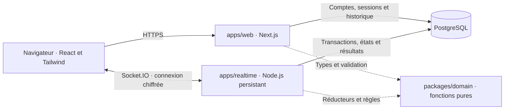

# Architecture du projet

> **Statut : proposition de conception · 1er octobre 2026**  
> Stack demandée : React, Next.js, TypeScript, Tailwind CSS et PostgreSQL.  
> Le code de l'application, le dépôt GitHub et les services de production seront créés dans une étape suivante.

[← Documentation](README.md) · [Modèle de données](06-modele-donnees.md) · [Machines à états](07-machines-etats.md) · [ADR temps réel](adr/0001-temps-reel.md)

## 1. Une fondation adaptée à une classe

Le produit doit permettre à environ 30 personnes de rejoindre une salle et de voir ses réglages évoluer ensemble. La version finale ajoutera la frappe simultanée, la reconnexion, les résultats et les statistiques. L'architecture proposée sépare l'interface, le serveur qui arbitre la course et les règles métier. Elle conserve un seul processus temps réel au départ pour réduire la complexité d'exploitation.

React fait partie de Next.js : il n'y aura pas une application React séparée de l'application Next.js. L'App Router organisera les pages, les composants serveur et les routes HTTP. TypeScript sera utilisé pour tout nouveau code applicatif, avec `strict` activé afin de renforcer les vérifications de types. [Documentation TypeScript](https://www.typescriptlang.org/tsconfig/strict.html).



| Bloc | Responsabilité | Limite à respecter |
|---|---|---|
| `apps/web` | Pages, authentification, émission d'un ticket de connexion, historique et préférences | Les pages ne décident jamais du gagnant ni des permissions de salle. |
| `apps/realtime` | Création et admission en salle, présence, configuration, départ, frappe, transfert d'hôte et résultats | Une commande doit être validée, autorisée et persistée avant son acquittement. |
| `packages/domain` | Règles de frappe, classement, états, génération de contenu et contrats d'événements | Aucun accès réseau, base de données, horloge implicite ou mutation cachée. |
| `packages/database` | Schéma PostgreSQL, migrations, accès serveur et transactions | Aucun import depuis le navigateur. |
| `packages/ui` | Composants réutilisables et jetons de la [direction artistique](03-direction-artistique.md) | Ne contient aucune règle de jeu. |

La création et l'admission passent par le service temps réel : un seul bloc applique les invariants de salle. Les routes HTTP de Next.js servent les opérations de compte et d'historique. Les deux services consultent les mêmes sessions PostgreSQL.

## 2. Organisation envisagée du dépôt

```text
apps/
  web/src/
    app/[locale]/           # Accueil, salon, course, résultats, profil
    app/api/                # Authentification, tickets, historique
    features/               # Écrans et interactions par fonctionnalité
  realtime/src/
    transport/              # Socket.IO, validation des entrées
    application/            # Commandes, autorisation, transactions
    persistence/            # États, journal et reprises
packages/
  domain/src/               # Types, réducteurs, règles et projections
  database/                 # Schéma et migrations SQL versionnées
  ui/src/                   # Composants et jetons visuels
docs/                       # Dossier de conception et ADR
tests/                      # Intégration, bout en bout et capacité
```

Cette arborescence décrit le futur dépôt; les répertoires applicatifs ne sont pas encore créés. Un espace de travail npm suffit au démarrage. Une orchestration plus complexe n'est utile que si le projet en démontre le besoin.

## 3. Une logique fonctionnelle testable

Le noyau prendra un état, une commande validée et des données explicites telles que l'heure serveur ou une graine aléatoire. Il produira un nouvel état, des événements et les effets à exécuter. Le service applicatif réalise les effets après avoir vérifié les droits.

```ts
// Contrat de conception; aucun module applicatif n'est encore livré.
type Decision = Readonly<{
  state: RoomState;
  events: readonly DomainEvent[];
  effects: readonly Effect[];
}>;

type Decide = (
  state: RoomState,
  command: ValidatedCommand,
  context: Readonly<{ now: number; randomSeed: number }>
) => Decision;
```

Les fonctions de score, d'attribution des bonus et de génération des textes seront déterministes. Les bots utiliseront les mêmes règles que les humains; leur simulation restera côté serveur. Les effets de rattrapage auront une politique documentée, indépendante de l'animation affichée. Le changement vers des personnages à capacités est autorisé par la capture client no 2, mais leur équilibrage reste à concevoir.

## 4. Identités et autorisations

| Identité ou rôle | Capacités proposées |
|---|---|
| Compte local, Discord ou GitHub | Créer une salle, participer et conserver ses statistiques. |
| Invité | Rejoindre une salle et conserver les résultats pendant sa session active. |
| Hôte de salle | Configurer, démarrer, exclure, désigner les spectateurs, lancer une revanche et fermer sa salle. |
| Spectateur | Observer; devenir admissible à la prochaine course selon les réglages de l'hôte. |

Il n'existe aucun rôle permanent « enseignant » ou « étudiant ». La capture client no 1 indique que tous les comptes disposent des mêmes capacités. Le même extrait interdit aux invités de créer une salle et prévoit que le participant le plus ancien puisse récupérer le rôle d'hôte au départ du précédent, sans préciser son éligibilité quand il est invité. **Créer une salle et recevoir une autorité temporaire dans une salle existante sont deux permissions distinctes.** La proposition est de permettre à un invité de reprendre cette autorité, sans acquérir la permission de créer une autre salle. Ce cas sera validé, visible et testé.

Le serveur vérifie le rôle actuel à chaque commande. Une exclusion invalide immédiatement l'accès temps réel de la personne, y compris lors d'une reconnexion. Masquer un bouton dans l'interface ne constitue jamais une vérification de permission.

### Authentification prévue

Le compte local conservera un nom d'utilisateur normalisé et un mot de passe haché avec Argon2id, sans courriel ni récupération. Les paramètres du hachage seront mesurés sur le serveur retenu et respecteront les recommandations actuelles. [OWASP — stockage des mots de passe](https://cheatsheetseries.owasp.org/cheatsheets/Password_Storage_Cheat_Sheet.html).

Les trois méthodes de compte aboutiront à une session applicative opaque, révocable dans PostgreSQL. Le navigateur recevra un cookie `HttpOnly`, `Secure`, à portée restreinte et avec une politique `SameSite` adaptée aux retours OAuth. Les sessions seront renouvelées après authentification; les mutations HTTP et les échanges OAuth auront leurs protections contre les requêtes intersites. Une bibliothèque d'authentification maintenue sera choisie au scaffold après vérification de son support du compte local **sans courriel**; les exemples par défaut ne modifieront pas cette exigence. [Guide d'authentification Next.js](https://nextjs.org/docs/app/guides/authentication), [OWASP — sessions](https://cheatsheetseries.owasp.org/cheatsheets/Session_Management_Cheat_Sheet.html).

Pour GitHub et Discord, l'identité externe sera indexée par fournisseur et identifiant stable, avec les permissions minimales. Aucune liaison automatique de comptes fondée sur un pseudonyme identique. Les secrets OAuth restent côté serveur. [OAuth GitHub](https://docs.github.com/en/apps/oauth-apps/building-oauth-apps/authorizing-oauth-apps), [OAuth Discord](https://docs.discord.com/developers/topics/oauth2).

La connexion Socket.IO utilisera un ticket opaque de courte durée, délivré par une route authentifiée. Le ticket ne remplace ni la session, ni la vérification d'appartenance à une salle. Chaque reconnexion revalide ces droits.

## 5. État autoritaire et reprise

Le navigateur affiche immédiatement la frappe locale pour conserver une sensation fluide. Le serveur valide les séquences reçues, calcule progression, erreurs et classement, puis publie l'état reconnu. Une interruption réseau suspend la frappe classée; des frappes produites hors ligne ne deviennent pas rétroactivement une performance validée.

Chaque salle possède une version monotone et un état PostgreSQL durable. Le service sérialise ses commandes par salle. Une transaction conserve ensemble le nouvel état, les événements publics et la réponse idempotente de la commande. Un acquittement annonce uniquement un état déjà validé par la base. Les clients demandent un instantané lorsqu'un numéro d'événement manque ou lorsqu'ils se reconnectent; le détail est défini dans l'[ADR](adr/0001-temps-reel.md).

**Politique de panne proposée :** les salons peuvent être rechargés après un redémarrage. Une course en compte à rebours ou en cours sera annulée avec le motif `server_restart`, sans victoire ni mise à jour des moyennes. Ses participants reviennent au salon après reconnexion. Cette limite évite de prétendre conserver l'équité pendant une panne de durée inconnue. Les données déjà acquittées restent durables; la course interrompue ne reprend pas. Une reprise complète avec horloge suspendue ferait l'objet d'un ADR ultérieur.

## 6. Persistance et choix d'accès aux données

PostgreSQL contiendra comptes, sessions, salles, invitations, courses et résultats. Drizzle est proposé pour décrire le schéma en TypeScript et conserver des migrations SQL lisibles. Les transactions et les contraintes restent explicites; l'ORM ne remplace pas les invariants de la base. [Transactions Drizzle](https://orm.drizzle.team/docs/transactions), [migrations Drizzle](https://orm.drizzle.team/docs/migrations).

Les préférences d'interface et la langue du texte sont indépendantes. Les erreurs du serveur renvoient des codes traduits par le navigateur. Les couleurs proviennent de jetons sémantiques communs aux modes clair et sombre. Un sélecteur explicite contrôlera le thème; Tailwind permet de lier les variantes sombres à ce choix. [Modes sombres Tailwind](https://tailwindcss.com/docs/dark-mode).

## 7. Premier checkpoint et limites

| Au checkpoint 1 | Prévu dans la version finale |
|---|---|
| Première authentification fonctionnelle, méthode locale proposée | Discord, GitHub et compte local complets; mode invité |
| PostgreSQL branché et migrations rejouables | Historique, heatmaps et progression |
| Salle créée et rejointe par code | Trois niveaux d'accès, invitations individuelles et partie rapide |
| Membres et réglages synchronisés en temps réel | Course, reconnexion de course, bots et bonus |
| Direction artistique visible, FR/EN, clair/sombre | Polissage complet des parcours |
| HTTPS et CI avec tests pertinents | Mesures de capacité et validation du moteur |

La grille reçue exige déjà une salle par code avec mises à jour en direct au premier checkpoint; cette exigence complète le cadrage précédent. La cible de 30 connexions, une diffusion de classement autour de cinq fois par seconde et une latence d'affichage visée inférieure à 300 ms au 95e percentile sont des **objectifs à tester**, pas des résultats acquis. Les versions de dépendances, offres d'hébergement et quotas seront vérifiés lors de l'implémentation.
