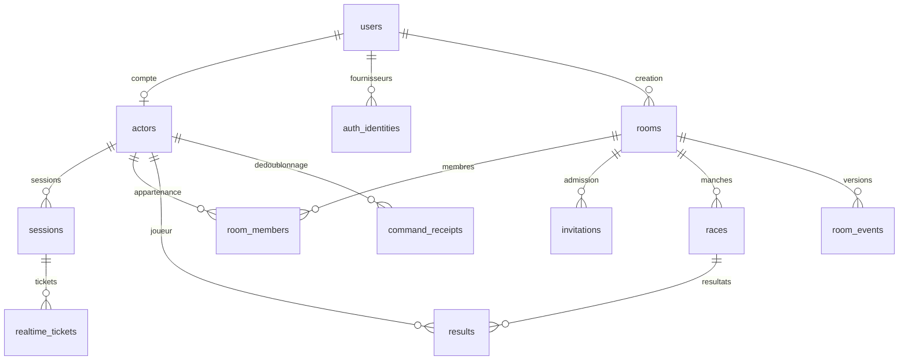

# Modèle de données PostgreSQL

> **Schéma actuel · 7 octobre 2026 · version applicative vérifiée 4d23075.**

[← Architecture](05-architecture.md) · [États](07-machines-etats.md) · [Migration initiale](../db/migrations/0001_initial.sql) · [Schéma TypeScript](../db/schema.ts)

## Sources et choix de stockage

La migration SQL crée **14 tables applicatives**. Le [migrateur](../scripts/migrate.ts) ajoute `schema_migrations`, soit 15 tables avec le suivi technique. Les entités du modèle initial sont maintenant représentées par ces tables et les états JSONB; il n’existe pas de tables séparées `race_entries`, `key_metrics` ou `room_snapshots` dans cette version.

Les cardinalités représentent les références relationnelles. Le rôle d’hôte est une référence supplémentaire de `rooms` vers un membre de la même salle, contrôlée par une clé étrangère composée différée.

## Tables effectivement créées

| Table | Clé / références | Contenu et contrainte principale |
|---|---|---|
| `users` | `id` UUID | `username`, `username_key` unique, `password_hash` nullable, date de création. Identité durable du compte. |
| `actors` | `id`; `user_id` unique nullable vers `users` | Pseudonyme et `kind` : `account`, `guest`, `bot`. Compte si et seulement si `user_id` est présent. |
| `auth_identities` | PK `(provider, subject)`; `user_id` | Identité externe associée à un compte. Le mot de passe local reste dans `users`. |
| `sessions` | `id`; `actor_id`; `token_hash` unique | Expiration, dernière activité, révocation et création. L’empreinte du jeton est stockée, pas son secret en clair. |
| `realtime_tickets` | `token_hash`; `session_id` | Expiration et consommation du ticket Socket.IO à usage unique. |
| `oauth_states` | `state_hash` | Fournisseur, vérificateur PKCE, empreinte de liaison et expiration du parcours OAuth. |
| `rooms` | `id`; `creator_user_id`; `host_actor_id`; `code` unique | Visibilité `public`, `code` ou `private`, phase, version positive, `state` JSONB et expiration. Salle privée si et seulement si le code est nul. |
| `room_members` | PK `(room_id, actor_id)` | Rôle `participant`/`spectator`, statut persisté `active`/`left`/`kicked`, date d’admission. |
| `invitations` | `token_hash`; `room_id`; `consumed_by` nullable | Expiration, révocation, consommation. `consumed_at` et `consumed_by` sont présents ensemble. |
| `races` | `id`; `room_id` | Texte commun, réglages JSONB, départ, échéance facultative, fin. Phase limitée à `countdown`, `racing`, `results`, `interrupted`. |
| `results` | `id`; `race_id`, `room_id`, `actor_id` | Résultat JSONB et date; unicité `(race_id, actor_id)` contre une double insertion. Index sur l’acteur. |
| `room_events` | PK `(room_id, version)` | Projection JSONB versionnée et date. Journal de salle, sans garantie de retransmission de tous les événements. |
| `command_receipts` | PK `(actor_id, command_id)`; `room_id` nullable | Réponse JSONB pour reconnaître une commande répétée et éviter un double effet. |
| `rate_limits` | `key` | Début de fenêtre et compteur, utilisés pour l’authentification et les commandes. |
| `schema_migrations` | `name` | Date d’application du fichier SQL; créée par le migrateur hors migration initiale. |

La contrainte `host_belongs_to_room` référence `(rooms.id, rooms.host_actor_id)` dans `room_members(room_id, actor_id)`. Elle est différée jusqu’au commit : la création insère salle et membre dans la même transaction. Les gardes applicatives complètent les contraintes SQL pour les transitions, permissions et capacités.

## Contenu des états JSONB

| Colonne | Informations principales | Source à lire |
|---|---|---|
| `rooms.state` | Réglages, hôte, membres avec connexion et état de frappe interne, course active, événements arcade et résultats courants. | [État interne et commandes](../lib/server/rooms.ts), [contrat public](../types/game.ts). |
| `races.settings` | Copie des règles de la manche : langue, contenu, erreurs, durée, accès et mode. | [Types](../types/game.ts). |
| `results.data` | Mesures, classement, mode/langue, erreurs par touche et référence de comparaison des règles. | [Résultat stocké](../types/game.ts), [API profil](../app/api/profile/route.ts). |
| `room_events.data` | État public versionné utilisé pour la traçabilité. | [Persistance et projection](../lib/server/rooms.ts). |
| `command_receipts.response` | Réponse de la commande, avec suppression du lien secret d’invitation avant stockage. | [Transaction de commande](../lib/server/rooms.ts). |

Un instantané public n’est pas une copie brute de `rooms.state`. Le serveur filtre le texte avant le départ et la saisie privée des autres joueurs, tout en exposant leurs métriques et progression autorisées. Un invité n’a pas de ligne `users`, mais son acteur/session peut être persisté; sa suppression et la conservation des données demandent une politique d’exploitation explicite.

## Migrations et vérification

Le migrateur prend un verrou PostgreSQL, applique chaque fichier SQL absent de `schema_migrations`, puis enregistre son nom dans la même transaction. Le guide Railway fait exécuter `node dist/migrate.mjs` avant le service temps réel. Une connexion à une base neuve ne crée pas à elle seule les tables.

Les migrations sur base vide et leur seconde exécution ont été vérifiées localement et en CI. En production, le healthcheck, la reconnexion au même compte et la création/admission de salle établissent le fonctionnement des parcours utilisés; ils ne constituent pas un inventaire SQL exhaustif ni un essai de restauration. Voir les [preuves](08-plan-checkpoint.md) et le [guide](19-deploiement.md).
