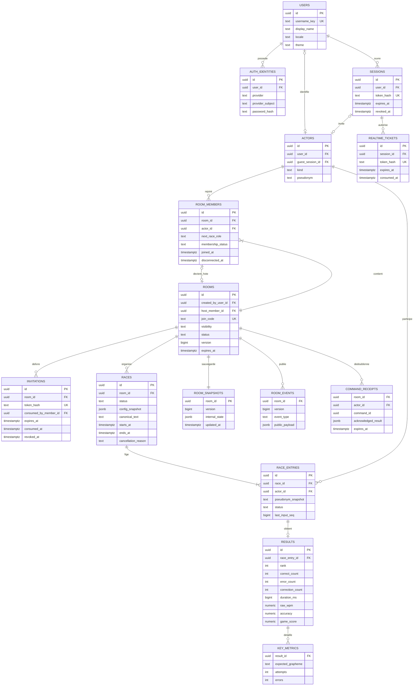

# Modèle de données PostgreSQL

> **Statut : modèle proposé · aucune migration exécutée**  
> Les tables décrivent la version finale. Le checkpoint 1 en utilisera le sous-ensemble comptes, sessions, salles, membres, tickets et états.

[← Architecture](05-architecture.md) · [Machines à états](07-machines-etats.md) · [ADR temps réel](adr/0001-temps-reel.md)

## 1. Principes

Une identité de jeu est un `actor`. Elle appartient soit à un compte permanent, soit à une session invitée. Un bot possède un acteur distinct et reste attaché à sa salle. Le rôle d'hôte appartient à la salle, tandis que la participation appartient à une course précise. Ainsi, une arrivée tardive peut regarder la course actuelle et participer à la suivante sans réécrire l'historique.

Les identifiants internes seront des UUID. Les heures seront stockées en `timestamptz` et échangées en UTC; l'interface les affichera dans le fuseau approprié. Les valeurs de langue, statut et mode auront des contraintes explicites. Le modèle ne contient aucun profil scolaire ni adresse courriel requise.

## 2. Relations principales

Les détails de clés composites et les règles conditionnelles ci-dessous complètent le diagramme; sa notation n'exprime pas toutes les contraintes SQL.

## 3. Dictionnaire et invariants

| Entité | Règle structurante |
|---|---|
| `users` | `username_key` normalisé et unique; aucun mot de passe en clair. |
| `auth_identities` | Unicité `(provider, provider_subject)` pour GitHub/Discord; une identité locale par compte, avec `password_hash` Argon2id. |
| `sessions` | `user_id` nul uniquement pour une session invitée. Jeton aléatoire dont seul le hachage est stocké; révocation et expiration vérifiées côté serveur. |
| `actors` | `kind = account` exige un `user_id` unique pour conserver une identité stable; `guest` exige un `guest_session_id` unique; `bot` n'a ni compte ni session. Une contrainte impose ces combinaisons. |
| `rooms` | `created_by_user_id` non nul : seul un compte crée une salle. La salle conserve un unique `host_member_id`, potentiellement lié ensuite à un invité. |
| `room_members` | Unicité `(room_id, actor_id)`; une reconnexion retrouve la ligne. Départ et exclusion restent distingués. |
| `invitations` | Jeton individuel; expiration, révocation et consommation ne sont pas assimilées. Le membre consommateur doit appartenir à la même salle. |
| `races` | Une seule course non terminale par salle, garantie par index unique partiel. Texte et configuration figés au lancement. |
| `race_entries` | Unicité `(race_id, actor_id)`. L'ensemble des participants est figé au départ; les nouveaux venus restent spectateurs. |
| `results` | Une ligne par entrée; aucune victoire ni moyenne enregistrée pour une course annulée. Les personnes qui abandonnent ont un résultat incomplet identifié. |
| `key_metrics` | Clé primaire `(result_id, expected_grapheme)`; le caractère attendu permet de cibler ce qu'il faut travailler. |
| `room_snapshots` | Une ligne par salle; version identique à celle de `rooms` à chaque transaction validée. |
| `room_events` | Clé primaire `(room_id, version)`; événement public filtré, sans secrets ni saisie brute. |
| `command_receipts` | Clé primaire `(actor_id, command_id)`, `room_id` rattaché au résultat; rejouer la même commande restitue sa réponse sans appliquer deux fois l'action, y compris si la création n'avait pas encore renvoyé l'identifiant de salle. |

Pour empêcher qu'une salle désigne le membre d'une autre salle comme hôte, `room_members` aura une clé unique `(room_id, id)` et `rooms(id, host_member_id)` référencera cette paire par une clé étrangère composite. Cette contrainte peut être différée jusqu'au commit pour insérer la salle et son premier membre dans une seule transaction. Une salle fermée peut avoir un hôte nul; une salle ouverte doit avoir un hôte valide.

Les appartenances actives et la nature humaine de l'hôte sont vérifiées par les commandes transactionnelles; un `CHECK` ne peut pas vérifier arbitrairement d'autres tables. Un futur déclencheur de contrainte pourra renforcer cet invariant si plusieurs chemins d'écriture deviennent nécessaires. Les clés étrangères, contraintes uniques et index partiels seront documentés dans les migrations. [Contraintes PostgreSQL](https://www.postgresql.org/docs/current/ddl-constraints.html).

La création recherche d'abord un reçu pour `(actor_id, command_id)`. Le compte est verrouillé pendant cette opération pour sérialiser deux tentatives identiques; salle, membre hôte, instantané et reçu sont ensuite insérés ensemble. L'index unique du reçu et le rollback empêchent une double création. Les mutations d'une salle existante verrouillent sa ligne. Les compteurs et durées ne peuvent pas être négatifs; la précision reste bornée entre 0 et 1.

## 4. Admissions privées atomiques

La capture client no 3 confirme que la course privée se rejoint uniquement par son lien d'invitation. Le QR du mode semi-public ne constitue pas une admission privée alternative.

1. Hacher le jeton reçu et rechercher l'invitation; limiter les essais et valider la session.
2. Verrouiller la salle puis l'invitation avec `SELECT … FOR UPDATE`, toujours dans cet ordre.
3. Vérifier la salle ouverte, la capacité, l'expiration, la révocation, l'absence d'exclusion et l'usage du jeton.
4. Insérer ou retrouver le membre admissible, mettre à jour l'état de salle et marquer le jeton consommé par ce membre.
5. Valider la transaction, puis seulement acquitter et publier la nouvelle version.

**Un refus d'admission ne consomme jamais l'invitation.** Deux admissions concurrentes avec le même jeton ne réussissent pas pour deux identités différentes. La reconnexion du consommateur passe par sa session et son appartenance existante, sans réutiliser le lien. Une nouvelle tentative après perte de l'acquittement retrouve le même membre grâce à l'idempotence. [Verrouillage PostgreSQL](https://www.postgresql.org/docs/current/explicit-locking.html).

La validité de 24 heures, la révocation par l'hôte et le plafond de 30 connexions humaines sont des propositions de l'équipe. Le lien cesse également d'être utilisable dès la fermeture de la salle. Le code semi-public comportera six caractères d'un alphabet sans caractères ambigus, avec une contrainte unique et une nouvelle génération en cas de collision; il expire avec la salle. Ce code est un moyen d'admission, pas un secret de compte.

## 5. Données de jeu et confidentialité

Le classement public contient pseudonyme de course, progression, position et statistiques de cette course. L'historique permanent et la heatmap globale appartiennent au compte; l'hôte n'acquiert aucun accès spécial à l'historique privé des autres. Il n'y a pas de carnet de notes d'enseignant.

Le serveur garde pendant la course un état de validation borné par la longueur du texte, incluant les compteurs et la séquence reconnue. Cet état privé peut contenir le tampon de frappe nécessaire à la reconnexion; il n'est jamais diffusé dans `public_payload`. Après les résultats, seules les mesures utiles restent : la saisie brute est supprimée. Les corpus intégrés devront porter source et licence; la conservation du texte personnalisé sera limitée au besoin de la salle et de la course.

| Donnée | Politique proposée à confirmer avant production |
|---|---|
| Ticket temps réel | Expire après 60 secondes; consommation unique par connexion. |
| Session invitée | Cookie de session; expiration serveur après 12 heures d'inactivité, pas de promesse de retour le lendemain. |
| Résultats d'invité | Disponibles pendant la session, puis purge sous 24 heures après expiration. |
| Invitation privée | 24 heures au maximum et invalidation à la fermeture de la salle. |
| État détaillé de frappe | Purge immédiate après résultat ou annulation; reprise limitée à la course active. |
| Événements et reçus | Fenêtre de reprise bornée; purge au plus tard 24 heures après fermeture. |
| Résultats de compte | Historique conservé; durée finale et suppression de compte à définir avant production. |

Une session de navigateur ne signifie pas nécessairement disparition instantanée à la fermeture d'un onglet; la politique sera formulée clairement dans l'interface. Les tâches de purge font partie de l'exploitation. Les journaux techniques n'enregistrent ni jetons, mots de passe, codes privés, ni saisies brutes.

## 6. Ordre des migrations futures

| Lot | Tables et preuves attendues |
|---|---|
| Checkpoint 1 | Comptes, identités locales, sessions, acteurs, tickets, salles, membres, instantanés, événements et reçus; création/rejoin et synchronisation démontrées. |
| Admission complète | Invitations, contraintes privées, exclusion et révocation. |
| Moteur de course | Courses, entrées et résultats; transaction de fin idempotente. |
| Progression | Mesures par touche, agrégations des comptes et règles de purge. |

Les agrégats tels que vitesse moyenne, nombre de victoires et heatmap globale seront calculés depuis les résultats avant d'introduire un cache d'agrégation. Toute optimisation conservera une méthode de reconstruction.
