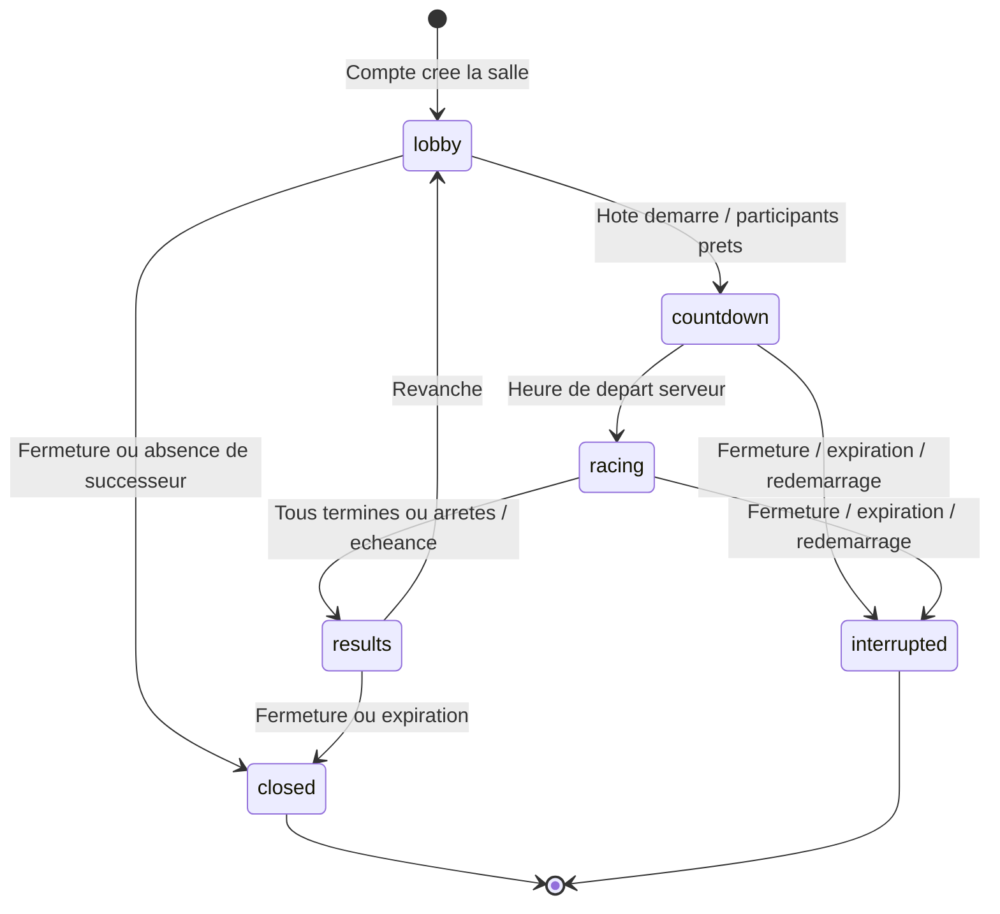

# Machines à états de l’application

> **Implémentation actuelle · 7 octobre 2026 · version applicative vérifiée 4d23075.**

## Dimensions réellement utilisées

| Dimension | Valeurs / représentation |
|---|---|
| Phase publique de salle (`RoomPhase`) | `lobby`, `countdown`, `racing`, `results`, `closed`, `interrupted` |
| Phase de la ligne `races` | `countdown`, `racing`, `results`, `interrupted` |
| Appartenance relationnelle (`room_members.status`) | `active`, `left`, `kicked` |
| Statut du joueur public | `active`, `finished`, `left`, `disconnected` |
| Rôle | `participant`, `spectator` |
| État complémentaire | Connexion, prêt, participation à la manche et abandon sont des champs distincts. |
| Hôte | Identifiant unique porté par la salle; un rôle temporaire, indépendant du compte et du rôle scolaire. |

Le statut public détaillé et le statut relationnel ne sont pas interchangeables. Par exemple, une courte coupure peut laisser le membre actif dans la table alors que le snapshot indique sa déconnexion.

## Salle et manche

| Commande / événement | Garde et effet actuels |
|---|---|
| `create` | Compte requis. Insère salle et membre, puis attribue l’hôte dans la même transaction. |
| `join` | Accès public/code/invitation autorisé, salle admissible et capacité disponible. Une arrivée pendant la manche observe celle-ci. |
| `configure` | Hôte, phase `lobby`, réglages valides et version cohérente lorsqu’elle est fournie. Les règles sont immuables après le départ. |
| `ready` | Participation admissible au salon; état prêt partagé. |
| `start` | Hôte, salon, au moins un participant, tous les participants actifs prêts et connectés. Texte serveur et départ à +3 secondes. |
| Horloge | Passe `countdown` à `racing`; termine à l’échéance ou quand les participants ne doivent plus continuer. |
| `input` | Membre de la manche, phase et identifiant de course valides, séquence attendue et limites respectées. Les entrées après l’échéance n’ajoutent pas de lettres. |
| `ability` | Arcade uniquement; course active, joueur admissible, énergie/usage/cible conformes. Les effets n’altèrent pas le texte partagé. |
| `role`, `kick`, `invite` | Droits d’hôte et gardes propres à la commande; aucune admission implicite dans une manche déjà lancée. |
| `leave` | Départ reconnu, arrêt de participation si nécessaire, succession immédiate de l’hôte concerné. |
| `rematch` | Hôte en `results`; réinitialise la manche et les états de préparation vers `lobby`. |
| `close` | Hôte; `closed` hors course, `interrupted` si compte à rebours/course actifs. |
| Redémarrage | Les courses `countdown`/`racing` deviennent interrompues; aucun résultat de victoire n’est créé. |

Les codes ont une durée de salle de **24 heures** dans l’implémentation; l’accès aux salles expirées est refusé. L’interface renvoie une salle fermée ou devenue inaccessible vers Jouer. Les résultats déjà enregistrés restent consultables selon les droits du compte; une interruption ne crée pas de résultat fictif.

## Succession de l’hôte

Le sélecteur serveur (`lib/server/rooms.ts`) considère les humains connectés encore admissibles; les bots sont exclus. Pour un départ volontaire, un `successorId` explicitement demandé est retenu s’il est admissible. Sinon l’ordre est : **participants avant spectateurs, admission la plus ancienne, identifiant stable pour départager**. Un spectateur humain connecté peut donc succéder si aucun participant ne convient; l’ancienne proposition de fermeture systématique dans ce cas n’est pas la règle implémentée. Un invité peut devenir hôte de la salle existante, sans obtenir le droit de créer une autre salle.

Une déconnexion involontaire garde la place pendant **60 secondes**. Au-delà, le membre est marqué parti; si c’est l’hôte, la succession s’applique. Sans successeur connecté admissible, la salle est fermée ou interrompue selon sa phase. Une commande `sync` ou une admission reconnue pendant la grâce restaure la connexion et la progression acquittée.

## Inactivité et fin

La politique du moteur (`lib/domain/engine.ts`) prévoit une indication d’inactivité après **45 secondes** et un abandon après **60 secondes**. Le ticker serveur, exécuté toutes les **250 ms**, applique ces règles et la deadline. Les résultats sont calculés avec l’heure de fin de course, même si un tick ou une commande arrive plus tard. L’unicité `(race_id, actor_id)` protège l’enregistrement contre une insertion répétée.

## Couverture réelle

Les tests du domaine, les tests PostgreSQL et HTTP/Socket.IO et les parcours CI vérifient transitions, permissions, départ, séquence, résultat et succession. La recette Railway du 7 octobre a vérifié la création/admission par code, l’arrivée, le changement de durée, les permissions et l’état prêt entre deux sessions; elle ne vérifie pas toutes les phases de course, la coupure réseau ou le transfert d’hôte en production. Le test de charge et les essais de redémarrage en exploitation restent à mener.
