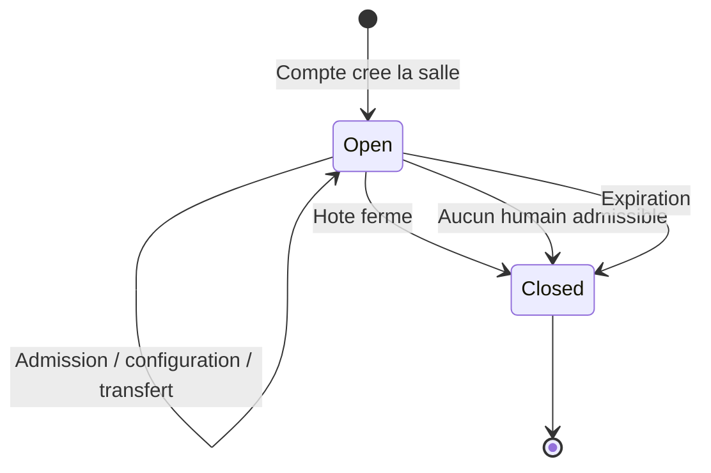
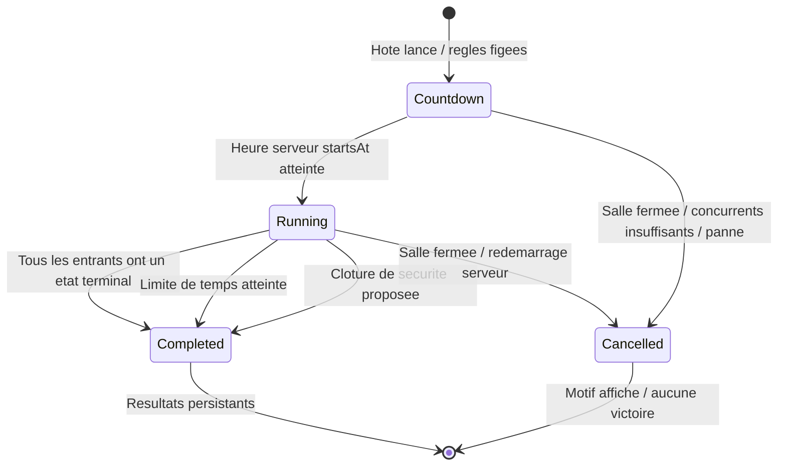
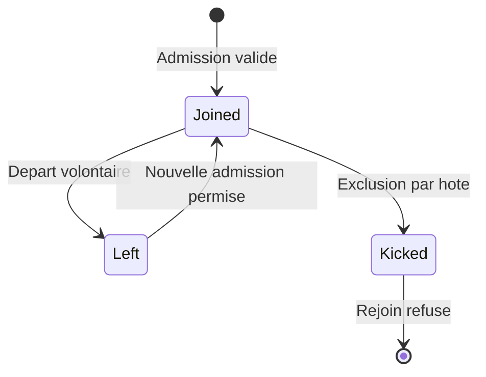
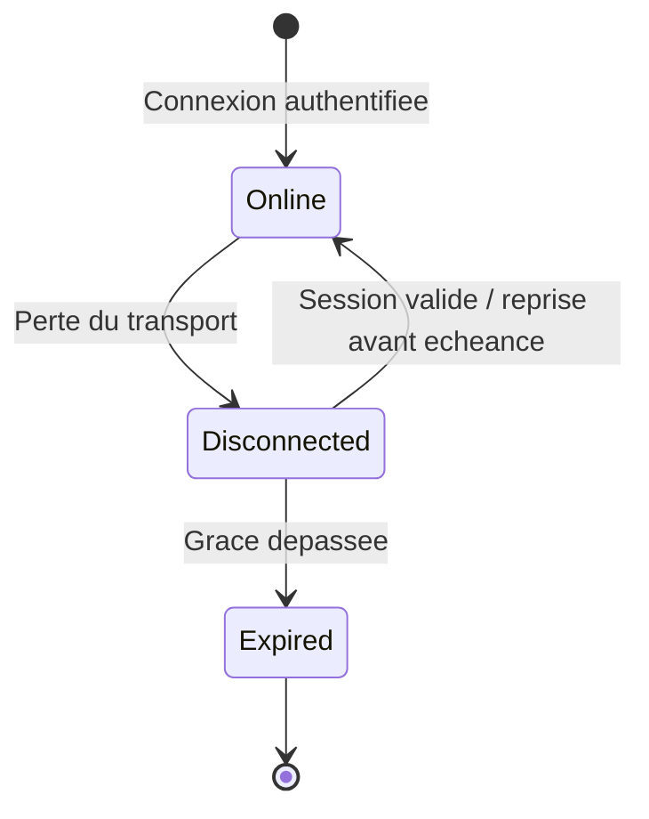
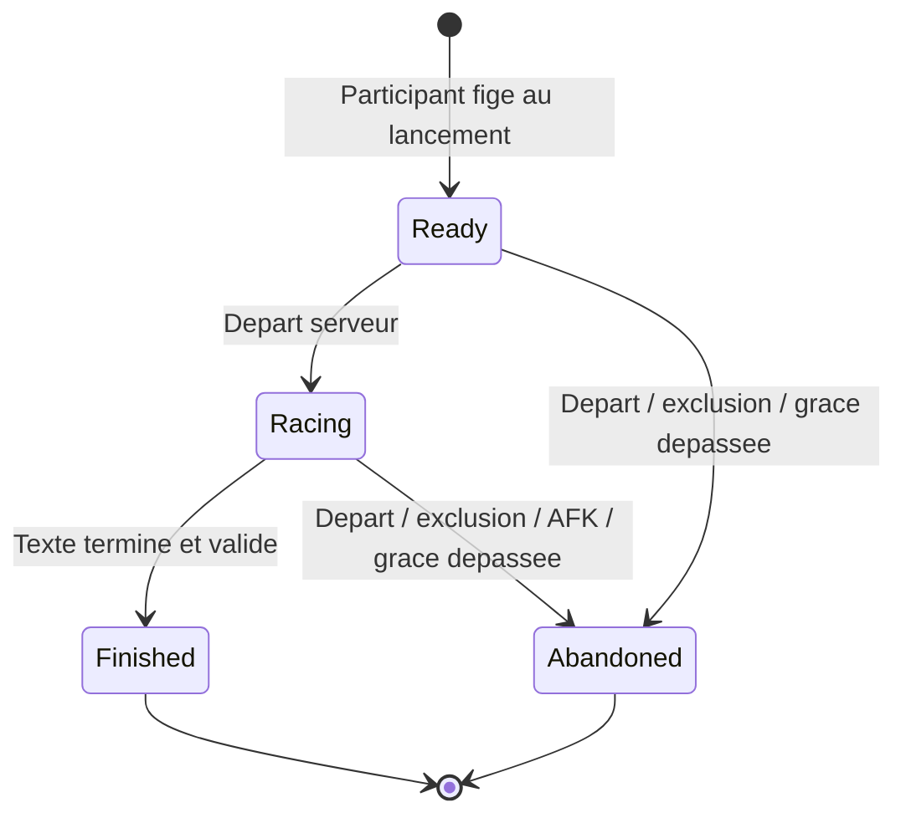

# Machines à états

> **Statut : règles proposées pour l'implémentation**  
> Les réponses client sur les invités, la reconnexion et la succession de l'hôte sont retenues. Les durées et règles de clôture ci-dessous restent des arbitrages de l'équipe à valider.

[← Architecture](05-architecture.md) · [Modèle de données](06-modele-donnees.md) · [Expérience utilisateur](04-experience-utilisateur.md)

## 1. Trois cycles indépendants

Une salle existe avant et après une course. Une personne peut rester membre tout en observant une course. La connexion réseau constitue encore une autre dimension. Ces états seront distingués pour éviter qu'une reconnexion devienne une nouvelle admission ou qu'une revanche perde les membres du salon.

| Dimension | États |
|---|---|
| Salle | `open`, `closed` |
| Course | `countdown`, `running`, `completed`, `cancelled` |
| Appartenance | `joined`, `left`, `kicked` |
| Connexion | `online`, `disconnected` |
| Rôle pour la prochaine course | `participant`, `spectator` |
| Entrée dans la course actuelle | `ready`, `racing`, `finished`, `abandoned` |

Le rôle d'hôte est une référence unique de la salle vers un membre. Il ne remplace ni son rôle de participant/spectateur, ni son état de connexion.

## 2. Salle

| Commande | Garde côté serveur | Effet |
|---|---|---|
| `room.create` | Session de compte valide | Insérer salle et premier membre; attribuer l'autorité d'hôte dans la même transaction. |
| `room.join` | Admission permise, capacité disponible, pas d'exclusion | Ajouter le membre; spectateur de la course actuelle si son admission suit le départ. |
| `room.configure` | Hôte actuel, salle ouverte, aucune course en compte à rebours ou en cours | Valider et publier les réglages; refuser une version de formulaire périmée. |
| `room.assignRole` | Hôte actuel et membre présent | Modifier l'admissibilité à la prochaine course; ne pas inscrire un nouveau joueur dans une course commencée. |
| `room.kick` | Hôte actuel et cible autorisée | Exclure, abandonner son entrée éventuelle, révoquer son accès à la salle. |
| `room.leave` | Membre identifié | Marquer le départ; abandonner l'entrée en cours et transmettre l'autorité si nécessaire. |
| `room.close` | Hôte actuel | Fermer les admissions, annuler la course active et prévenir tous les membres. |

Une salle expirera après 24 heures selon la proposition actuelle. Une salle fermée reste consultable seulement pour les données autorisées; son code et ses invitations ne fonctionnent plus.

### Transfert de l'hôte

La capture client no 1 impose qu'une courte déconnexion permette de revenir et qu'un départ volontaire transmette le rôle au participant le plus ancien, ou à une personne désignée avant le départ.

La politique proposée est la suivante :

1. Pour un départ volontaire, choisir immédiatement le successeur désigné s'il est présent, humain, admissible et connecté.
2. Sinon, choisir le participant humain connecté dont `joined_at` est le plus ancien; départager une égalité par identifiant stable.
3. Les invités peuvent recevoir cette autorité dans la salle existante. Ils restent incapables de créer une nouvelle salle.
4. En cas de déconnexion involontaire, conserver l'hôte pendant une grâce de **60 secondes**. Les réglages et le départ sont alors suspendus; une course déjà lancée continue sous l'arbitrage du serveur.
5. Au-delà de la grâce, effectuer le même transfert. Si tous les successeurs potentiels sont déconnectés, attendre la fin de leur propre grâce; sans participant admissible, fermer la salle.

Les bots ne deviennent jamais hôtes. Le traitement d'une salle composée uniquement de spectateurs est proposé ainsi : fermer la salle si aucun participant humain n'est admissible, plutôt qu'attribuer silencieusement des droits à un spectateur. Cette exception devra être confirmée dans les essais de parcours.

## 3. Course

Au lancement, le serveur fige les participants admissibles, le texte exact, les règles d'erreur, le mode de jeu, la formule de classement et les échéances. Le compte à rebours est proposé à trois secondes. Une date `startsAt` commune est publiée; chaque navigateur affiche le temps restant en estimant son décalage d'horloge. Le serveur refuse les frappes reçues avant le départ.

Une course comprend au moins deux concurrents, dont un humain; le second peut être un bot pour la pratique individuelle. Toute admission après le début du compte à rebours observe la course actuelle; cette garde empêche une inscription changeante pendant le départ. L'hôte ne peut plus modifier les règles figées.

### Fin sans blocage par une personne inactive

La règle du cahier « tous les participants actifs ont fini ou le temps expire » est conservée. `finished` et `abandoned` sont des états terminaux; une personne AFK ou hors ligne n'attend pas indéfiniment.

| Situation | Proposition de traitement |
|---|---|
| Tous les participants sont arrivés ou ont abandonné | Terminer immédiatement et persister les résultats une seule fois. |
| Limite de temps choisie par l'hôte | Terminer à l'échéance serveur, y compris si certains participants n'ont pas terminé. |
| Déconnexion | Conserver progression et entrée pendant 60 secondes; abandonner à l'échéance si aucune reprise valide. |
| Pas de frappe ni correction pendant 45 secondes | Montrer un avertissement; 15 secondes supplémentaires sans activité entraînent l'abandon. |
| Pas de limite choisie | Proposition à valider : clôturer 60 secondes après la première arrivée, avec un plafond de sécurité de 10 minutes depuis le départ. |
| Aucun participant n'a terminé | Le plafond de sécurité proposé ou l'abandon de toutes les entrées finit la course. |

Les deux délais de clôture sans limite ne proviennent pas d'une réponse client. Ils constituent une option explicite, à comparer à l'option « abandon automatique seulement ». S'ils sont retenus, ils doivent être affichés dans les réglages avant le départ et figés dans `config_snapshot`. Aucune échéance invisible ne sera ajoutée après le lancement.

Les entrées incomplètes conservent leur vitesse et leur précision mesurées. Elles ne sont pas présentées comme ayant terminé le texte. Le podium applique la politique du [cahier consolidé](01-cahier-des-charges.md); la formule et les critères de départage seront validés avant de coder le moteur. Les statistiques de frappe restent distinctes du résultat arcade.

Une revanche crée une nouvelle course et de nouvelles entrées dans la même salle. Elle ne remet pas les anciens résultats à zéro.

## 4. Appartenance, connexion et participation

Une perte de connexion ne change pas immédiatement `racing` en `abandoned`. La personne reprend la même entrée si sa session est valide avant l'échéance. Après l'abandon, elle peut revenir comme spectatrice de la course actuelle; sa progression ancienne n'est pas réactivée. La fin d'un transport Socket.IO n'est jamais utilisée comme identifiant permanent de personne.

## 5. Reprise et déploiement

Lors d'une reconnexion, le serveur vérifie session, appartenance, exclusion et échéance. Il renvoie une projection complète filtrée selon les droits, avec version de salle, entrée courante, dernière séquence reconnue et échéances serveur. Le navigateur remplace l'état périmé puis retransmet seulement les commandes déjà émises dont l'acquittement reste inconnu. Les doublons retrouvent leur réponse sans augmenter le score.

Un redémarrage du service ferme les connexions mais ne supprime pas le salon persistant. Lors de la reprise du processus, les courses `countdown` ou `running` seront annulées atomiquement avec le motif `server_restart`; leurs entrées encore actives deviennent `abandoned`. Les entrées n'alimentent pas les victoires ou moyennes; les membres reconnectés reviennent au salon. Le transfert d'hôte attend les grâces de reconnexion après la reprise. Cette limite sera annoncée dans l'exploitation et testée.

## 6. Scénarios de vérification futurs

| Scénario | Résultat attendu |
|---|---|
| Un invité émet `room.create` | Refus serveur sans salle créée. |
| L'hôte transmet à un invité puis quitte | L'invité administre cette salle et ne peut pas en créer une autre. |
| L'hôte perd le réseau pendant 20 secondes | Identité et autorité restaurées; une course déjà lancée a continué. |
| L'hôte reste absent plus de 60 secondes | Un unique successeur admissible est choisi et publié. |
| Une personne arrive pendant la course | Observation actuelle, admissibilité possible à la suivante. |
| Une même commande de départ est envoyée deux fois | Une seule course créée, même réponse acquittée. |
| Une personne reste AFK et une autre termine | Clôture selon règles figées; aucun blocage infini. |
| Service redémarré après une frappe acquittée | Salon durable, course annulée clairement, aucune victoire fabriquée. |
