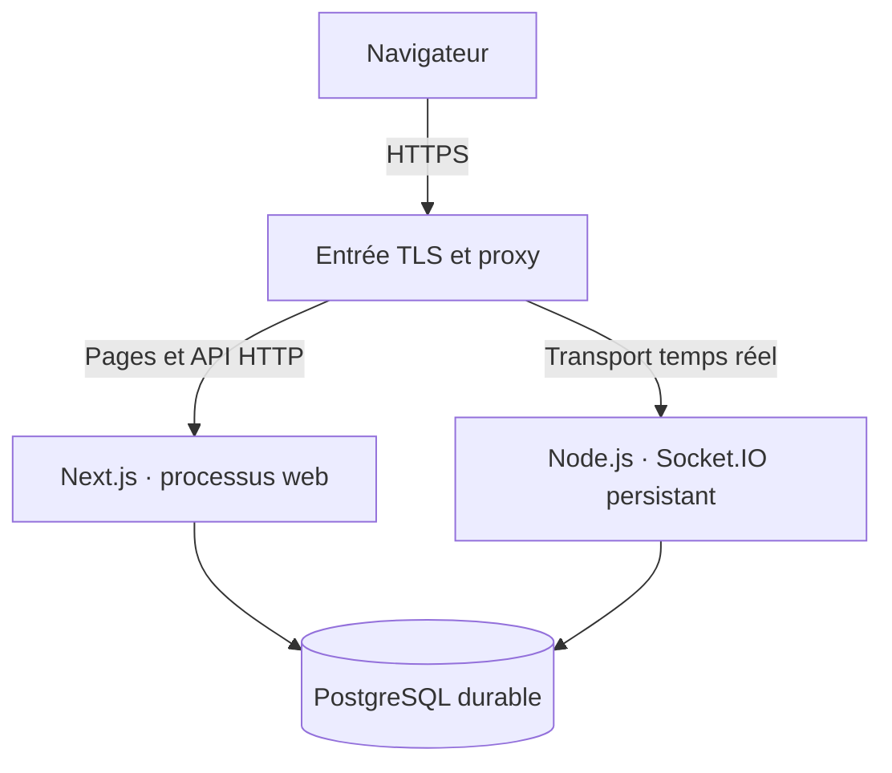

# Développement, qualité et déploiement

> **Lecture actuelle · 7 octobre 2026 :** ce document conserve la conception ou les observations à leur date. L’état du code et des choix implémentés figure dans [18](18-implementation.md); les procédures utilisables dans [19](19-deploiement.md); les preuves locales, CI et Railway dans [CP1](08-plan-checkpoint.md) et la synthèse de [20](20-verification-implementation.md). Une maquette ou un test prévu ne constitue pas une preuve de production.

> **Statut : plan d'exécution futur · 1er octobre 2026**  
> Aucun scaffold applicatif, compte d'hébergement, dépôt GitHub ou site de production n'est créé par ce dossier de conception. Les commandes ci-dessous deviendront utilisables lorsque les scripts correspondants auront été ajoutés au projet.

[← Documentation](README.md) · [Architecture](05-architecture.md) · [Matrice des exigences](02-matrice-exigences.md)

## 1. Première livraison attendue

La capture de remise indique le **5 octobre 2026 avant 23 h 55, heure de Toronto**. Le fichier à remettre devra contenir le lien du dépôt GitHub clonable et celui du site en ligne. Ces liens ne sont pas encore disponibles.

| Critère de la grille | Points | Preuve à préparer |
|---|---:|---|
| Cahier des charges | 20 | Document consolidé et réponses client traçables. |
| Démarche créative et direction artistique | 20 | Nom et logo validés humainement, moodboard, palette, typographies et démarche. |
| Architecture | 20 | Modèle de données, machines à états et ADR temps réel. |
| Production fonctionnelle | 20 | URL HTTPS, première authentification et PostgreSQL réellement connecté. |
| Salle par code en temps réel | 10 | Deux navigateurs créent/rejoignent la même salle et voient les changements. |
| CI, langue, thème et qualité | 10 | Tests automatiques, FR/EN, clair/sombre et matrice des exigences. |

Les documents constituent une partie de la preuve. Les lignes HTTPS, authentification, PostgreSQL et temps réel ne seront marquées livrées qu'après une démonstration sur le site déployé.

## 2. Ordre d'implémentation proposé

1. Valider le nom, la construction du logo et les choix structurants de la direction artistique.
2. Créer l'espace de travail Next.js/React, TypeScript strict et Tailwind; intégrer les jetons, FR/EN et le thème.
3. Brancher PostgreSQL, écrire les migrations initiales et implémenter une première méthode d'authentification locale.
4. Ajouter le service Socket.IO, les sessions/tickets et les commandes de création et admission par code.
5. Synchroniser les membres et réglages; vérifier les refus d'autorisation et les commandes répétées.
6. Ajouter les tests et la CI, puis déployer et vérifier le parcours sur deux navigateurs.
7. Compléter les liens de remise et les preuves du checkpoint.

Le moteur de course complet, les bots, les bonus et la progression arrivent après cette fondation. Discord et GitHub restent obligatoires dans la version finale; leur mise en avant visuelle peut être préparée dès le checkpoint sans afficher de connexion comme fonctionnelle avant qu'elle le soit.

## 3. Environnement local futur

La version de Node.js sera une version LTS compatible avec la version de Next.js retenue. Elle sera fixée dans le dépôt, avec le gestionnaire de paquets et son lockfile. Les versions exactes seront décidées au scaffold, puis mises à jour de manière contrôlée. [Cycle des versions Node.js](https://nodejs.org/en/about/previous-releases).

PostgreSQL local pourra être lancé dans un conteneur ou via une installation existante. Un jeu de données de démonstration ne contiendra que des comptes et pseudonymes fictifs. Le projet utilisera la même famille de version PostgreSQL en développement, CI et production pour rendre les migrations reproductibles.

### Contrat des scripts à créer

| Commande future | Fonction prévue |
|---|---|
| `npm ci` | Installer exactement les dépendances du lockfile. |
| `npm run dev` | Lancer web et service temps réel en développement. |
| `npm run db:migrate` | Appliquer les migrations SQL versionnées. |
| `npm run db:seed` | Créer les données fictives de développement. |
| `npm run lint` | Exécuter ESLint, avec règles d'imports serveur/client. |
| `npm run typecheck` | Vérifier TypeScript pour tous les blocs. |
| `npm run test:unit` | Exécuter les tests des règles métier. |
| `npm run test:integration` | Vérifier base, admissions et transactions. |
| `npm run test:e2e` | Exécuter les parcours Playwright. |
| `npm run build` | Compiler web, temps réel et bibliothèques partagées. |

Ces commandes décrivent les scripts attendus; elles ne sont pas exécutables dans le dossier de conception actuel. Le README sera réécrit avec la procédure réelle après le scaffold.

### Configuration à documenter sans secrets

| Variable proposée | Portée |
|---|---|
| `DATABASE_URL` | Serveurs uniquement; connexion PostgreSQL. |
| `APP_ORIGIN` | URL autorisée de l'interface et des retours d'authentification. |
| `REALTIME_PORT` | Port interne du service persistant. |
| `NEXT_PUBLIC_REALTIME_URL` | URL publique du transport, jamais un secret. |
| `GITHUB_CLIENT_ID`, `GITHUB_CLIENT_SECRET` | Adaptateur OAuth GitHub côté serveur. |
| `DISCORD_CLIENT_ID`, `DISCORD_CLIENT_SECRET` | Adaptateur OAuth Discord côté serveur. |
| Variables de la bibliothèque d'authentification | À fixer après choix de l'outil; secrets côté serveur. |

Un `.env.example` décrira les champs avec des valeurs factices; les fichiers de secrets seront ignorés par Git. Les paramètres préfixés `NEXT_PUBLIC_` peuvent être présents dans le code envoyé au navigateur et ne doivent contenir aucune information sensible. En hébergement propre, Next.js recommande un proxy inverse devant le serveur. [Guide d'hébergement Next.js](https://nextjs.org/docs/app/guides/self-hosting).

## 4. Tests utiles et intégration continue

Les tests se concentreront sur les comportements qui déterminent les permissions, l'équité et la cohérence de l'état. Les changements purement décoratifs seront vérifiés visuellement dans les deux thèmes et tailles d'écran adaptées.

| Niveau | Scénarios prioritaires |
|---|---|
| Unitaires, Vitest proposé | Réducteurs immuables, guards, normalisation du texte, compteurs, classement, attribution des bonus, échéances. |
| Intégration PostgreSQL | Création salle/hôte atomique, clé étrangère cohérente, capacité concurrente, invitation unique, rollback sur refus et reçu idempotent. |
| Bout en bout, Playwright proposé | Création de compte, connexion, création et rejoin par code, réglages synchronisés, FR/EN, clair/sombre et refus d'un non-hôte. |
| Moteur final | Départ commun, arrivée tardive, déconnexion, abandon AFK, transfert d'hôte et fin persistée une fois. |

Vitest servira aux fonctions de domaine; Playwright pilotera plusieurs contextes de navigateur pour les parcours partagés. [Guide Vitest](https://vitest.dev/guide/), [CI Playwright](https://playwright.dev/docs/ci-intro).

GitHub Actions exécutera sur les pull requests et la branche principale : installation verrouillée, lint, types, tests unitaires, migrations sur PostgreSQL éphémère, intégration, compilation et bout en bout. Les tests ne dépendront pas des secrets de production; OAuth pourra être simulé pour les tests automatisés, puis vérifié manuellement avec les fournisseurs sur l'environnement de recette. [Conteneur de service PostgreSQL dans GitHub Actions](https://docs.github.com/en/actions/use-cases-and-examples/using-containerized-services/creating-postgresql-service-containers).

Une modification de logique de salle entraînera ses tests d'intégration. Une modification du moteur entraînera ses tests déterministes. Les traces d'échec resteront utiles au diagnostic sans enregistrer de comptes réels ou de jetons.

## 5. Topologie de production proposée

Le choix prioritaire est une entrée TLS commune avec deux processus et PostgreSQL durable. Les processus peuvent se trouver sur un même service capable de les exploiter ou sur des services séparés. Un serveur de base de données ne sera pas exposé directement au navigateur.

| Hébergement à comparer au moment du déploiement | Vérification obligatoire |
|---|---|
| Plateforme avec services Node.js persistants | Connexions longues, mise en veille, redémarrages, mémoire et offre accessible sans coût non approuvé. |
| Serveur fourni par l'établissement | Disponibilité publique, HTTPS, supervision, sauvegardes et droit d'installation. |
| Web géré et temps réel séparé | Origines autorisées, région, tickets de connexion, quotas de chaque service et latence vers PostgreSQL. |

Aucune offre gratuite n'est présumée suffisante. Les prix, quotas, mises en veille et exigences de carte bancaire seront vérifiés avant de retenir un fournisseur. Aucun coût ne sera engagé sans accord explicite. La [décision temps réel](adr/0001-temps-reel.md) reste indépendante d'une ancienne affirmation d'incompatibilité WebSocket chez un fournisseur.

## 6. Procédure de mise en ligne à réaliser

1. Retenir les versions et services après validation de leurs limites; consigner la décision.
2. Configurer les secrets dans l'environnement de déploiement et des URLs de retour OAuth exactes.
3. Sauvegarder PostgreSQL avant une évolution de schéma; appliquer des migrations compatibles avec le code à déployer.
4. Déployer le service temps réel puis le web, avec un protocole compatible. Éviter un déploiement pendant une course : la politique initiale annule les courses actives après redémarrage.
5. Vérifier HTTPS, santé des services, connexion, persistance du compte et accès à une salle par code.
6. Tester sur deux navigateurs physiques ou contextes indépendants la synchronisation, les refus de droits et la reprise du salon.
7. Inscrire URL de production, commit, date et résultats de vérification dans la documentation de remise.

En cas d'échec, revenir au code compatible précédent. Une migration destructive ne sera pas annulée à l'aveugle; une procédure de restauration vérifiée sera nécessaire. Les premières migrations devront privilégier des ajouts compatibles.

## 7. Mesures de capacité et exploitation

La cible de 30 connexions sera mesurée avec des clients Socket.IO compatibles avec le protocole de l'application. Le scénario reproduira admissions, réglages, frappes en lots, diffusion du classement, déconnexions et retours. Les résultats indiqueront matériel, région, réseau, durée, fréquence et version du code. Les tests de charge utiliseront un environnement autorisé, pas un service public tiers non prévu pour cela.

| Indicateur | Usage |
|---|---|
| Latence au 95e percentile | Objectif proposé inférieur à 300 ms pour une mise à jour partagée, à vérifier. |
| Taux d'échec des commandes | Distinguer refus métier attendus, erreurs techniques et délais. |
| Débit de transactions et temps de commit | Vérifier que la persistance avant acquittement tient la charge. |
| CPU, mémoire et taille de la file par salle | Repérer une saturation ou une fuite. |
| Reconnexions et restaurations réussies | Valider la grâce de 60 secondes et la cohérence du salon. |
| Purges et sauvegardes | Vérifier la rétention annoncée et une restauration de test. |

Le service possédera des endpoints de santé pour distinguer processus vivant et base accessible. Les logs utiliseront identifiants de commande, version de salle et codes d'erreur filtrés. La version finale devra disposer d'une procédure de sauvegarde/restauration, d'une purge des sessions expirées et d'un message clair lorsque le service annule une course.

## 8. État actuel et prochaines preuves

| Élément | État actuel |
|---|---|
| Dossier de conception | Préparé pour revue et future publication dans le dépôt. |
| Application Next.js | À créer après les arbitrages de design. |
| PostgreSQL et authentification | À implémenter et vérifier. |
| Salle par code en temps réel | À implémenter et démontrer. |
| CI GitHub | À créer et faire passer. |
| URL HTTPS et lien GitHub | Non disponibles à ce stade. |

La remise sera considérée prête lorsque chaque preuve fonctionnelle de la grille pourra être reproduite depuis le dépôt et l'URL publique.
