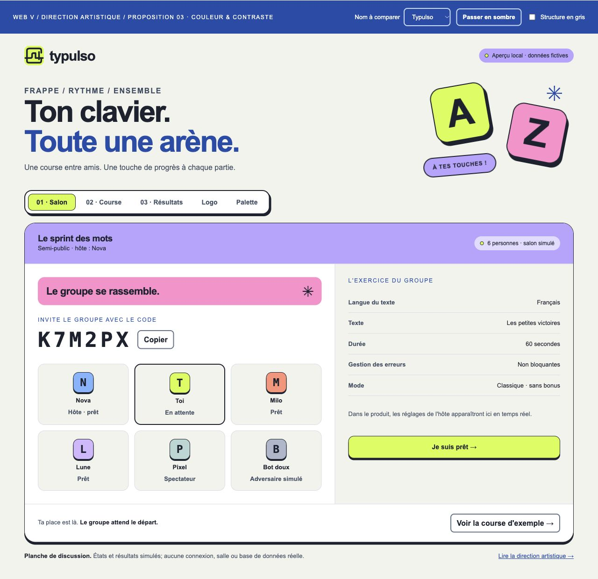
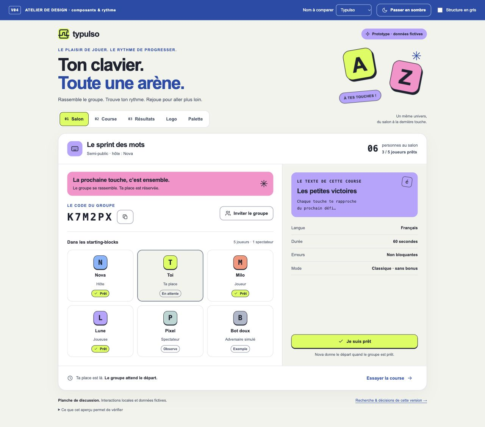

# Vérification du dossier et de l’aperçu

> **Portée :** je conserve ici mes recherches, propositions ou observations à leur date. Ces éléments expliquent ma démarche de conception; une maquette ou un test prévu ne constitue pas une preuve de fonctionnement en production.

> **1er octobre 2026 · America/Toronto · proposition v0.4**  
> Périmètre : documentation, skill, visuels et prototype local. Aucune preuve d’application ou de production.

## Contrôles initiaux — historique v0.1 à v0.3

| Objet | Vérification | Résultat et portée |
|---|---|---|
| Exigences | Correspondance cahier initial → cahier consolidé → matrice | 59 identifiants conservés : 49 exigences et 10 hypothèses; 8 CLIENT et 10 CP1 ajoutés; 77 lignes concordantes, sans doublon |
| Checkpoint | Comparaison avec la grille jointe | Six critères, 100 points; salon partagé et code, temps réel, authentification, base et HTTPS prévus dès CP1 |
| Sources | Réponses client, slides, conversation antérieure et extraits de transcription relus | Attribution et limites dans le registre; aucune remise, publication ou prise de contact effectuée |
| Recherche | Ouverture des pages finales, remplacement des blocages et dédoublonnage | 51 sites supplémentaires accessibles; huit sites observés visuellement, dont sept du corpus et Monkeytype |
| Identité | Relecture du nom, des logos et des mentions de provenance | Douze noms explorés; trois symboles proposés; aucune identité finale ni contribution humaine inventée |
| Skill | Frontmatter, noms, références et copie installée | SKILL.md et les deux références identiques entre le workspace et l’installation; métadonnées préexistantes conservées |
| Liens locaux | Existence des destinations Markdown, CSS, images et aperçu | 98 références locales présentes; aucun lien de fichier manquant; blocs de code équilibrés dans 20 documents Markdown |
| Visuels | Rendu SVG → PNG et inspection du moodboard | Planches lisibles et sources SVG éditables; polices système explicitement indiquées |
| Aperçu | Navigateur rendu à 1280 × 720 puis 390 × 844 | Salon et course inspectés au bureau; cinq vues inspectées sur petit écran; aucune largeur au-delà de 390 px |
| Interactions | Prêt, nom, onglets, thème, gris, saisie, classement | Changements locaux visibles; Rytapo mis à jour dans les trois signatures; précision 100 % pour « Chaque touche te », 0 % pour « X »; classement déplié |
| Clavier | Onglet Résultats → touche Home | Retour au Salon avec onglet actif et focus cohérents |
| Mouvement | Styles effectifs des deux touches | Animations actives au Salon, `none` dans la Course; règle de mouvement réduit relue; pas d’émulation de préférence système effectuée |
| Chargement | Images et journal du navigateur | Aucune image en échec; aucun avertissement ni erreur remonté pendant ce contrôle |

L’aperçu est une **planche de discussion HTML/CSS autonome**. Son petit script gère les démonstrations locales; il ne constitue pas le futur code applicatif TypeScript. La minuterie, les adversaires, le classement et les résultats sont fictifs. La frappe met à jour un exercice local, sans stockage et sans synchronisation réseau. Elle ne mesure pas une vraie vitesse de course.

## Contrastes des couleurs proposées

Calcul sur aplats opaques sRGB, avec linéarisation des canaux et rapport `(Lclair + 0,05) / (Lsombre + 0,05)`. La cible de cette révision est 7:1 pour le texte fonctionnel courant et 3:1 pour les contours/focus essentiels. Chaque paire de texte fonctionnel a été vérifiée sur le fond et la surface de son thème.

| Paire ou groupe | Rapport | Résultat |
|---|---:|---|
| Texte principal clair / fond et surface | 15,27–16,97:1 | Passe |
| Texte secondaire clair / fond et surface | 7,80–8,67:1 | Passe |
| Bleu fonctionnel clair / fond et surface | 7,31–8,12:1 | Passe |
| Erreur claire / fond et surface | 7,08–7,87:1 | Passe |
| Texte principal sombre / fond et surface | 13,20–15,85:1 | Passe |
| Texte secondaire sombre / fond et surface | 8,59–10,32:1 | Passe |
| Bleu fonctionnel sombre / fond et surface | 8,11–9,74:1 | Passe |
| Erreur sombre / fond et surface | 7,73–9,28:1 | Passe |
| Bordures de contrôle, deux thèmes | 4,26–5,19:1 | Passe à 3:1 |
| Texte à saisir clair / fond et surface | 7,80–8,67:1 | Passe |
| Texte à saisir sombre / fond et surface | 9,19–11,05:1 | Passe |
| Encre / citron | 14,76:1 | Passe |
| Encre / rose | 8,14:1 | Passe |
| Encre / lavande | 7,92:1 | Passe |
| Encre / bleu ciel | 8,02:1 | Passe |
| Encre / corail | 7,89:1 | Passe |
| Blanc / bleu de marque | 8,12:1 | Passe |

Les références sont les critères officiels W3C : [contraste renforcé du texte](https://www.w3.org/WAI/WCAG22/Understanding/contrast-enhanced.html), [contraste des éléments non textuels](https://www.w3.org/WAI/WCAG22/Understanding/non-text-contrast.html) et [texte des placeholders](https://www.w3.org/WAI/WCAG22/Understanding/contrast-minimum.html).

Le focus utilise le bleu fonctionnel sur les surfaces de lecture et le citron sur le bandeau bleu. Les accents citron, rose, lavande, bleu ciel et corail **ne passent pas 3:1 seuls sur blanc ou craie**. Ils servent donc de surfaces avec texte encre ou de décoration avec information explicite; les curseurs reçoivent un contour contrasté. Les rangs et pourcentages restent lisibles sans distinguer les couleurs.

## Révision v0.3 : contraste dans les vues rendues

Les cinq vues ont été examinées en clair et sombre à 615 px, puis en clair à 390 px. L’audit a lu les couleurs calculées des groupes de texte du DOM et composé leurs fonds unis; il a relevé entre 30 et 59 groupes par vue. Aucun groupe contrôlé n’était sous 7:1 : minimum 7,31:1 en clair et 7,89:1 en sombre. Les textes de course, placeholders, erreurs et pistes ont aussi été contrôlés par leurs styles effectifs. Aucune largeur ne dépassait le viewport dans ces vues.

Ce relevé concerne les états observés et des fonds unis : il ne mesure pas automatiquement les pixels des SVG, les dégradés ou toute opacité possible. Les deux cas de logo ont été corrigés et inspectés séparément : encre sur lavande à 7,92:1; logo monochrome sur plaque craie à 15,27:1. Les contours des champs, onglets actifs et repères du joueur sont renforcés. Le focus du studio en mode gris utilise une couleur claire.

Les captures locales et le moodboard ont été actualisés après cette révision. Le skill général n’a pas été modifié.

## Révision v0.4 : recherche complémentaire et composants

Les lots D–F ajoutent **51 nouvelles références**, soit **102 entrées A–F** hors Kahoot, Wooclap et Monkeytype. Le contrôle des registres retrouve 17 identifiants par lot et aucun domaine primaire répété entre les 102 entrées. Huit nouvelles références ont fait l’objet d’une revue rendue : cinq exploitables et trois partielles, avec limites et captures consignées. Les fonctions décrites dans une aide officielle restent distinguées des interactions réellement testées.

La palette v0.3 est conservée. Le prototype v0.4 précise les contrôles, le salon, la frappe et les résultats; la spécification des 18 composants prépare leur future réalisation React/Next.js/Tailwind. Aucun framework, kit de composants, serveur ou base de données n’a été installé pour cette révision.

| Contrôle | Observation réelle | Portée |
|---|---|---|
| Contraste rendu | Cinq vues en clair et sombre à **390 px CSS**; 34–75 groupes de texte contrôlés par vue. Minimum **7,31:1** en clair et **7,89:1** en sombre; aucun groupe relevé sous 7:1. Contrôles complémentaires de Course et Résultats à 1280 px. | Fonds unis composés à partir du DOM; pas une certification globale. Le podium a été revérifié après sa correction sémantique. |
| Adaptation | Largeur du document égale à 390 px dans les dix vues contrôlées. Salon en deux colonnes de joueurs sur petit écran; panneau d’exercice empilé. | Aucun débordement horizontal constaté aux dimensions testées. |
| Invitation au clavier | Ouverture avec focus sur fermer; Tab parcourt copier → revenir au salon → fermer; Escape ferme et remet le focus sur l’invitation. | Dialogue natif local; aucune salle partagée créée. |
| Copie | Confirmation « Code d’exemple copié : K7M2PX. » dans le dialogue; le toast extérieur reste masqué. | Copie locale via Clipboard API; aucun envoi à un service. |
| État prêt | Bouton, badge et compteur passent de 3/5 à 4/5; `aria-pressed` suit l’état. | Démonstration locale; pas de validation serveur. |
| Frappe | Initialement précision « — », progression 0. « Chaque touche te » donne 100 % de précision, 17 % du texte; « X » donne 0 % de précision. | Exercice fixe de 94 caractères; aucune mesure de vitesse réelle. |
| Stabilité de frappe | Positions absolues, largeurs et retours à la ligne des mots identiques avant/après une erreur, tolérance 0,01 px. Aucun gras variable; caret sans changement de largeur. | Géométrie comparée dans le navigateur, sur l’exercice local. |
| Fin de texte | Texte complet : précision et progression 100 %; caret final présent; curseur de piste contenu dans son bord droit. | Cas limite vérifié; caractères supplémentaires comptés comme erreurs. |
| Concentration et reprise | Introduction masquée en concentration; touches sans animation pendant Course; recommencer vide le champ et lui rend le focus. | Préférence système de mouvement réduit relue dans le CSS, sans émulation. |
| Onglets et podium | Home depuis Course revient au Salon avec focus cohérent. Podium lu dans l’ordre Nova 1, Toi 2, Milo 3, tout en gardant le premier au centre visuellement. | Clavier et arbre d’accessibilité inspectés; lecteur d’écran réel restant à tester. |
| Variantes | Rytapo mis à jour dans les trois signatures; mode structure en gris activé puis retiré. | Polices système de secours conservées; nom non validé. |
| Chargement et syntaxe | Trois images chargées; journal navigateur sans avertissement ni erreur au contrôle; `node --check` passe sur `prototype.js`. | Pas de build Next.js : le livrable reste HTML/CSS/JavaScript. |
| Liens et dossier | 177 références locales présentes et blocs de code équilibrés dans 28 documents Markdown; aucune destination de fichier manquante ni dépendance hors du dossier. | Contrôle après les mises à jour documentaires et les captures v0.4. |
| Conservation du skill | Skill général et copie du projet inchangés par cette révision. | La recherche suit la méthode déjà installée. |

Deux finitions ont été corrigées pendant la vérification : un changement de fond d’onglet pouvait créer brièvement une paire peu contrastée, et le caret final sortait de la piste à 100 %. La transition de fond a été retirée et le curseur borné. Les captures ci-dessous montrent l’état final; les anciennes captures v0.3 sont conservées. La taille de l’image capturée ne sert pas de mesure du viewport CSS : le navigateur applique son facteur de zoom.

Ces vérifications ne couvrent pas toutes les combinaisons d’états. La composition IME est protégée dans le code mais n’a pas été testée avec un clavier IME réel; la saisie tactile, les lecteurs d’écran et les essais avec le public cible restent à réaliser. Les captures n’attestent pas les animations des références externes.

## Contrôles restant à faire

- Implémentation Next.js/TypeScript, authentification réelle, migrations PostgreSQL, deux navigateurs synchronisés et production HTTPS.
- CI, tests unitaires du moteur, intégration, charge à 30 personnes, reconnexion et transfert d’hôte.
- Essais avec adolescents, saisie tactile, lecteur d’écran, zoom et préférences système de mouvement réduit.
- Intégration des polices proposées et licences; petit format du logo; contributions humaines et identité définitive.
- Rendu des diagrammes Mermaid dans GitHub : les blocs ont été relus, mais aucun moteur Mermaid n’était installé pour les compiler ici.

Le validateur Python officiel du skill n’a pas été exécuté : PyYAML manque dans les runtimes disponibles. Le frontmatter simple, les références, l’absence de placeholders et la copie installée ont été contrôlés directement. Cette vérification ne certifie pas l’accessibilité ni la disponibilité d’un futur service.

## Regroupement du dossier

Les livrables ont été déplacés dans `projet-course-de-frappe/`. Les sources liées ont été copiées dans `sources/`, leurs liens ajustés et 108 références locales contrôlées après regroupement : aucune destination manquante et aucune dépendance de fichier hors du dossier. Le skill général de Codex reste à son emplacement; le projet et le workspace en conservent des copies. L’aperçu est servi depuis le nouvel emplacement à la même adresse locale.

## Révision v0.5 : toutes les pages

Le rapport du 2 octobre documente la revue de 20 écrans et 74 combinaisons d’états, leurs contrastes et les parcours locaux réellement contrôlés. Les résultats v0.3 et v0.4 ci-dessus restent des vérifications historiques. L’ancienne planche est conservée dans atelier.html; l’aperçu principal montre maintenant le site de conception complet. La stack future, les choix d’identité et les preuves réseau du checkpoint restent distincts de cette maquette.
