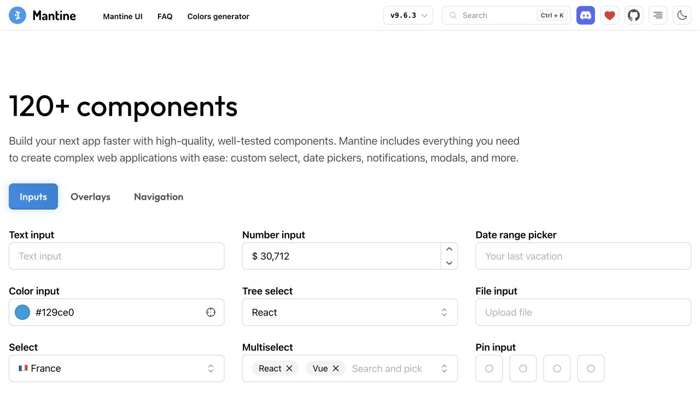

# Deuxième exploration — du style au soin des composants

> **1er octobre 2026 · America/Toronto · proposition v0.4**  
> **51 nouvelles références distinctes**, en complément des 51 du premier corpus  
> Direction confirmée : **colorée, vibrante, amusante et ludique**  
> Résultat : aperçu local affiné et spécification des futurs composants React / Next.js / Tailwind

[← Documentation](README.md) · [Premier corpus](12-recherche-inspiration.md) · [Direction artistique](03-direction-artistique.md) · [Composants](14-composants-interface.md) · [Vérification](11-verification.md)

La demande est d’enrichir l’inspiration et d’atteindre le soin attendu d’une application web moderne. Cette recherche porte donc sur le **salon, le code d’invitation, les états des joueurs, la frappe et les résultats**. Les marques ludiques donnent des pistes d’expression; les outils plus sobres et les systèmes de composants donnent des contrepoints utiles pour la précision. « Moderne » devient ici un ensemble de propriétés vérifiables : hiérarchie, espacement, états, clavier, adaptation mobile et stabilité.

## 1. Corpus complémentaire

Les pages officielles finales ont été ouvertes et lues. Les aides officielles remplacent certains accueils vides; elles approfondissent la même identité et ne gonflent pas le décompte. Les détails, exclusions et limites sont conservés dans chaque lot.

| Lot | Famille | Sites supplémentaires | Preuve commune | Registre |
|---|---|---:|---|---|
| **D** | Applications créatives, sociales et personnelles | 17 | Texte et descriptions d’images; fonctions documentées | [Lot D](recherche/lot-d.md) |
| **E** | Jeux, participation et apprentissage | 17 | Texte, modèles d’interface, aides et articles officiels | [Lot E](recherche/lot-e.md) |
| **F** | Composants, design systems et mouvement | 17 | Catalogue et documentation primaire | [Lot F](recherche/lot-f.md) |
| **Cette exploration** | Trois familles complémentaires | **51** | Décompte par identité; aucun doublon entre lots | D01–D17, E01–E17, F01–F17 |
| **Cumul des deux corpus** | A–F | **102** | Les 3 inspirations initiales sont hors de ce total | [A–C](12-recherche-inspiration.md) + D–F |

Arc et son renvoi vers Dia restent une entrée. TypeRacer et son blog, Gimkit et son aide, Little Alchemy et ses indices, Luma et ses redirections/aides restent chacun une identité. Flowbite React est l’entrée officielle de la famille Flowbite. Le catalogue Polaris actuel est étudié dans son contexte Shopify; il n’est pas proposé comme kit React pour notre application indépendante. Les pages officielles React, Next.js, Tailwind et WAI approfondissent l’intégration et restent hors des 51.

Cette collecte est une **recherche publique ciblée**, pas une aspiration de sites complets. Elle ne copie aucun logo, personnage, illustration ou template concurrent dans notre interface.

## 2. Revue rendue complémentaire

Huit nouvelles références ont aussi été examinées dans le navigateur. **Cinq rendus exploitables** et **trois rendus partiels** sont distingués ci-dessous. Les inspections concernent les pages publiques indiquées; elles ne prétendent pas couvrir les applications après connexion. Les captures fixes ne prouvent pas le mouvement.

| Référence et page rendue | Niveau / observation réellement vue | Ce que notre version en retient | Preuve |
|---|---|---|---|
| [shadcn/ui](https://ui.shadcn.com/) | Accueil rendu; boutons principal/secondaire/outline, champs et cartes. Dialogue de démonstration ouvert : titre, phrase courte, deux actions; focus initial sur l’annulation. | Un vocabulaire limité de contrôles, une composition de dialogue courte et une hiérarchie nette. | Navigation CUA à 1280; interaction de dialogue observée. |
| [Headless UI](https://headlessui.com/) | Fond sombre, accents colorés périphériques, grille de démonstrations de contrôles. | Une personnalité indépendante de la mécanique; décoration séparée du contenu central. | [Capture](assets/recherche-v04/headless-ui.jpg) |
| [Mantine](https://mantine.dev/) | Section Inputs rendue après sélection : labels persistants, champs alignés, hauteurs et espacements réguliers, combobox et saisie de code. | Même hauteur et mêmes rayons pour les contrôles; label conservé pendant la saisie. | [Capture](assets/recherche-v04/mantine-inputs.jpg) |
| [Chakra UI](https://chakra-ui.com/) | Accueil clair, titre contrasté, accent discret et paire de boutons d’action; bandeau de couleur séparé. | Actions nettes, surfaces calmes et accent expressif localisé. Les états de chargement viennent de la documentation, pas de ce rendu. | [Capture](assets/recherche-v04/chakra-ui.jpg) |
| [mymind](https://mymind.com/) | Titre ample, beaucoup d’espace, capsules colorées et action orangée. Visuel de téléphone partiellement chargé. | Hiérarchie typographique et rythme des surfaces; nos propres paires texte/fond contrastées. | [Capture](assets/recherche-v04/mymind.jpg) |
| [Gartic Phone](https://garticphone.com/) | **Partiel** : fond violet, pseudo, modes anonyme/authentifié, action de départ et tutoriel par étapes visibles; personnage, logo et certaines polices manquants. | Entrée collective simple, présence expressive et explication courte à proximité. Aucun salon créé. | [Capture partielle](assets/recherche-v04/gartic-phone.jpg) |
| [skribbl.io](https://skribbl.io/) | **Partiel** : univers bleu, marque multicolore, pseudo/langue, action jouer et action salle privée; aperçu d’avatar manquant. | Peu de choix avant l’activité et distinction entre action principale et invitation du groupe. Aucun jeu lancé. | [Capture partielle](assets/recherche-v04/skribbl.jpg) |
| [Pitch](https://pitch.com/) | **Partiel** : fond lavande diffus, action citron et surface de saisie arrondie; une partie du contenu principal reste invisible. | Contraste entre expression périphérique et surface de travail. Pas de conclusion sur l’écran complet. | [Capture partielle](assets/recherche-v04/pitch-partiel.jpg) |

**Limites de rendu consignées :** Linear est resté sur « Loading »; Raycast a bloqué les commandes de capture; Keybr n’a affiché que sa navigation sans l’exercice. Aucun jugement sur leurs animations ou leur zone de travail n’est déduit de ces tentatives. Leurs preuves textuelles éventuelles restent celles des lots; Keybr est exclu du corpus retenu.

## 3. Décisions transposées dans notre aperçu

Le principe directeur reste **« une arène expressive autour d’un exercice précis »**. La v0.4 conserve les couleurs et leur contraste; elle réduit les contours lourds répétés et précise la composition des composants.

| Sujet | Proposition précédente | Version v0.4 | Raison / références |
|---|---|---|---|
| **Panneaux et contrôles** | Contours encre et ombres dures sur plusieurs niveaux | Panneau avec contour décoratif fin et ombre douce; contrôles délimités, rayon 12 px; profondeur courte sur l’action citron | Réserver la profondeur expressive aux touches et à l’action; régularité observée dans Mantine et shadcn. |
| **Invitation** | Code et copie séparés; partage absent | Code/copie regroupés; action « Inviter le groupe »; dialogue court avec règle d’accès et code d’exemple | La règle semi-publique est visible avant de partager; distinction d’accès documentée chez Luma/Whereby, anatomie de dialogue shadcn/Headless. |
| **Participants** | Avatar, pseudo et statut dans une carte | Grille régulière; rôle et badge distincts; carte personnelle identifiée; compteur prêt synchronisé localement | L’état est une donnée lisible. Principes de statut explicite chez Linear et variantes de composants du lot F. |
| **Exercice du salon** | Liste de réglages seule | Aperçu lavande du texte, puis quatre réglages et une action prête dominante | Montrer ce que le groupe va pratiquer avant ses paramètres; proximité contenu/action chez Craft et Padlet. |
| **Course** | Métriques, saisie et décoration partageaient le même poids | Métriques séparées; label persistant; champ net; mots et caret sans modification de largeur; mode concentration | Contrepoint de concentration de mymind; champs observés Mantine; contraintes de saisie de [React](https://react.dev/reference/react-dom/components/input). |
| **Progression et résultat** | Pistes minimalistes; résumé très coloré | Avatar, rang, pseudonyme et pourcentage par piste; progression accessible; podium coloré avec résumé personnel calme | L’information demeure lisible sans distinguer les couleurs; apprentissage et classement ont des rôles différents. [Typing.com](https://www.typing.com/) et [TypeRacer](https://blog.typeracer.com/2025/10/10/new-mode-type-on-race-results/) apportent le contexte des mesures. |
| **Retour d’action** | Message dans le bas du salon | Confirmation de copie non bloquante; état prêt via texte, badge, bordure et compteur; focus visible commun | La finition inclut le résultat de l’action. États décrits dans [HeroUI](https://heroui.com/en/docs/react/components/button) et [Chakra](https://chakra-ui.com/docs/components/button). |

La réduction des grandes bordures ne retire pas les repères fonctionnels. Les champs, boutons outline et focus gardent une couleur contrastée. Citron, rose et lavande portent toujours l’encre dédiée, dans les deux thèmes.

## 4. Mouvement et détails

| Élément | Comportement de la planche | Pourquoi |
|---|---|---|
| Touches illustrées | Oscillation de 4 / 4,6 s, arrêt dans la Course, disparition sur petit écran | Exprimer le clavier dans les moments collectifs. |
| Action principale | Retour de pression court, 160 ms | Donner une réponse perceptible au clic sans retarder l’état. |
| Progression locale | Transition linéaire de 160 ms; curseur borné à la largeur de la piste | Adoucir le repère périphérique sans dépasser la piste à 100 %. |
| Texte de frappe | Couleurs et soulignement; mots de largeur constante; aucun gras variable ni translation du texte | Préserver la lecture et la position des mots. |
| Mode concentration | Masque l’introduction et recentre le panneau | Dégager la tâche sans retirer la progression ni l’accès aux contrôles. |
| Mouvement réduit | Animations et transitions supprimées par média CSS | Garder le même contenu et les mêmes états. |

Pas d’effet 3D, de défilement forcé, de pointeur suiveur, de son imposé ni de compteurs qui roulent pendant la frappe. Les animations annoncées par Motion, Aceternity ou Magic UI restent des pistes pour des moments ponctuels; aucune bibliothèque d’animation n’est nécessaire à cet aperçu.

## 5. Préparer les composants de la future stack

La [spécification de composants](14-composants-interface.md) décrit anatomie, variantes, états et comportements. La recommandation est de garder **un habillage original relié à nos tokens**, puis de choisir une base comportementale accessible après comparaison sur un champ, des onglets et un dialogue réels. Aucun kit ni version n’est adopté dans cette recherche.

Les documents officiels précisent les points à respecter : [frontières serveur/client de Next.js](https://nextjs.org/docs/app/getting-started/server-and-client-components), [valeur et caret d’un input React](https://react.dev/reference/react-dom/components/input), [variantes d’état Tailwind](https://tailwindcss.com/docs/hover-focus-and-other-states) et [navigation des onglets Radix](https://www.radix-ui.com/primitives/docs/components/tabs). Les références sont des aides à la construction; leur simple importation ne prouve pas le soin ou l’accessibilité du résultat intégré.

La v0.4 reste une planche HTML/CSS/JavaScript locale. La création du projet Next.js, du serveur de jeu, de PostgreSQL et du déploiement viendra après la validation de ce cadrage. Nom et logo restent des explorations attribuées; cette révision ne les valide pas.

## 6. Repères pour la prochaine validation

1. La personne distingue le code, l’état du groupe et sa propre action au premier regard.
2. Le même composant garde sa taille et son sens dans les deux thèmes et sur petit écran.
3. Les contrôles se parcourent au clavier; le dialogue contient le focus, ferme avec Escape et rend le focus à l’invitation.
4. Une erreur de frappe ne déplace ni les mots ni les lignes; le retour ne dépend pas de la couleur seule.
5. Le classement et le progrès personnel se comprennent avec les effets coupés.

Les résultats observés et les limites sont consignés dans [la vérification v0.4](11-verification.md). Les préférences du public cible restent à tester avec des personnes réelles.
