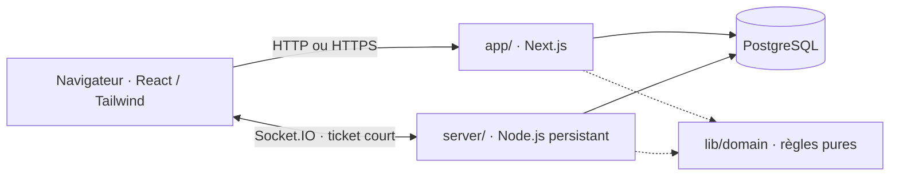
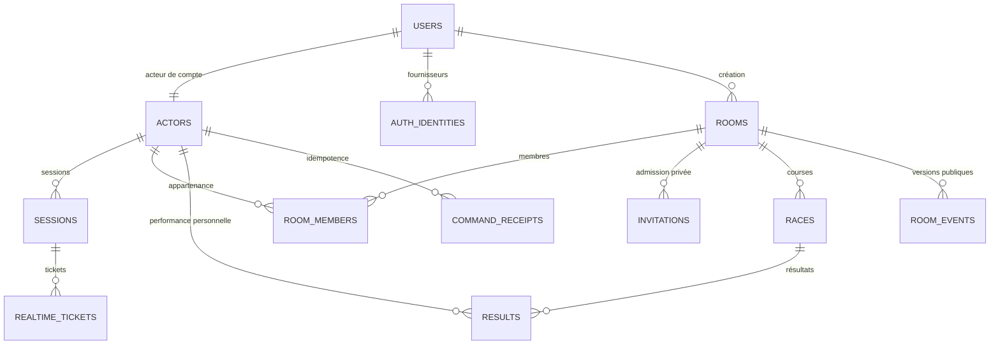
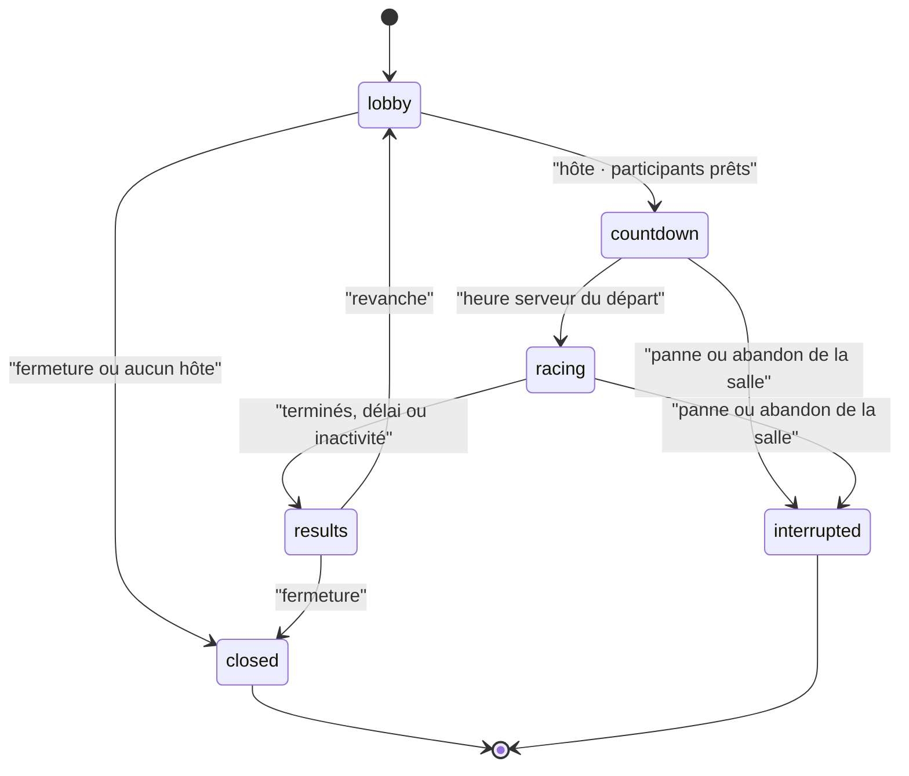

# Architecture de l'implémentation

**Auteur : YANN CEDRICK KOUEKAM TELEWOU**

> **Authentification actuelle :** j’ai limité la connexion aux comptes au **pseudonyme et au mot de passe**. Les options **OAuth GitHub/Discord sont prévues pour la suite**; le code préparatoire ne constitue pas une connexion externe livrée. L’accès invité reste distinct de l’authentification d’un compte.

> **Structure applicative · actualisée le 7 octobre 2026 · commit applicatif vérifié 4d23075**

Ce document décrit le code réellement présent. Les documents 05/06/07 et l’ADR temps réel ont été harmonisés avec cette structure le 7 octobre; les explorations et recettes anciennes gardent leur date. Le dossier CP1 et la synthèse du rapport 20 relient le commit applicatif **4d23075**, la CI distante réussie et le salon vérifié sur Railway. Le dépôt est privé.

Les dernières itérations incluent la frappe directement dans le texte sans rectangle de saisie visible, les repères de progression des autres joueurs, les pistes animées, les sons et capacités classique/arcade, le terrain de jeu du salon et le favicon reprenant le logo. Leur intégration ne signifie pas que tous les parcours ont été vérifiés en production.

## Un dépôt simple, deux processus

Le projet de référence `cours-next-js` utilise App Router, TypeScript, Bun et Tailwind à la racine. Typulso reprend cette structure plutôt que le monorepo initialement envisagé. Les responsabilités restent séparées.

| Répertoire | Responsabilité |
|---|---|
| `app/`, `components/` | Pages, layouts serveur, interactions React et présentation des états. |
| `app/api/` | Identité, inscription, connexion, déconnexion, tickets, profils et résultats. |
| `lib/client/` | Stores à snapshot SSR stable, préférences locales et connexion Socket.IO. |
| `lib/domain/` | Validation des réglages, génération du texte et moteur de frappe avec temps explicite. |
| `lib/server/` | Sessions, sécurité HTTP, transactions et projections publiques. |
| `server/` | Commandes de salle, présence, horloge, bots et diffusion des instantanés. |
| `db/` | Schéma Drizzle et migrations SQL rejouables. |
| `types/game.ts` | Types communs des réglages, commandes, réponses et résultats. |

## Rendu et données

Next.js utilise `cacheComponents: true` et React Compiler. Les composants serveur conservent les responsabilités statiques; les interactions et stores vivent dans des composants client. Les appels runtime sont placés sous Suspense. L'identité et les autorisations ne sont jamais stockées dans un cache partagé. Les polices sont installées localement, sans téléchargement Google Fonts à la compilation.

La langue d'interface FR/EN et le thème clair/sombre sont des préférences du navigateur. La langue du texte de course est un réglage de salle indépendant. Les historiques et scores proviennent du serveur; les états sans course affichent une absence de données explicite.

Les licences des polices livrées avec l'application sont conservées dans Space Grotesk et IBM Plex Mono.

## Présentation pleine largeur · ajustement du 4 octobre

L'en-tête, le contenu et le pied de page occupent la largeur de l'écran. Une marge commune `--page-gutter` varie de 20 à 40 px, puis reste à 16 px sous 540 px. Les panneaux de course, les formulaires et les états vides suivent ce cadre; les limites de longueur des paragraphes et des dialogues servent uniquement la lecture.

Au-dessus de 1 050 px, les boutons ont une hauteur minimale de 56 px, les champs de 56 px et les cartes un padding de 32 à 40 px. Les titres d'accueil grandissent avec l'écran, de 64 à 104 px. Sur ordinateur, l'en-tête utilise trois colonnes : deux colonnes latérales de même largeur entourent le menu, centré exactement sur l'écran. Le logo reste à gauche et les commandes à droite. La navigation passe sur sa propre ligne sous 1 200 px, avec un écart vertical de 12 px; elle garde sa grille 2 × 2 sous 380 px. Les contrôles mobiles conservent un minimum de 44 px.

Sur l'accueil, deux colonnes partagent la largeur disponible, séparées de 24 à 40 px sur ordinateur. La carte de connexion occupe au maximum 640 px et se centre dans sa colonne : elle utilise une partie de l'espace libre à droite sans agrandir le formulaire. Son padding varie de 24 à 36 px et son titre de 30 à 40 px. Dans la mise en page à deux colonnes, le paragraphe d'introduction est limité à 20 em, soit 420 px avec sa taille de texte de 21 px sur ordinateur; ses retours à la ligne restent naturels dans les deux langues. Les actions suivent immédiatement le paragraphe. Les deux touches utilisent un écart de base fixe de **72 px**, indépendant de la colonne disponible; la largeur de leur scène suit la somme des deux touches, de cet écart et des marges. Cela réserve la place des rotations et évite leur contact sur grand écran. Les touches décoratives restent visibles à toutes les tailles : grandes et placées à côté des actions à partir de 1 400 px, compactes sous les actions aux formats intermédiaires et mobiles. À 800 px et moins, l'introduction occupe toute la largeur disponible et se centre : titre, paragraphe, actions, repères et lettres. Le paragraphe perd sa limite de 20 em dans ce format; les lettres restent sous les actions. La carte suit l'introduction dans une seule colonne et se centre elle aussi; sur mobile elle prend la largeur disponible. Le code est centré dans son champ uniquement sur l'accueil. Les lettres rebondissent désormais sur des cycles décalés de **3,2 et 3,8 secondes**, avec une montée de **24–26 %** de leur taille (environ 20–22 px sur mobile et 36–40 px sur grand écran), des rotations plus marquées et un léger effet de ressort par changement d’échelle. Seul `transform` est animé. La préférence système et le réglage de réduction de mouvement les désactivent sans masquer les lettres; le réglage des effets expressifs reste respecté.

Les titres `h1`, `h2` et `h3` de l'application utilisent maintenant la graisse **700** de Space Grotesk, déjà fournie localement, pour renforcer la hiérarchie demandée. Leurs tailles et les règles de mise en page restent identiques.

Le pied de page partagé SiteFooter (`components/site-footer.tsx`) suit désormais la proposition « Dernière touche » : grande signature Typulso, motif original de touches et deux groupes de destinations, **Jouer** et **Bien jouer**. Le bas propose un retour citron vers les courses publiques. Sous 760 px, l’identité se centre au-dessus des groupes; sous 540 px, le motif et l’action s’empilent; sous 350 px, les groupes passent à une colonne. L’entraînement utilise le footer complet, comme les pages ordinaires. Les salles utilisent une variante compacte avec les trois liens d’aide. La palette, les textes encre sur les touches pastel, les contrôles de 44 px et le focus sont conservés. La règle CSS qui masque le footer en concentration reste présente; son activation n’a pas été exercée pendant cette recette.

Les fondations restent dans la feuille de styles de l'application (`app/globals.css`). Les styles ciblés du footer (`app/footer.css`), du jeu (`app/race.css`) et des résultats (`app/results.css`) sont importés une seule fois par le layout racine, après les fondations, sans redimensionnement artificiel de la page. Les mesures et captures documentent cette évolution.

Les dialogues natifs partagés retrouvent leur centrage avec `margin: auto`, nécessaire après la remise à zéro des marges par Tailwind. Une marge de sécurité `--dialog-gutter` varie de 16 à 32 px autour du panneau. Les largeurs restent limitées à 540 px, ou 920 px pour la variante large; la hauteur suit le viewport dynamique moins ces marges. Les formulaires longs défilent à l’intérieur du dialogue. Le mécanisme natif `showModal()`, la fermeture par Échap, le focus et les couleurs sont conservés.

## Footer, course et bilan · intégration du 4 octobre

Les pistes de recherche sont intégrées avec les composants et dépendances déjà présents. RaceDashboard, ArcadeControls et RaceTracks (`components/race-interface.tsx`) séparent les mesures, la frappe, l’énergie arcade et les concurrents. Le tableau de bord est partagé avec l’échauffement solo. Les pistes gardent leur ordre d’arrivée pour rester stables; leur position est explicitement calculée selon la progression, distincte du classement officiel final. La connexion et les raisons de désactivation des capacités sont écrites. Les guards existants, les acquittements et la réconciliation de saisie restent inchangés.

ResultsPanel (`components/results.tsx`) présente le bilan personnel avant le podium : vitesse, précision, erreurs et corrections, puis actions de suite, podium et tableau. Le rang reste celui du serveur; seuls les rangs officiels 1–3 apparaissent au podium. Les couleurs initiales et les traductions FR/EN sont conservées. À 600 px et moins, les mesures du jeu utilisent une grille 2 × 2 et les pistes se répartissent sur deux lignes. Le bilan dispose aussi de quatre mesures, puis deux colonnes sur mobile.

La recette locale distingue les vérifications visuelles, les tests PostgreSQL/Socket.IO et les vérifications de production encore à réaliser.

La page de salle redirige vers Jouer (`/`) lorsque le serveur confirme une fermeture/interruption ou refuse l’accès avec `room_closed`. La navigation remplace l’entrée de salle dans l’historique et annule les lots de saisie en attente. La recette locale couvre la fermeture en direct, l’ancien lien et le retour navigateur.

## Modèle réellement persisté

Les acteurs invités et bots n'ont pas de compte `users`. `oauth_states` prépare la protection des retours OAuth pour l’évolution ultérieure; `rate_limits` conserve les fenêtres de débit; `schema_migrations` trace les migrations appliquées. Les identifiants sont UUID; les contraintes et clés étrangères sont dans la migration initiale (`db/migrations/0001_initial.sql`). La clé composite différée de l'hôte garantit son appartenance à la salle dans la transaction de création.

Les transitions relèvent du serveur, jamais d'une minuterie React. Les instantanés complets sont diffusés toutes les 250 ms pendant la course; les commandes produisent aussi des instantanés immédiats. La salle active reste sur une seule instance de service.

## Identité, permissions et transport

Une identité de jeu est un acteur stable lié à un compte, ou un acteur invité lié à sa session. Une session opaque est stockée par empreinte dans PostgreSQL; le navigateur reçoit un cookie HttpOnly. L’authentification actuelle des comptes utilise uniquement le pseudonyme et le mot de passe; les mots de passe sont hachés avec Argon2id. Les connexions OAuth GitHub/Discord sont prévues pour la suite. Leur code préparatoire conserve une identité externe distincte du pseudonyme, sans fusion implicite de comptes.

Le navigateur demande un ticket de connexion court et à usage unique via HTTP, puis l'utilise dans la connexion Socket.IO. À chaque commande, le serveur relit l'identité et les droits. L'invité peut participer; il ne peut pas créer une salle. Le rôle d'hôte reste temporaire et transférable.

Le client envoie `command`, reçoit un acquittement typé et écoute `room:state`. Les modifications sont transactionnelles, avec version et réponse idempotente persistée. L'état durable d'une salle comporte une projection privée JSONB; les instantanés destinés au navigateur retirent secrets, invitations et saisie des autres joueurs. Les membres et résultats sont également indexés dans les tables métier.

La création d'une invitation constitue une exception au rejeu de l'acquittement : son URL est remise une seule fois au demandeur. PostgreSQL conserve uniquement l'empreinte du jeton et un reçu sans URL. Répéter le même `commandId` renvoie `invitation_already_issued`, sans générer un second lien. Si l'acquittement initial a été perdu, l'hôte demande une nouvelle invitation avec une nouvelle commande. Ce choix évite de conserver le secret en clair dans le journal des reçus.

## Frappe et reprise

La zone de frappe présente une saisie immédiate et envoie des opérations ordonnées : insérer un caractère Unicode normalisé ou effacer. Le serveur contrôle l'identifiant de course et la séquence, puis calcule erreurs, corrections, précision, progression et vitesse. Le classement et le départ commun de trois secondes sont autoritaires.

Chaque opération locale porte aussi une révision. Un instantané ou acquittement différé ne remplace la valeur affichée que si toutes les opérations locales concernées sont confirmées et si la séquence serveur ne régresse pas. Les lots scindés restent protégés jusqu'au dernier acquittement. La reconnexion suspend la frappe pendant la synchronisation puis remonte un éditeur depuis la valeur confirmée; les réponses d'une ancienne course ou époque sont ignorées.

En mode bloquant, la progression correspond au préfixe correct : une mauvaise lettre reste visible, mais ne fait pas avancer la piste. En mode libre, les caractères saisis font avancer la piste; les erreurs restent comptabilisées et réduisent le score. L'abandon pour inactivité concerne les participants connectés; une déconnexion conserve sa grâce distincte de 60 secondes. Un abandon de la course ne supprime pas l'appartenance au salon, ce qui permet de consulter les résultats et de préparer une revanche.

Un retour après déconnexion récupère l'état courant; la frappe classée ne continue pas hors ligne. Une courte déconnexion réserve la place pendant 60 secondes. Le départ volontaire transfère l'hôte. Un redémarrage du service interrompt les courses actives; les salons peuvent être récupérés. La première version conserve un seul processus temps réel : plusieurs répliques demanderaient un ADR et un mécanisme de coordination supplémentaires.

## Choix de la première version

| Sujet | Choix explicite |
|---|---|
| Code de salle | Six caractères alphanumériques lisibles, admission validée par le serveur. |
| Invitation privée | Lien individuel à usage unique, durée de 24 heures, route `/invitation/[token]`. |
| Capacité | Limite serveur de 30 membres; la capacité sous charge doit être mesurée avant de l'affirmer. |
| Reconnexion | Grâce de 60 secondes; reprise par instantané. |
| Mode arcade | Pulsation/bouclier/virgule piégée, un choix de rattrapage; métriques éducatives conservées. Équilibrage à tester avec le public. |
| Authentification actuelle / évolution | Pseudonyme et mot de passe dans la version livrée. OAuth GitHub/Discord prévu pour la suite; routes préparatoires présentes, sans connexion externe déclarée opérationnelle. |
| Exécution | Bun pour installation, développement et tests; Node.js 24 pour les deux services de production. |

Les versions ont été vérifiées dans le registre npm, puis verrouillées. Les conventions s'appuient sur les [docs Next.js](https://nextjs.org/docs/app/getting-started), [versions React](https://react.dev/versions), [installation Tailwind](https://tailwindcss.com/docs/installation/framework-guides/nextjs) et [docs PostgreSQL](https://www.postgresql.org/docs/current/). TypeScript 6.0.2 reste dans la plage officiellement acceptée par le parseur ESLint installé; passer à 7 maintenant créerait une incompatibilité de pairs.

## Formules lisibles

- Vitesse : caractères actuellement corrects divisés par cinq, rapportés à une minute; durée minimale d'échantillon d'une seconde. L'effacement puis la réécriture ne multiplient pas ces caractères.
- Précision : tentatives correctes divisées par toutes les tentatives; une correction conserve l'erreur déjà commise.
- Score classique : vitesse × précision², avec précision exprimée entre 0 et 1. Les comparaisons utilisent les valeurs complètes avant arrondi d'affichage.
- Progression : caractères tapés en mode libre; préfixe correct en mode bloquant. Une lettre erronée visible n'avance pas la piste bloquante.
- Arcade : 100 d'énergie et au moins cinq points de retard, un usage par course. Pulsation et bouclier ne changent pas la vitesse/précision brute; avantage plafonné à six points. Les pièges retirent au maximum quatre points, sans score négatif.

Ces choix sont des décisions d'implémentation, pas une validation d'équilibrage avec les adolescents.

## Identité et lisibilité · ajustement du 6 octobre

La marque de l’en-tête utilise un nom de 36 à 48 px et un symbole de 48 à 64 px selon l’écran. Sur les petits écrans, la marque est centrée sur sa propre ligne; les commandes suivent, puis la navigation en deux colonnes sous 540 px. Le logo conserve son SVG et ses proportions.

Les anciens textes de 10 à 15 px des styles de l’application partagent désormais deux tailles relatives : `--text-label` de 0,9375 rem et `--text-support` de 1 rem. Les aides de formulaire et les paragraphes `.small` utilisent 1 rem avec une hauteur de ligne de 1,6. Les repères « Ensemble, en direct » et « Ton talent, ton rythme » utilisent 18 px, une graisse 500, le texte principal du thème et des icônes de 20 px. La même échelle s’applique aux styles du footer, de la course et du bilan. Les couleurs des surfaces sont conservées.

## Aide plus aérée · ajustement du 6 octobre

Les pages `/touches` et `/aide` utilisent des listes de consignes avec titres courts, touches `kbd` pour les raccourcis et icônes décoratives pour les repères de frappe. Les textes sont reformulés sans changer les règles du jeu. Les cartes gardent leur hauteur naturelle et leurs groupes sont espacés de 24 px. La comparaison des modes occupe un `aside` distinct, séparé de la grille par 36 px, ou 28 px sous 540 px. La grille passe à une colonne sous 1 100 px; les raccourcis et modes s’empilent sur mobile.

## Contraste du profil et sticker traduit · 6 octobre

Le libellé « Ton espace » du bandeau rose utilise `--on-color`, comme son texte secondaire, pour conserver une couleur encre dans les deux thèmes. Le fond rose reste identique. Le sticker du composant partagé `KeyScene` suit la langue d’interface : « À TOI DE JOUER » en français et « PRESS PLAY » en anglais, sur l’accueil et la connexion.

### Clavier des statistiques

Le composant partagé du profil et des résultats propose une vue clavier AZERTY français ou QWERTY américain, ainsi que la table détaillée existante. Les variantes d’une touche regroupent les tentatives et erreurs avant le calcul du pourcentage. Les caractères hors disposition restent affichés séparément. Une touche inutilisée affiche « — ». Sur mobile, le défilement reste contenu dans le clavier. Le choix concerne uniquement la visualisation, sans modifier la saisie ou les préférences système.

Les quatre catégories de taux d’erreur servent de filtres exclusifs dans les deux vues. Un second clic sur la catégorie active ou « Tout afficher » réinitialise le filtre. Les touches exclues sont estompées et retirées de l’arbre accessible, en conservant la géométrie du clavier; le tableau ne montre que les lignes correspondantes. Les catégories suivent le pourcentage arrondi affiché, et les touches sans tentative ne font pas partie du filtre « 0 % ».

**Historique de l’itération du 6 octobre :** les champs natifs avaient d’abord reçu un chevron espacé, des angles arrondis et des états de focus. Ils ont ensuite été remplacés par le composant personnalisé décrit ci-dessous; cette note n’est pas le contrat actuel.

### Listes d’options personnalisées

Le composant `Select` partagé remplace désormais les sélecteurs natifs dans les pages de l’application. La liste utilise la couche supérieure du navigateur (Popover API), un fond adapté au thème, des options d’au moins 44 px, une coche et un accent pour la valeur choisie. Le bouton conserve son label, un chevron espacé et les attributs combobox/listbox. Flèches, Début/Fin, Entrée/Espace, Tab, Échap et recherche par caractères sont pris en charge. La liste se place au-dessus si l’espace manque en dessous; un clic extérieur la ferme. Les règles de données et leurs validations restent inchangées. Cette implémentation remplace le comportement natif décrit dans la note précédente.

## Sensations de course intégrées · 7 octobre

Le module pur `lib/domain/arcade.ts` applique les trois capacités côté serveur. Une virgule vise le concurrent actif connecté le plus proche devant soi ; `raceId` et `targetId` sont revalidés dans la transaction. Une cible devenue protégée refuse la commande sans consommation ni nouvelle cible. Le serveur expose uniquement état du piège, protection, séries et événements confirmés ; valeur de saisie et heatmap adverse restent privées.

La virgule avertit pendant 1,2 s puis pénalise les nouvelles erreurs pendant 3 s : un point arcade par erreur, deux par attaque, quatre par manche. Un bouclier actif à l’impact absorbe le piège et expire. Fin de cible, départ ou déconnexion annulent les charges futures ; dix secondes d’immunité suivent la résolution. Les cinq premières/dernières secondes et une cible à 95 % sont protégées. Les résultats conservent les mesures brutes et détaillent bonus/pénalité.

Un `AudioContext` partagé synthétise douze motifs, avec volume et options frappe/événements indépendantes, désactivées par défaut. Limites : douze clics par seconde, deux erreurs par seconde, dépassement confirmé 500 ms et espacé de 4 s, huit voix. Muter arrête les notes programmées ; un onglet masqué suspend l’audio. Les snapshots de reprise servent de référence silencieuse et les événements sont dédupliqués. Les préférences proposent douze aperçus explicites.

Le panneau de course montre rival proche et écart de progression réel, série et protection ; les pistes gardent leurs touches sur roues. Les capacités se présentent en trois cartes, empilées sur mobile, avec explications lisibles même indisponibles. Les annonces ordinaires de duel n’alimentent pas la région live, afin d’éviter la lecture continue d’un écart changeant.

Les records utilisent une empreinte `rulesKey` persistée dans le JSON du résultat : mode, langue, correction, corpus, longueur, durée, texte personnalisé et contraintes. Comparaison de vitesse brute avec au moins vingt tentatives, première référence lorsqu’aucun historique admissible n’existe. Les anciens résultats sans empreinte restent visibles, mais ne fondent pas de record. Aucun changement de schéma PostgreSQL n’est nécessaire. La meilleure série compte de nouvelles positions correctes ; effacer/retaper ne multiplie pas les récompenses.

## Filtres du catalogue et de l’historique · 7 octobre

Le composant `RaceFilters` regroupe langue et mode dans une carte avec signature citron, libellés à icônes décoratives et sélecteurs de largeur maîtrisée. Les actions du catalogue restent à droite ; « Tout afficher » réinitialise les deux filtres uniquement lorsqu’un choix est actif. Sous 1 100 px, la signature prend sa propre ligne ; sous 600 px, les sélecteurs s’empilent. La sélection personnalisée existante, les règles de filtrage et les accès restent identiques.

Sur grand écran, les filtres occupent désormais la colonne centrale d’une grille à colonnes latérales égales ; le titre reste à gauche et les actions à droite. Le bouton de langue de l’en-tête utilise deux lignes de 16 px, espacées de 2 px, et un padding de 4 px ; FR/EN reste contenu dans la cible tactile de 44 px (52 px sur bureau).

## Favicon du site · 7 octobre

`app/favicon.ico` reprend exactement `public/logo.svg`, avec trois images de 16, 32 et 48 px. La convention de métadonnées Next.js déclare automatiquement cette icône dans toutes les pages avec une URL versionnée. Vérification de la version compilée : accueil, profil et salle contiennent le lien ; `/favicon.ico` répond en HTTP 200, type `image/x-icon`, avec les trois tailles et le même contenu que le fichier source. `bun run check` réussit (formatage, lint, TypeScript, 69 tests unitaires, compilations web et temps réel).
