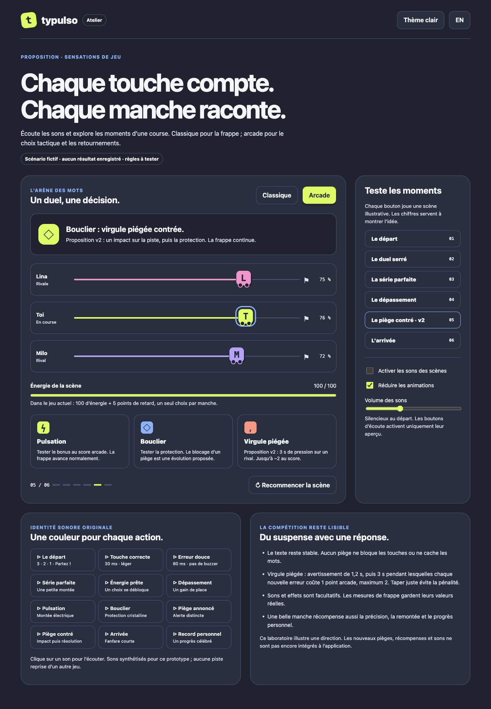
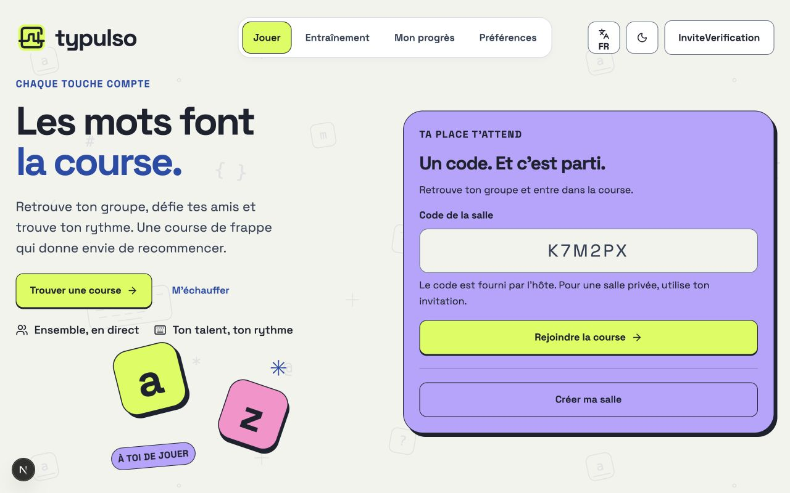
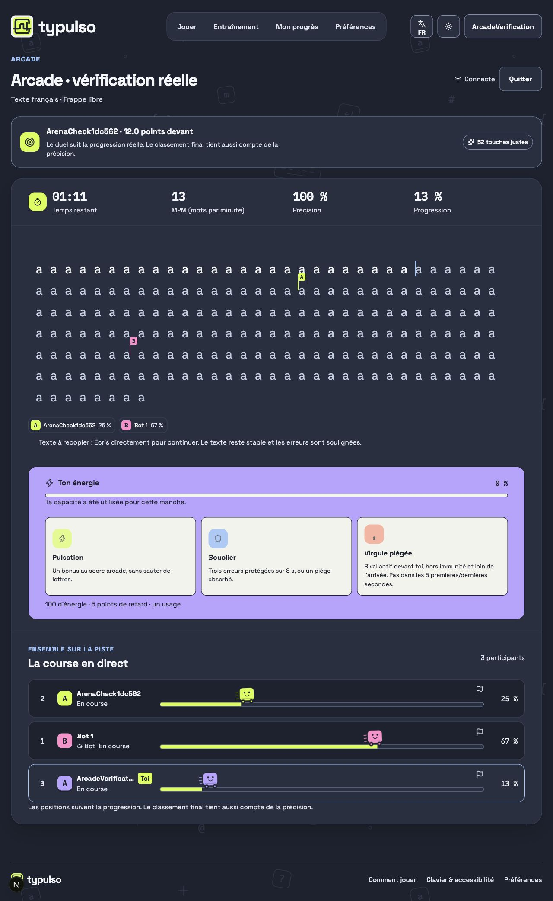
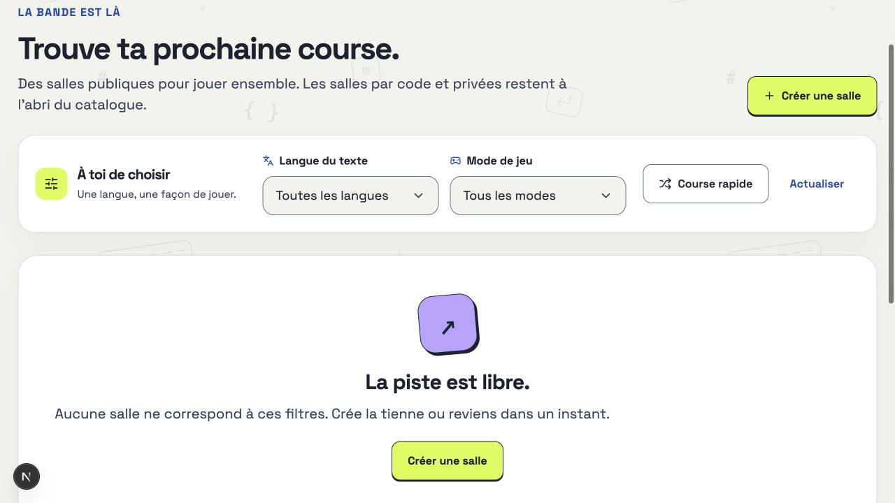
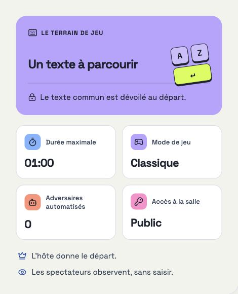

# Vérification de la première implémentation

> **3 octobre 2026 · recette locale de la version 0.1**

[← Documentation](README.md) · [Architecture](18-implementation.md) · [Déploiement](19-deploiement.md) · [Exigences et preuves](02-matrice-exigences.md)

Ce rapport concerne l'application React/Next.js dans `/Users/admin/Documents/typulso`. Les rapports 11 et 17 restent les preuves historiques du prototype HTML. Le dépôt Git local est initialisé sur `main`, sans commit, remote ni publication GitHub. Aucun contrôle ci-dessous ne constitue une preuve de production.

## Environnement effectivement utilisé

- Next.js **16.3.8**, React **19.3.0**, Tailwind **4.3.3**, TypeScript **6.0.2**, Bun **1.4.1**; dépendances verrouillées.
- Services de production compilés lancés sous **Node.js 24.21.0**, archive officielle vérifiée par son SHA-256, sans remplacer le Node de la machine.
- Application `http://127.0.0.1:3000`; Socket.IO `http://127.0.0.1:3001`.
- PostgreSQL **18.3**, base isolée `typulso` sur `127.0.0.1:55432`; aucune base existante modifiée. Cluster temporaire local, sans valeur d'hébergement durable.
- `.env.local` et `.env.test` ignorés par Git; identités générées uniquement pour la recette.

## Contrôles exécutés

| Contrôle | Résultat effectif |
|---|---|
| Migrations | Migration initiale appliquée à une base vide; nouvelle exécution sans duplication. |
| Formatage, lint et TypeScript | Réussis sur les sources du projet. Les documents historiques sont exclus du formatage automatique. |
| Tests unitaires | **53 réussis, 0 échec, 1 044 assertions**, après le correctif de réconciliation. Les tests de base sont volontairement ignorés dans cette commande. |
| Intégration réelle | **7 tests réussis, 0 échec, 60 assertions**, 18,98 s, contre PostgreSQL et les deux services compilés sous Node 24, avec le serveur web standalone final. |
| Build Next.js | Réussi : pages statiques, pré-rendues partiellement et routes dynamiques selon leurs accès runtime; aucun échec de pré-rendu. |
| Build du temps réel | Réussi; bundle Node du service Socket.IO démarré. |
| Docker Compose | `docker compose config --quiet` réussi. **Images et conteneurs non exécutés : Docker Desktop indisponible.** |
| Skill de développement | Validateur officiel du skill réussi dans son emplacement final. Skill général de design conservé et copie portable présente. |
| Liens documentaires | 345 références locales contrôlées, aucune cible manquante au contrôle du 3 octobre. |
| Tests navigateur automatiques | Scénarios Playwright créés, relus et typés; exécution locale automatique **non réalisée**. Exécution prévue dans la CI. |
| CI distante | Workflow GitHub Actions livré; **aucune exécution sur GitHub réalisée**. |

### Ce que l'intégration vérifie

Les tests [HTTP/Socket.IO](../tests/integration.test.ts) utilisent deux identités et connexions indépendantes : inscription et invité, contrôle d'origine, salle/code, droits de modification, état partagé, idempotence, départ commun, saisie validée, résultat persisté, transfert d'hôte, invitation unique et révocation à la déconnexion.

Les tests [PostgreSQL directs](../tests/backend.database.test.ts) vérifient les empreintes des sessions/tickets, le ticket à usage unique, l'interdiction de créer en invité, la création idempotente, l'admission pleine qui ne consomme pas l'invitation, la grâce de reconnexion et la consommation concurrente d'une invitation par un seul acteur.

Le moteur couvre notamment Unicode, erreurs/corrections, progression bloquante, score, génération, contraintes, bots variables et capacités arcade. Ces contrôles ne démontrent pas l'équilibrage avec des adolescents ou la charge à 30.

## Recette visuelle dans le navigateur

La recette a utilisé l'interface réellement rendue, avec navigation et frappe, sur les services locaux. Les comptes de test ont été créés pour cet environnement; aucun score fictif n'a été injecté dans l'interface.

| Parcours | Observation |
|---|---|
| Responsive | Largeurs CSS **1440, 1080, 900, 468, 390, 384 et 320 px** examinées; pas de débordement horizontal. Liens principaux d'au moins 44 px. |
| Navigation | Fond visible; bloc compact à 900/390 px; navigation 2 × 2 à 320 px. Espace sous le header cohérent avec les lignes nécessaires. |
| Entraînement local | Frappe de « Bonjour la bande » : 100 % de précision et 11 % de progression; vitesse mesurée depuis la frappe. Ce mode reste local au navigateur. |
| FR/EN et thème | Libellés et thèmes changent sans changer le texte français d'un exercice déjà commencé. |
| Création | Connexion locale, réglage d'une salle par code avec un bot et 30 s, prévisualisation réelle, création et état prêt parcourus. |
| Course et résultat | Départ de trois secondes, bot en progression, expiration, classement/heatmap et résultat visible dans le profil persisté observés. La frappe rapide du préfixe complet conserve tous ses caractères après le correctif : **100 % de précision, 17 % de progression**, puis erreur volontaire corrigée et progression à **21 % / 99 %**. Aucun écrasement par les instantanés précédents lors de cette nouvelle recette. Résultat final : **30 MPM, 99 %, une erreur et une correction**, retrouvé dans le profil avec les deux courses enregistrées. |

### Lisibilité : contrôle ciblé

Le contrôle de contraste a porté sur des groupes de texte visibles et des champs, avec calcul de la couleur composée sur leurs fonds unis. La zone de texte décorative `aria-hidden`, les gradients et tous les états d'interaction ne sont pas couverts par ce seul relevé.

| Vue à 390 px | Thème | Groupes contrôlés | Ratio minimal |
|---|---|---|---|
| Entraînement | Clair | 28 | 7,31:1 |
| Entraînement | Sombre | 28 | 8,11:1 |
| Création | Clair | 62 | 7,31:1 |
| Création | Sombre | 62 | 7,92:1 |
| Salon | Clair | 46 | 7,31:1 |
| Accueil à 1280 px | Clair | 38 | 7,31:1 |
| Accueil à 1280 px | Sombre | 38 | 7,92:1 |

Le focus clavier de l’action principale a été observé : contour visible de 3 px. La dernière vérification à 320 px confirme une largeur de document de 320 px, une navigation de 288 × 104 px en deux lignes et quatre liens de 44 px de haut. Le compte de recette a été déconnecté; l’accueil est laissé ouvert.

[Accueil clair](assets/app-v01/accueil.png) · [Accueil sombre](assets/app-v01/accueil-sombre.png) · [Écran de 320 px](assets/app-v01/mobile-320.png)

Ces relevés ciblés soutiennent la lisibilité observée; ils ne constituent pas une certification d'accessibilité. Focus clavier, tableaux, mouvement réduit et noms accessibles sont présents dans l'implémentation et demandent aussi une recette avec les appareils et technologies d'assistance ciblés.

## À vérifier avant et après publication

- **Lundi :** URL HTTPS valide, WSS, base durable, migrations, sauvegardes, deux navigateurs sur le site public, création/rejoindre par code, droits et reconnexion.
- **GitHub :** dépôt, commit, revue des sources à partager, clonage neuf, CI verte et deux liens réels de remise.
- **OAuth :** applications GitHub/Discord, secrets serveur et retours externes effectivement testés.
- **Produit final :** charge/latence avec 30 personnes, essais avec les 12–17 ans, équilibrage arcade, conservation/suppression des données et ergonomie tactile.
- **Marque :** Typulso reste un nom de travail; choix final et contribution humaine au nom/logo à documenter.

Le [guide de déploiement](19-deploiement.md) décrit les étapes et les limites de la première topologie. Une configuration livrée n'est pas présentée comme un service cloud déjà déployé.

## Ajustement de largeur · 4 octobre 2026

La demande concerne la présentation : utiliser davantage l'écran et agrandir les composants en conservant la direction artistique. Le cadre de 1 232 px et les limites de largeur des panneaux sont retirés. Les marges, boutons, champs, cartes et titres suivent une échelle commune. Les icônes des cartes colorées gardent leur encre sombre dans les deux thèmes.

| Mesure réelle sur l'accueil à 1 920 px | Avant | Après |
|---|---:|---:|
| Largeur extérieure du contenu | 1 232 px | 1 920 px |
| Début du contenu depuis le bord gauche | 376 px | 38,4 px |
| Taille du titre principal | 64 px | 96 px |
| Hauteur du bouton Rejoindre | 44 px | 56 px |
| Taille du code dans le champ | 16 px | 28 px |

- Accueil examiné à **2 560, 1 920, 1 440, 1 201, 1 150, 1 050, 900, 800, 540, 390 et 320 px** : largeur du document identique à celle du viewport; aucun débordement des éléments visibles du contenu et de l'en-tête.
- Entraînement, exercice démarré, préférences et connexion examinés à **1 920, 900, 390 et 320 px**. Les configurations d'entraînement et la connexion sont également observées à 1 150 px; la connexion à 800 px. La zone de course mesure **1 843 px** à 1 920 px et **358 px** à 390 px.
- À 1 150 px, la navigation occupe une ligne séparée de **509 × 66 px**, avec 12 px entre les deux lignes d'en-tête. À 320 px, les quatre liens de navigation restent dans une grille de **288 × 104 px**.
- Accueil examiné en clair et sombre; préférences en sombre à 320 px. Le focus clavier du lien principal conserve un contour bleu solide de **3 px**.
- Formatage, lint, TypeScript, compilation Next.js et compilation temps réel contrôlés. Les **53 tests unitaires** réussissent, avec **1 044 assertions**; les tests d'intégration ne sont pas réexécutés pour cette modification CSS.

[Accueil large clair](assets/app-v01/largeur-clair-1920.png) · [Accueil large sombre](assets/app-v01/largeur-sombre-1920.png) · [Accueil mobile](assets/app-v01/largeur-mobile-390.png)

La liste des courses est également examinée à 1 920, 900, 390 et 320 px dans son **état d'indisponibilité**. Pendant cette recette, PostgreSQL configuré sur `127.0.0.1:5432` refuse la connexion : le catalogue ne se charge pas et le build signale cette indisponibilité pendant certains pré-rendus, tout en réussissant sa compilation. Aucune nouvelle preuve de fonctionnement des comptes, salles ou données n'est déduite de ces contrôles visuels. Les captures de connexion ne sont pas livrées, pour éviter de publier des valeurs mémorisées dans le navigateur.

### Navigation centrée · 4 octobre 2026

L'en-tête utilise deux colonnes latérales symétriques autour d'une colonne de navigation. Le menu est centré sur l'écran, indépendamment de la largeur du logo et des commandes de compte. Les liens gardent leur fond et leurs dimensions existantes.

Mesures dans le navigateur à **1 920, 1 440, 1 280, 1 201, 1 200, 1 150, 900, 390 et 320 px** : écart entre le centre du menu et celui du viewport de **0 px**, aucune superposition avec le logo ou les commandes, aucune largeur de document supérieure au viewport. À 1 920 px, le centre est **960 px** en français comme en anglais. Le menu reste centré sur sa deuxième ligne aux formats intermédiaires et dans sa grille mobile.

[Capture de la navigation centrée](assets/app-v01/navigation-centree.png).

### Composition de l'accueil · 4 octobre 2026

Première version du rééquilibrage : le texte et la carte partagent la largeur disponible à parts égales. Les actions restent proches du paragraphe et les touches décoratives, plus grandes, occupent l'espace vers le centre à partir de 1 400 px. Cette version masquait l'illustration aux formats plus étroits; la correction suivante rétablit sa visibilité et limite la largeur de la carte. Les mesures et captures ci-dessous documentent cette première version.

- À **1 920 px**, les deux colonnes mesurent **902 px** et leur écart **38 px**. À **1 440 px**, elles mesurent **677 px**, séparées de **29 px**. Les deux actions restent sur la même ligne dans les deux langues à ces largeurs.
- Accueil examiné à **1 920, 1 440, 1 401, 1 399, 1 201, 1 200, 1 050, 900, 800, 390 et 320 px** : aucun débordement horizontal du document, actions contenues dans leur zone, navigation toujours centrée. À 390 px, texte et carte mesurent chacun **358 px**; à 320 px, **288 px**.
- Versions FR/EN et thèmes clair/sombre observés. La validation d'un code vide affiche son erreur dans la carte et conserve `aria-invalid`; le bouton Rejoindre garde son focus clavier visible et sa hauteur de **56 px** sur ordinateur.
- Formatage, lint, TypeScript, les **53 tests unitaires** (**1 044 assertions**) et les compilations Next.js/temps réel réussissent. Les tests avec PostgreSQL ne sont pas réexécutés pour cette modification de présentation; la limite de connexion à la base décrite plus haut reste applicable.

[Accueil rééquilibré](assets/app-v01/hero-equilibre.jpg) · [Thème sombre et focus clavier](assets/app-v01/hero-equilibre-sombre.jpg) · [Version mobile](assets/app-v01/hero-equilibre-mobile.jpg).

### Carte compacte et lettres sur mobile · 4 octobre 2026

La carte d'accueil est limitée à **640 px**, avec des marges intérieures de **24 à 36 px** et un titre plafonné à **40 px**. Les règles qui masquaient les lettres aux formats étroits sont supprimées pour cette illustration. Les lettres gardent leurs animations et passent à une taille compacte sous 1 400 px; à 390 et 320 px, leur scène mesure **210 px** de large et chaque touche **84 px** avant rotation. La réduction de mouvement reste traitée par la règle globale existante.

- Version anglaise examinée à **1 920, 1 440, 1 200, 1 050, 900, 800, 600, 540, 390 et 320 px** : lettres et scène visibles, animations `key-a` et `key-z` actives, aucun chevauchement avec la zone des actions ni débordement horizontal. La navigation reste centrée.
- Version française et thème sombre examinés à **1 920, 600, 390 et 320 px**. À 320 px, la validation du code vide et le focus clavier du bouton Rejoindre restent visibles, sans débordement.
- Largeur réelle de la carte : **640 px** à 1 920 et 1 440 px, **358 px** à 390 px et **288 px** à 320 px.
- Formatage, lint, TypeScript, les **53 tests unitaires** (**1 044 assertions**) et les compilations Next.js/temps réel réussissent. Les tests avec PostgreSQL ne sont pas réexécutés pour cette modification CSS; la limite de connexion à la base décrite plus haut reste applicable.

[Carte compacte sur ordinateur](assets/app-v01/carte-compacte.jpg) · [Lettres visibles sur mobile](assets/app-v01/carte-compacte-mobile.jpg).

### Décalage de la carte et longueur du paragraphe · 4 octobre 2026

La carte est centrée dans sa colonne pour la déplacer vers la droite en utilisant l'espace libre, tout en gardant son plafond de 640 px. Le paragraphe d'introduction est limité à **20 em**, sans saut de ligne forcé. Ce relevé précède le centrage de l'introduction sur les petits écrans documenté ci-dessous.

- À **1 920 px**, le bord gauche de la carte passe de **979 à 1 110 px**, soit un déplacement de **131 px**. À **1 440 px**, il se situe à **753 px**; le déplacement diminue naturellement lorsque la colonne offre moins d'espace.
- Sur ordinateur, le paragraphe mesure **420 px** et affiche trois lignes. La première ligne anglaise est exactement « Meet your group, challenge your friends ». À 900 px, sa limite mesure **340 px**; à 390 px, **300 px**. À 320 px, il occupe les **288 px** disponibles et passe à quatre lignes.
- Mesures dans le navigateur à **1 920, 1 440, 1 200, 900, 800, 540, 390 et 320 px** : largeur du document égale au viewport, navigation centrée et illustration des lettres visible. Mesures FR et sombre à **1 920, 900 et 390 px** : trois lignes pour le paragraphe et aucun débordement horizontal.
- Formatage, lint, TypeScript, les **53 tests unitaires** (**1 044 assertions**) et les compilations Next.js/temps réel réussissent. Les tests avec PostgreSQL ne sont pas réexécutés pour cette modification CSS; la limite de connexion à la base décrite plus haut reste applicable.

[Accueil avec texte limité et carte décalée](assets/app-v01/accueil-texte-limite.jpg).

### Introduction centrée lorsque la carte passe en dessous · 4 octobre 2026

À **800 px et moins**, l'introduction et son paragraphe occupent toute la largeur disponible. Le titre, le texte, les actions, les repères et les lettres sont centrés. Les lettres restent sous les actions, y compris sur tablette. La carte garde son plafond de 640 px et se centre sous l'introduction. Au-dessus de ce seuil, la composition à deux colonnes conserve le paragraphe limité et la carte décalée vers la droite.

| Largeur du viewport | Introduction et paragraphe | Écart au centre : boutons, repères, lettres et carte |
|---:|---:|---:|
| 800 px | 760 px | 0 px |
| 600 px | 560 px | 0 px |
| 390 px | 358 px | 0 px |
| 320 px | 288 px | 0 px |

Les mesures en anglais couvrent **1 920, 801, 800, 600, 390 et 320 px**. À 801 px, la carte reste à côté et le texte est aligné à gauche; à 800 px, la carte passe dessous et le texte se centre. Les mesures FR et sombre à **800, 390 et 320 px** confirment le centrage de tous les groupes, y compris lorsque les actions se répartissent sur plusieurs lignes. Aucun débordement horizontal du document n'est relevé.

Formatage, lint, TypeScript, les **53 tests unitaires** (**1 044 assertions**) et les compilations Next.js/temps réel réussissent. Les tests avec PostgreSQL ne sont pas réexécutés pour cette modification CSS; la limite de connexion à la base décrite plus haut reste applicable.

[Introduction centrée sur mobile](assets/app-v01/introduction-centree-mobile.jpg).

### Titres en gras · 4 octobre 2026

Les titres de page et de carte partagent la graisse **700** de Space Grotesk. Les styles calculés dans le navigateur confirment cette graisse pour les cinq titres de l'accueil. Vérification EN à **1 920, 900, 800, 390 et 320 px**, puis FR et sombre à **390 et 320 px** : aucun débordement horizontal, centrage mobile conservé et lettres toujours visibles.

Formatage, lint, TypeScript, **53 tests unitaires** (**1 044 assertions**) et compilations Next.js/temps réel réussissent. Les tests PostgreSQL restent hors de cette vérification CSS; la limite de connexion décrite plus haut demeure applicable.

[Accueil avec titres en gras](assets/app-v01/titres-gras.jpg).

### Lettres plus expressives · 4 octobre 2026

Rebonds amplifiés, rotations et léger changement d’échelle, sur deux cycles de **3,2 / 3,8 secondes**. Les déplacements en pourcentage suivent la taille des touches. Styles calculés observés à **1 920, 900, 390 et 320 px** : animations actives, matrices de transformation différentes au cours du mouvement et aucun débordement horizontal. Rendu examiné en clair sur ordinateur et sombre sur mobile.

Le réglage **Réduire les animations** est activé pour vérification : les deux animations passent à `none` et les lettres restent visibles. Le réglage initial est ensuite rétabli. Formatage, lint, TypeScript, **53 tests unitaires** (**1 044 assertions**) et compilations Next.js/temps réel réussissent; les vérifications PostgreSQL ne sont pas réexécutées pour cette modification CSS.

[Capture d’une phase du rebond](assets/app-v01/lettres-expressives.jpg). La capture fixe documente la disposition; le mouvement s’observe dans l’aperçu local.

### Écart régulier entre les lettres · 4 octobre 2026

Les positions des touches suivent un écart de base fixe de **72 px**, avec une scène dimensionnée à partir de leurs tailles. Elles ne sont plus ancrées aux deux bords d’une colonne de largeur variable. La grille réserve la largeur de la scène sur ordinateur, tout en conservant les tailles des touches et les rebonds amplifiés. La distance visuelle varie naturellement pendant les rotations; l’écart de mise en page reste identique entre les formats.

Mesures EN à **1 920, 1 440, 1 400, 1 399, 900, 800, 390 et 320 px** : écart calculé de **72 px** (écart d’arrondi inférieur à 0,01 px), touches séparées dans les phases observées, aucun débordement horizontal. Vérification FR et sombre à **1 400, 900 et 320 px** : aucun chevauchement avec les actions. Formatage, lint, TypeScript, **53 tests unitaires** (**1 044 assertions**) et compilations Next.js/temps réel réussissent après cette correction; les tests PostgreSQL restent hors de cette vérification CSS.

[Espacement sur ordinateur](assets/app-v01/lettres-espace-regulier.jpg) · [Espacement sur mobile](assets/app-v01/lettres-espace-mobile.jpg).

### Couleurs initiales rétablies · 4 octobre 2026

Les essais de texte blanc sur violet sont annulés à la demande de l’utilisateur. Les surfaces lavande retrouvent le texte encre `#171C2B` et leur fond initial `#BBA3FF` dans les deux thèmes. Les tokens et règles ajoutés pour les premiers plans blancs, ainsi que les adaptations d’avatars et de vignettes correspondantes, sont retirés. La direction artistique et les instructions du projet retrouvent la règle d’origine.

Styles calculés confirmés sur l’accueil anglais à **1 920 px**, en clair et en sombre : lavande d’origine et textes sombres sur le titre, les instructions et le sticker. Le bouton citron reste identique. Aucun débordement horizontal relevé à **1 920, 900 et 390 px**. Les rapports d’essais de blanc sur violet sont retirés de ce document pour conserver la référence actuelle.

[Capture de la palette initiale rétablie](assets/app-v01/couleurs-initiales-retablies.jpg).

### Footer composé · 4 octobre 2026

Panneau arrondi avec identité Typulso, trois destinations illustrées et retour vers les courses publiques. La palette initiale est conservée. L’identité et les liens utilisent les surfaces de leur thème; seuls les pictogrammes et l’action finale emploient les accents expressifs.

- Rendu observé sur l’accueil anglais sombre et français clair à **1 920 px**. Focus clavier confirmé sur le lien des préférences : contour bleu de 3 px, sans découpe par le panneau.
- Mesures françaises claires à **1 101, 1 100, 900, 701, 700, 390 et 320 px** : aucun débordement horizontal du document ou des liens. À 390 px, les lignes de navigation mesurent **88 px**; à 320 px, la hauteur augmente avec le texte. La composition à trois colonnes passe à une colonne sous 700 px.
- Le lien « Comment jouer » ouvre la route `/aide`, dont le titre et le contenu sont observés. Les trois autres destinations utilisent les routes existantes `/touches`, `/preferences` et `/courses`; leur URL est vérifiée dans le composant. Ce passage ne constitue pas une preuve de fonctionnement de PostgreSQL.
- `bun run check` réussit : formatage, lint, TypeScript, **53 tests** (**1 044 assertions**), builds Next.js et temps réel. **9 tests avec base sont ignorés**; les deux avertissements PostgreSQL local indisponible restent présents pendant le build, qui termine avec succès.

[Footer clair](assets/app-v01/footer-clair.jpg) · [Footer sombre avec focus](assets/app-v01/footer-sombre.jpg) · [Liens sur mobile](assets/app-v01/footer-mobile.jpg).

### Footer et piste au centre · 4 octobre 2026

Cette itération intègre les premières pistes de la [recherche ciblée](21-recherche-footer-et-jeu.md) : signature et groupes de liens du footer, bande de mesures compacte, frappe centrale, commandes arcade sous la saisie et lignes de joueurs stables. Le bilan personnel et les prochaines destinations précèdent désormais le podium. La palette initiale, les règles de course et l’autorité des résultats serveur sont conservées.

| Parcours local observé | Preuve de cette itération |
|---|---|
| Footer complet | Clair FR à **1 536, 900, 390 et 320 px**, sombre EN à **1 536 px**; largeur du document égale au viewport aux formats mesurés. Les liens mesurent au moins **44 px**, l’action **52 px** et le focus clavier **3 px**. Le lien d’aide clavier ouvre sa destination. |
| Échauffement | Clair FR à **1 536 et 900 px**, sombre FR à **390 px**. Frappe réelle puis deux corrections : « Bonjour la bande », **94 % de précision / 11 % de progression**. Focus visible. |
| Salle arcade réelle | Compte local de recette, invité indépendant et un bot, avec PostgreSQL et Socket.IO : départ commun, saisie et pistes observés. L’ordre des lignes reste stable malgré l’évolution des positions. Rendu clair à **1 536 et 390 px**, sans débordement horizontal mesuré. |
| Capacité et correction | À **100 d’énergie** avec un déficit d’au moins 5 points, Accélération est activée; l’énergie passe à 0 et les deux boutons deviennent indisponibles. Une erreur est ensuite corrigée avec Retour arrière et le texte est terminé. |
| Résultats | Bilan personnel avant podium vérifié. Rang officiel **3**, **26 MPM, 99 %, une erreur et une correction**, également retrouvé dans le profil persistant. Clair à **1 536 px**, sombre EN à **900, 390 et 320 px**, sans débordement horizontal mesuré. Le compte de recette est déconnecté à la fin. |

La vérification finale `bun run check` réussit : formatage, lint, TypeScript, **53 tests unitaires** (**1 044 assertions**) et compilations Next.js/temps réel; **9 tests PostgreSQL sont ignorés dans la commande unitaire**. L’intégration est relancée ensemble avec PostgreSQL sur `127.0.0.1:5432` : **7 tests réussis, 0 échec, 60 assertions**, environ 19 s. Un premier essai utilisait encore l’ancien port `55432` dans l’environnement du terminal et faisait échouer les quatre tests directs de base; la relance explicite sur `5432` corrige cet écart de configuration. Les preuves historiques ci-dessus restent celles de leur environnement d’origine.

La règle CSS du mode concentration qui masque le footer est conservée dans le code; son activation n’est pas exercée pendant cette recette. Cette itération n’ajoute pas de preuve visuelle de perte réseau, de reconnexion ou de parcours spectateur, ni de preuve de production. Aucun classement ou score fictif n’est injecté.

Seules des captures neutres de footer et d’échauffement sont livrées, sans identités de recette : [footer clair](assets/app-v01/footer-refresh-clair.jpg), [footer sombre](assets/app-v01/footer-refresh-sombre.jpg), [footer mobile](assets/app-v01/footer-refresh-mobile.jpg) et [échauffement](assets/app-v01/jeu-refresh-clair.jpg).

### Footer complet sur Practice · 4 octobre 2026

Le choix de variante est corrigé à la demande de l’utilisateur : `/entrainement` affiche le même footer complet que les pages ordinaires, y compris pendant l’échauffement. La variante compacte reste réservée aux salles. Le rendu est observé en anglais sombre à **1 536 px**, puis à **900 px** et en anglais clair à **390 px**; aucune largeur du document supérieure au viewport sur les formats mesurés. `bun run check` réussit : formatage, lint, TypeScript, **53 tests unitaires** et compilations Next.js/temps réel. Les tests PostgreSQL ne sont pas relancés pour ce changement de sélection visuelle.

[Footer complet de Practice](assets/app-v01/practice-footer-complet.jpg).

### Dialogues centrés et espacés · 4 octobre 2026

La remise à zéro des marges de Tailwind plaçait les dialogues au bord du viewport. Le style partagé rétablit `margin: auto` et réserve 16 à 32 px sur chaque côté. Le dialogue « Your people & roles » est ouvert dans une vraie salle locale; les règles de salle servent à vérifier le défilement d’un contenu long. Aucune règle n’est enregistrée pendant cette recette.

| Viewport CSS | Dialogue observé | Résultat |
|---|---|---|
| 1 066 × 750 px | Participants · sombre | Largeur 540 px, centré; aucun débordement interne horizontal. |
| 659 × 743 px | Participants · clair | Largeur 540 px, marges latérales 59,5 px; centré verticalement. |
| 390 × 844 px | Participants · clair | Marges latérales 16 px; titre et fermeture restent dans le panneau. |
| 320 × 500 px | Participants puis règles · clair | Marges latérales 16 px; le formulaire long conserve aussi 16 px en haut et en bas et défile à l’intérieur. |
| 844 × 390 px | Règles · clair | Largeur 540 px, marges verticales d’environ 25,3 px; défilement interne sans débordement horizontal. |

Échap ferme les dialogues et rend le focus au bouton qui les ouvre. `bun run check` réussit : formatage, lint, TypeScript, **53 tests unitaires** (**1 044 assertions**) et compilations Next.js/temps réel. Les **9 tests PostgreSQL sont ignorés dans la commande unitaire**; ils ne sont pas relancés pour cette correction CSS. Le compte local de recette est déconnecté et l’aperçu revient à l’entraînement après les vérifications.

### Marque agrandie et textes lisibles · 6 octobre 2026

Les tailles calculées sur l’accueil français clair à 1 920 px confirment le nom à **48 px**, le symbole à **64 px** et les repères à **18 px**. À 320 px, le nom reste à **36 px**, les repères à **18 px** et la navigation occupe une grille de deux colonnes. Aucun débordement horizontal du document n’est mesuré sur l’accueil aux formats 1 920, 1 280, 900, 390 et 320 px observés pendant l’itération, en clair ou sombre selon la capture. Les contrôles finaux de 320 et 1 280 px portent sur la dernière version.

L’échauffement ouvert, les préférences et la connexion sont également examinés à **390 px**, sans débordement horizontal mesuré. Les textes visibles de l’échauffement n’ont aucune taille calculée inférieure à 15 px. Les styles partagés de course et de bilan sont adaptés; cette recette ne rejoue pas une course multijoueur ni des résultats authentifiés. Les préférences de langue et de thème utilisées pour la recette sont rétablies à la fin.

`bun run check` réussit après les derniers changements : formatage, lint, TypeScript, **53 tests unitaires** (**1 044 assertions**) et compilations Next.js/temps réel. Les **9 tests PostgreSQL sont ignorés** dans la commande unitaire; l’intégration n’est pas relancée pour cette modification visuelle.

### Aide aérée et comparaison détachée · 6 octobre 2026

La page `/touches` est observée en français sombre à **1 536 et 390 px**, et en français clair à **900 et 320 px**. Aucun débordement horizontal du document n’est mesuré. L’écart entre la grille et la bande de comparaison est de **36 px** sur ordinateur et tablette, **28 px** sur mobile. `/aide`, qui partage cette présentation, est vérifiée à **320 px**, sans débordement mesuré. Tab depuis le lien de préférences atteint « Rejoindre une course » avec un contour de focus de **3 px**. Les préférences de recette et le viewport sont rétablis après vérification.

`bun run check` réussit : formatage, lint, TypeScript, **53 tests unitaires**, **1 044 assertions**, builds Next.js et temps réel. Les **9 tests PostgreSQL sont ignorés** dans la commande unitaire; aucune intégration n’est relancée pour cette présentation.

[Page clavier plus aérée](assets/app-v01/aide-aeree.png).

### Contraste du profil et traduction du sticker · 6 octobre 2026

Le contraste du bandeau est vérifié dans un aperçu anonyme isolé qui charge la feuille de styles réelle de l’application : texte calculé `rgb(23, 28, 43)` sur fond `rgb(255, 143, 206)` en thème sombre, sans débordement à 1 280 px. La connexion au compte local de recette a été refusée par la vérification automatique faute d’autorisation explicite d’utilisation des identifiants; aucun profil authentifié n’est validé dans ce passage. Le fichier temporaire de présentation est supprimé après la capture.

Le sticker de l’accueil est observé en français sombre à **1 280 px**. Le passage FR → EN confirme les textes « À TOI DE JOUER » et « PRESS PLAY ». À **390 px**, la version française n’ajoute aucun débordement horizontal du document. Le composant est partagé avec la connexion, dont le rendu n’est pas rejoué. Les préférences et le viewport sont rétablis.

La vérification finale `bun run check` réussit : formatage, lint, TypeScript, **53 tests unitaires**, **1 044 assertions**, compilations Next.js et temps réel. Les **9 tests PostgreSQL sont ignorés** dans cette commande.

[Sticker français](assets/app-v01/sticker-fr.png) · [Contraste du bandeau isolé](assets/app-v01/profil-contraste-isole.png).

### Vue clavier AZERTY / QWERTY

Vérification du composant React réel dans une route anonyme temporaire avec des données fictives clairement indiquées, supprimée ensuite : sélection AZERTY/QWERTY, passage à la table conservant les cinq métriques originales, français/anglais et rendu sombre à 1 280 px. À 390 px, largeur du document égale au viewport (390 px), défilement contenu dans le clavier. Aucun profil authentifié ni résultat réel n’est simulé.

Trois tests couvrent le regroupement pondéré des majuscules, les touches accentuées et chiffres AZERTY, la conservation des caractères hors disposition et les métriques vides. La vérification complète réussit : 56 tests, 1 051 assertions, 9 tests de base de données ignorés, formatage, lint, TypeScript et compilations.

[Aperçu clavier avec données de démonstration](assets/app-v01/clavier-azerty.png).

### Filtres des indicateurs

Vérification sur le composant réel dans un aperçu temporaire anonyme avec des métriques fictives : sélection 5–14 %, correspondance de la touche regroupée, filtrage du tableau, second clic rétablissant les cinq lignes, activation de ≥15 % avec Entrée. Rendus clair/sombre, FR/EN et largeur du document limitée à 390 px sur mobile. Route temporaire supprimée et préférences rétablies. Un test vérifie les bornes de catégories, l’arrondi du taux affiché et la distinction des touches sans tentative.

[Aperçu du filtre actif — données fictives](assets/app-v01/filtres-clavier.png).

### Menus déroulants

La page entraînement réelle est vérifiée en clair à 1 280 px. Les quatre menus ont un chevron à 18 px du bord et 56 px de padding droit. Le changement de langue du texte EN puis FR fonctionne. À 390 px, les menus mesurent 316 px et le document reste à 390 px. En thème sombre, le chevron utilise la couleur claire prévue. Préférences et viewport rétablis.

[Aperçu des menus déroulants](assets/app-v01/menus-deroulants.png).

### Liste d’options ouverte

Sur la page entraînement réelle, vérifications FR/EN et clair/sombre : ouverture de la liste personnalisée, coche de la valeur sélectionnée, clic sur une option, navigation avec flèches et Fin, confirmation Entrée, annulation Échap conservant la valeur, recherche « c » puis confirmation Tab donnant « Correction obligatoire ». À 390 px, la liste ouverte reste entre x=37 et x=353, dans le viewport; aucune largeur supplémentaire du document. Valeurs de pratique, préférences et viewport rétablis.

Le composant suit le [modèle combobox à sélection du W3C](https://www.w3.org/WAI/ARIA/apg/patterns/combobox/examples/combobox-select-only/). Les noms accessibles et options sont observés dans l’arbre du navigateur; une validation avec lecteur d’écran n’est pas réalisée dans ce passage. Les autres pages utilisent le composant partagé, mais leurs parcours authentifiés ne sont pas rejoués. `bun run check` réussit : formatage, lint, TypeScript, tests existants et compilations web/temps réel.

[Aperçu de la liste ouverte](assets/app-v01/menu-options.png).

### Hauteur des deux blocs d’aide

La grille d’aide étire les deux cartes à une hauteur commune lorsqu’elles sont côte à côte, sans hauteur fixe. Sur `/touches`, mesures identiques de 623,47 px à 1 536 px en clair et à 1 200 px en sombre. À 390 px, les cartes sont empilées avec leurs hauteurs naturelles (697,47 px et 765,05 px), sans débordement horizontal. Préférences et viewport rétablis.

[Aperçu des cartes alignées](assets/app-v01/aide-hauteurs.png).

### Répartition des étapes dans le bloc d’aide

Sur écran à deux colonnes, les quatre étapes sont réparties sur la hauteur disponible. À 1 536 px, les cartes conservent une hauteur identique de 623,47 px et la marge entre la dernière étape et le bas du bloc est ramenée à 33 px. À 390 px, la répartition redevient naturelle et le document reste à 390 px. Préférences et viewport rétablis.

[Aperçu du contenu réparti](assets/app-v01/aide-repartie.png).

### Suppression des bandes latérales

Les accents verticaux décoratifs sont retirés des notices partagées, du guide de comparaison, du repère personnel de piste et des lignes personnelles des résultats. Le curseur de frappe reste fonctionnel. Les erreurs gardent un contour complet de leur couleur dédiée. Sur `/touches`, les bordures gauche et droite du guide sont identiques (1 px neutre) en clair à 1 536 px et en sombre à 390 px, sans débordement horizontal. Les écrans de course/résultats authentifiés ne sont pas rejoués dans ce passage. Préférences et viewport rétablis.

[Aperçu sans bande verticale](assets/app-v01/sans-bande.png).

### Organisation des statistiques du clavier

L’entête associe le titre et un sous-titre court, avec le bouton de vue à droite. La barre de commandes répartit les filtres à gauche et le choix de disposition à droite sur grand écran. Les explications complètes sont repliées dans « Comment lire ce clavier ? ». Vérification du composant réel dans l’aperçu temporaire à données fictives : français clair à 1 536 px, filtre 5–14 %, tableau à une ligne correspondante, retour aux touches, réinitialisation, ouverture de l’aide. À 390 px, commandes empilées, document de 390 px. Route de démonstration supprimée et préférences rétablies.

[Aperçu de la disposition équilibrée — données fictives](assets/app-v01/clavier-equilibre.png).

L’explication du clavier est maintenant affichée en permanence sous les touches; la ligne repliable est supprimée à la demande de l’utilisateur. Texte français observé sans interaction à 1 280 px dans l’aperçu anonyme du composant réel (données fictives), puis aperçu temporaire supprimé. `bun run check` réussit.

[Aperçu de l’explication visible](assets/app-v01/explication-visible.png).

### Profil : statistiques et résultats — 6 octobre 2026

Les six statistiques utilisent une grille centrée (six colonnes à 1536 px, trois à 1200 px, deux à 390 px), avec icônes et accents de la palette existante. Le tableau regroupe mode et langue sous le nom de course et met en valeur vitesse, précision et rang. Les données et liens restent ceux du profil.

Vérification visuelle des composants réels via une route temporaire anonyme, avec des données explicitement fictives ; route supprimée après inspection. Aucun accès à un profil authentifié. À 390 px, aucun débordement de la page : le tableau défile dans son conteneur. Cartes lisibles en thème sombre. Capture de démonstration : `assets/app-v01/profil-resultats.png`.

### Motifs du fond général — 6 octobre 2026

Le fond de page affiche une texture SVG répétée et discrète de touches, lettres, petits claviers et symboles. Deux variantes adaptent le contraste aux thèmes clair et sombre. Les surfaces opaques des composants masquent naturellement les motifs ; aucune superposition interactive ni animation supplémentaire. Motifs masqués à l’impression. Rendu inspecté sur l’accueil en clair/sombre à 1280 px ; à 390 px, texture réduite et aucun débordement horizontal (largeur de page : 390 px).

### Frappe immédiate — 6 octobre 2026

Le composant partagé `TypingZone` place le focus dans la zone de frappe quand elle devient utilisable, au montage ou après une suspension. Aucun recentrage à chaque lettre : quitter volontairement le champ reste possible. Le champ désactivé ou terminé ne reçoit pas le focus. Le texte d’attente invite maintenant à commencer à écrire. Vérification navigateur sur l’entraînement solo : après le bouton de départ, `document.activeElement.id` vaut `typing-input` ; une pression de B sur l’élément déjà focalisé ajoute B sans clic dans le champ. Cette modification est partagée avec la course ; le départ multijoueur n’a pas été exécuté pendant cette vérification.

### Reprise de frappe hors du champ — 6 octobre 2026

En complément du focus au départ, une lettre ou Retour arrière pressé depuis une zone non interactive reprend le focus et applique la première opération au moteur partagé, sans la perdre. Les raccourcis avec modificateur, la composition IME, les champs, boutons, liens et fenêtres ouvertes conservent leurs événements. Le listener est supprimé quand la frappe est désactivée/terminée ou au démontage. Test navigateur réel en solo : clic sur le titre (focus BODY), pression B → champ focalisé et valeur B ; second clic sur le titre puis o → valeur Bo. Tab quitte bien la zone vers un lien. Le scénario multijoueur n’a pas été exécuté pour cette vérification.

### Saisie intégrée au texte — 6 octobre 2026

Le rectangle de saisie et son icône ont été retirés de `TypingZone`. La textarea native reste accessible, visuellement masquée, pour conserver événements de saisie, accents/composition et validation. La frappe se reflète uniquement dans les lettres du texte ; cliquer/toucher le texte redonne le focus au champ natif. L’instruction change de couleur au focus clavier. Test solo navigateur : aucun `.typing-field`, champ natif de largeur 1 px, B puis o après un clic hors de la zone donnent Bo et deux lettres correctes dans le texte. Clic sur le texte → focus `typing-input`. À 390 px, aucun débordement horizontal. Le clavier virtuel d’un appareil mobile physique n’a pas été testé.

### Pistes animées — 6 octobre 2026

Chaque jauge de course est accompagnée d’une touche souriante sur roues, colorée comme l’avatar. Sa position et la longueur du rail citron utilisent la progression réelle (bornée entre 0 et 100), avec transition de 350 ms. Le rebond ne s’active que pendant une course pour un joueur actif connecté et s’arrête quand il termine ; les préférences de mouvement réduit et effets désactivés retirent transitions et rebond. Le drapeau marque l’arrivée. Aucun changement au calcul des scores ou aux permissions.

Vérification des vrais composants via un aperçu temporaire explicitement fictif, retiré après inspection : positions 0/25/70/100 %, avatar à 100 % contenu dans la piste, animation arrêtée au terme ; rendus sombre à 1280 px et clair à 390 px, aucun débordement horizontal. Aucune course multijoueur réelle lancée pour cette inspection.

### Repères des coéquipiers dans le texte — 6 octobre 2026

Le passage partagé affiche les initiales colorées des autres participants à leur position de progression publique, avec légende nom/pourcentage. Les participants partis sont exclus ; les joueurs hors ligne gardent leur dernière position confirmée et sont indiqués hors ligne. Les repères à la même position sont regroupés (deux initiales puis nombre supplémentaire). Le texte observé après sa propre arrivée et la vue spectateur utilisent le même composant. Aucune saisie privée supplémentaire ne traverse le serveur : positions calculées à partir du snapshot déjà public. La projection tient compte des points de code normalisés du serveur et des graphèmes de l’affichage.

Tests : recul après suppression, bornes, texte vide, accents combinés et emoji composé. Aperçu temporaire fictif des vrais composants retiré après inspection : repère Lina à 50 % (index 57), puis 10 % (index 11) ; repère de fin à 100 %. Rendus sombre bureau et clair mobile à 390 px sans débordement horizontal. Le scénario réseau entre deux sessions réelles n’a pas été exécuté pendant cette vérification.

### Fin de course et recherche de sensations — 7 octobre 2026

Une dernière commande de saisie pouvait parvenir après l’échéance et recevoir `time_expired`, alors que le tick normal prépare déjà les résultats. Le client conservait ce refus en rouge avec Réessayer. Le serveur acquitte maintenant les lots valides du même participant et de la même course avec l’état final, sans ajouter de caractères après l’échéance. La finalisation borne son horloge à la limite de la course et reste idempotente. Les gardes de membre, course et séquence restent appliquées.

Le navigateur suspend la saisie et vide les lots non envoyés à l’échéance estimée depuis le dernier snapshot serveur. Il présente brièvement « Course terminée · Le classement arrive… », puis les résultats reçus. Les erreurs de saisie ne restent pas affichées dans la phase résultats ; une vraie erreur pendant la course conserve son traitement.

Vérification PostgreSQL et HTTP/Socket.IO avec deux sessions indépendantes : **8 tests réussis, 0 échec, 82 assertions**. La course chronométrée réelle vérifie les lots tardifs après résultats, la conservation des valeurs et mesures, la confidentialité des heatmaps et la persistance. Le test direct avance uniquement la course de sa propre fixture pour vérifier le lot reçu après l’échéance avant le tick, sa répétition, les deux participants, les deux résultats uniques et le rejet d’un autre identifiant de course. Aucun compte utilisateur existant ni mot de passe enregistré n’a été utilisé.

Lors de la première passe, la base de test configurée sur 55432 était indisponible ; la vérification a utilisé explicitement la base locale active sur 5432. Les attentes ont été corrigées pour tenir compte des heatmaps privées par destinataire et du tick local concurrent, qui peut ignorer une ligne verrouillée. Les fixtures de fin de course rejoignent bien leur salle par code.

Contrôles applicatifs : `bun run check` réussi (formatage, lint, TypeScript, **60 tests unitaires réussis**, compilation Next et serveur temps réel). Les tests d’intégration ignorés par la passe unitaire sont vérifiés dans la passe dédiée : huit tests réussis. Le lint final est sans avertissement.

Le [dossier de sensations](22-sensations-et-competition.md), son registre et le laboratoire autonome sont enregistrés séparément. Vérification du laboratoire : aperçu sonore « Bouclier » sans erreur navigateur ; passage Classique masquant les capacités et désactivant le piège ; anglais clair à 390 px, document de 390 px ; français sombre à 1280 px, document de 1280 px ; animations réduites effectivement désactivées. L’écoute humaine, une session navigateur authentifiée complète et les nouvelles règles multijoueurs ne sont pas validées par cet aperçu.

### Sortie automatique d’une salle fermée — 7 octobre 2026

La page de salle retourne automatiquement à **Jouer (`/`)** dès qu’elle reçoit une phase `closed` ou `interrupted`, ou un refus `room_closed` pendant l’admission, la synchronisation ou la saisie. Un chargement traduit remplace l’écran terminal pendant la navigation ; aucune tentative de rejoindre de nouveau une salle déjà reconnue fermée. Les lots en attente sont annulés. `router.replace` remplace l’entrée obsolète dans l’historique. Les autres erreurs gardent leur traitement habituel.

Recette navigateur avec un hôte de fixture et une nouvelle session invitée, sans compte utilisateur existant : salle publique rejointe, fermeture envoyée par la connexion Socket.IO de l’hôte → URL `/` avec contenu Jouer et zéro bouton Réessayer. Accès direct à l’ancien lien dans un nouveau document → `/`. Retour du navigateur → `/`, zéro bouton Réessayer. Capture en français clair à 1280 px. Session invitée déconnectée, langue/thème initiaux et viewport rétablis, onglet de recette fermé. Le cas d’interruption en cours de frappe n’a pas été rejoué dans cette recette.

`bun run check` réussit : formatage, lint sans avertissement, TypeScript, 60 tests unitaires, build Next et build temps réel. Aucun changement de contrat ou de règle serveur.

### Intégration des sensations classique/arcade · 7 octobre 2026

La proposition est maintenant reliée aux données de partie : douze motifs sonores optionnels, rival proche, séries, énergie prête, sprint, trois capacités, piège contrable et reconnaissances réellement calculées. Les résultats différencient première référence et meilleur admissible avec règles comparables ; aucun résultat historique n’est requalifié artificiellement.

**Contrôles :** `bun run check` réussi, formatage, lint sans avertissement, TypeScript, **69 tests unitaires réussis, 0 échec, 1 116 assertions**, compilations web et temps réel. Les onze entrées ignorées de cette passe appartiennent aux suites de base/session, exécutées séparément. La passe dédiée PostgreSQL + HTTP + Socket.IO réussit : **9 tests, 0 échec, 99 assertions** sur la base locale active à 5432. Les neuf tests de domaine supplémentaires couvrent ciblage sans réattribution, coût/usage unique, garde classique/départ/arrivée, plafonds, correction/expiration, bouclier/immunité, déconnexion, cumul et séries non cultivables par réécriture.

Le scénario réseau arcade utilise trois sessions indépendantes. Il gagne l’énergie avec de vraies opérations de frappe, vérifie refus de cible/course obsolètes, rejeu sans double effet, avertissement partagé, absorption au bon moment, confidentialité et refus d’une seconde capacité. Deux manches de mêmes règles vérifient première référence puis record réel, remise à zéro des effets et événements.

**Recette navigateur réelle :** salle de fixture publique à texte personnalisé, hôte, bot et nouvelle session invitée. Départ commun, saisie native sans rectangle, énergie gagnée jusqu’à 100, choix de virgule accepté, énergie consommée et trois boutons devenus indisponibles. Rival et séries suivent le serveur ; lettres privées des autres toujours absentes. Versions FR/EN, bureau clair/sombre, mobile sombre à 390 px (document mesuré à 390 px). Cartes empilées et explications lisibles ; layout bureau corrigé après découverte d’une ancienne colonne automatique trop étroite. Fermeture de la salle → Jouer, sans Réessayer.

Dans les préférences, douze aperçus présents ; aperçu Bouclier confirmé par l’état de lecture, aucune erreur/alerte navigateur ; activation des sons et volume clavier de 35 à 36 puis retour à 35 vérifiés. Sons désactivés, anglais/sombre et viewport initiaux restaurés, invité déconnecté et onglet temporaire fermé. L’écoute humaine et l’équilibrage entre joueurs ne sont pas vérifiés par cette recette. La musique et les mini-séries restent proposées.

[Aperçu mobile](assets/app-v01/arcade-mobile.png) · [Réglages sonores](assets/app-v01/arcade-sons.png)

### Présentation des filtres · 7 octobre

Carte partagée catalogue/historique : champs compacts, libellés à icônes, actions regroupées et réinitialisation conditionnelle. Recette anonyme du vrai catalogue : anglais sombre puis français clair à 1 280 px ; sélection Français, sélection Classique par flèches/Entrée, réinitialisation des deux valeurs. À 900 px puis 390 px, largeur document égale au viewport ; présentation sombre mobile empilée. L’historique authentifié n’est pas rejoué dans cette recette. Aucun résultat fictif ajouté. Langue/thème initiaux et viewport restaurés, onglet temporaire fermé. `bun run check` réussi : formatage, lint sans avertissement, TypeScript, 69 tests unitaires et deux compilations. Aucun changement de données ou permissions ne requiert de passe réseau supplémentaire.

### Centrage des sélecteurs et bouton de langue mobile

À 1 878 px, centres mesurés de la carte et du groupe de filtres identiques : 939 px. Rendu clair à 1 280 px, sombre à 900 px et 390 px ; document mobile de 390 px. Bouton langue mobile mesuré à 44 px : icône et libellé contenus, marge de 4 px en haut et 5 px sous FR/EN. Changement FR/EN et clair/sombre fonctionnel ; préférences et viewport initiaux restaurés, onglet fermé. Aucun changement de comportement de filtrage. Contrôles complets applicatifs exécutés après les corrections CSS.

[Aperçu du centrage](assets/app-v01/filtres-centres.png) · [Bouton langue sur mobile](assets/app-v01/langue-mobile.png)

### Présentation du terrain de jeu dans le salon · 7 octobre 2026

Le panneau latéral conserve l’aperçu violet, avec une typographie de lecture et des touches décoratives. Les quatre réglages réels de la salle (durée, mode, adversaires automatisés et accès) sont présentés dans une grille de cartes à icônes. Les rôles hôte et spectateur sont expliqués en deux lignes. Les traductions français/anglais, les valeurs serveur et le texte caché avant le départ sont conservés. Aucun changement des règles de course ou des permissions.

Recette locale sur une vraie salle de fixture avec hôte et session invitée : anglais sombre puis français clair à 1 280 px, largeur document 1 280 px ; breakpoint 900 px et français sombre à 390 px, largeur document égale au viewport. Les accents gardent un texte encre et les cartes restent lisibles sur mobile. La légère rotation des touches reste contenue dans l’aperçu. Préférences et viewport rétablis, salle et onglet de recette fermés. L’accès au lien de production demande une identité ; cette recette n’atteste pas encore du déploiement Railway.

Contrôles complets : `bun run check` réussi, formatage, lint, TypeScript, **69 tests unitaires réussis**, compilations Next.js et temps réel. Les onze tests dépendant de la base sont ignorés dans cette passe ; aucune donnée ou permission modifiée ne nécessite une nouvelle passe réseau.

[Aperçu mobile sombre](assets/app-v01/salon-terrain-mobile.png)
