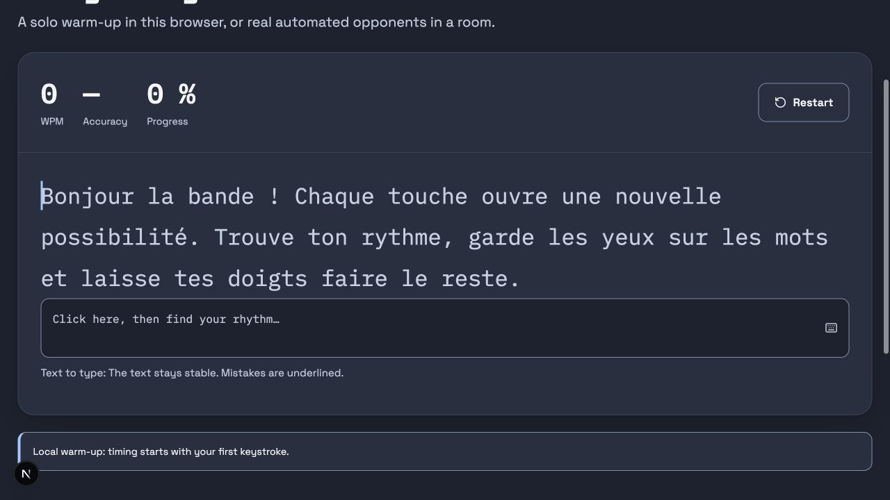
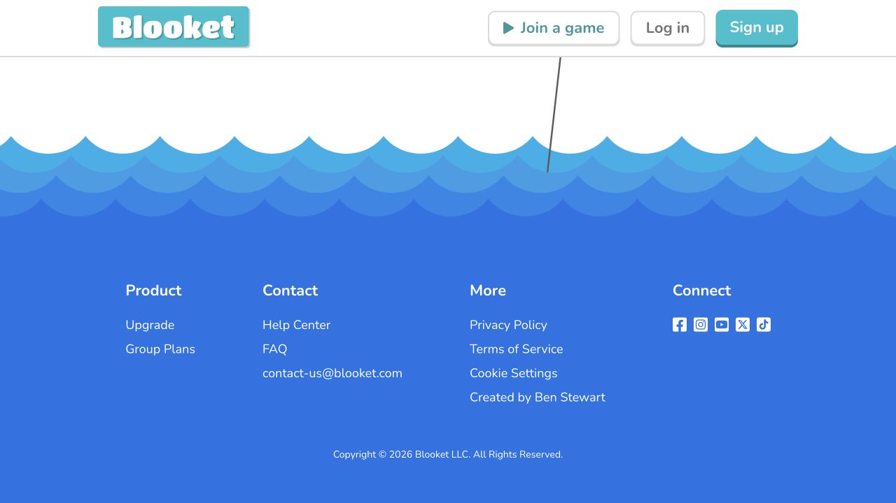
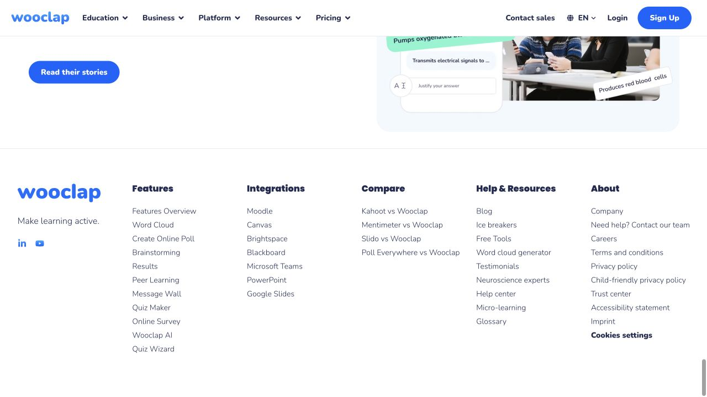
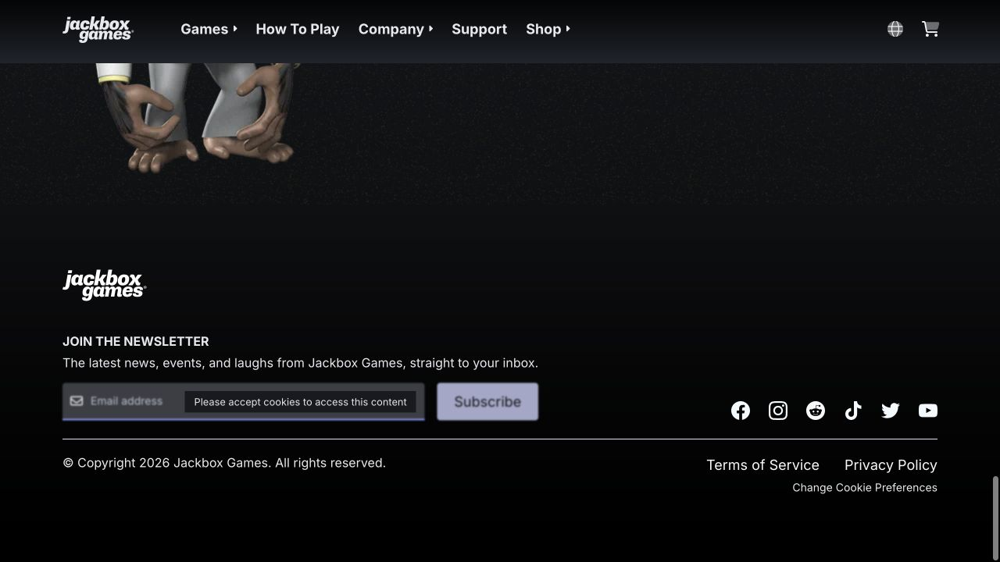
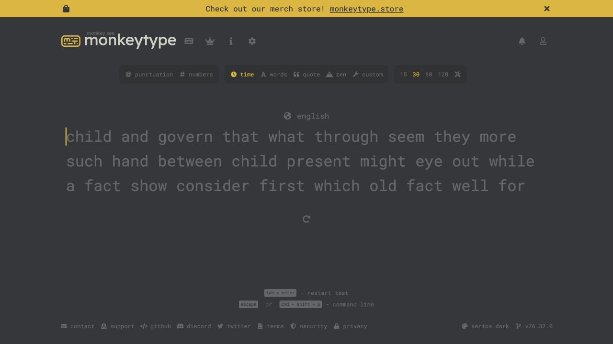
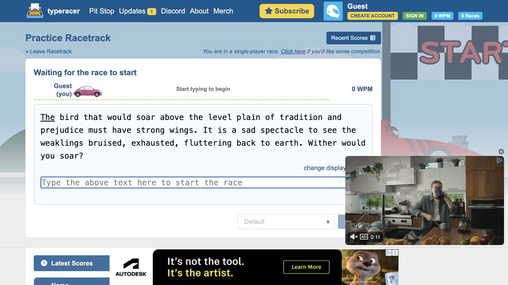
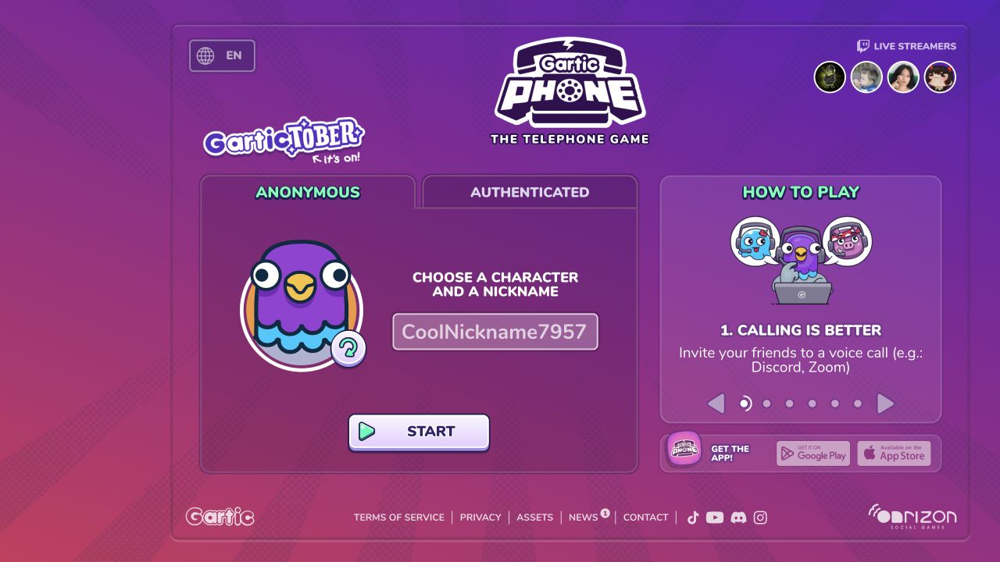

# Une fin de page qui donne envie de rejouer

[← Dossier du projet](README.md)

> **Recherche ciblée · 4 octobre 2026 · footer et page de jeu**  
> **Statut : recherche conservée et première intégration de présentation réalisée le 4 octobre 2026.**

La direction recommandée garde la personnalité de Typulso : **colorée, vibrante, amusante et ludique**. Le footer devient une signature plus reconnaissable ; pendant une course, le texte à taper reste le centre de l’attention. L’énergie vient des formes, des touches de couleur et des moments de départ ou de résultat. Les observations et propositions ci-dessous documentent la collecte initiale; la première intégration est décrite à la fin du document.

La collecte couvre **79 candidats, dont 54 références exploitables** : 8 examinées à l’écran et 46 par leur contenu textuel. Elle comprend **51 références au-delà de Kahoot!, Wooclap et Monkeytype**. Le [registre complet](recherche/footer-jeu-2026-10-04.md) distingue les preuves et les 25 exclusions. Les revisites ne sont pas ajoutées au total historique des recherches précédentes.

## La base observée avant l’intégration

Au début de la collecte, le footer possédait déjà une identité, un slogan, trois liens illustrés et un retour vers les courses. Il avait remplacé l’ancienne ligne de liens montrée dans la capture de départ. Cette recherche poursuit ce travail.

La zone de frappe possède déjà un texte stable, un curseur, des erreurs soulignées, une saisie accessible et des mesures. La course ajoute minuterie, pistes et commandes arcade. Le mode concentration masque déjà le footer et la navigation secondaire.

Références locales : [footer actuel](../components/site-footer.tsx), [salon et course](../components/room-page.tsx), [zone de frappe](../components/typing-zone.tsx), [composants](14-composants-interface.md) et [design des états](16-design-pages-et-etats.md).



Cette capture montre l’échauffement local avant la première frappe. Les états multijoueurs ont été relus dans le code, mais pas rejoués durant cette collecte : PostgreSQL local n’était pas disponible. Aucun classement fictif n’a été créé pour compléter la vue.

## Inspirations pour le footer

| Référence | Ce que montre la capture | Application à Typulso |
|---|---|---|
| [Blooket](https://www.blooket.com/) | Transition illustrée, footer coloré et navigation regroupée | Terminer la page par un motif de touches original |
| [Wooclap](https://www.wooclap.com/) | Identité avant les groupes de liens, alignements simples | Donner du poids au nom et limiter les groupes à notre contenu |
| [Jackbox Games](https://www.jackboxgames.com/) | Logo, action puis informations secondaires séparées | Une invitation à rejouer et une hiérarchie claire |
| [Gartic Phone](https://garticphone.com/) | Footer léger au bord d’une aire de jeu expressive | Une variante compacte autour des activités |







### Proposition « Dernière touche »

Faire évoluer les trois cartes équivalentes vers une composition plus forte : une signature Typulso généreuse, une phrase courte et une invitation verte à retourner sur la piste. Les liens utiles restent présents, regroupés par intention.

Structure monochrome, avant les détails de couleur :

```text
┌───────────────────────────────────────────────────────────────────┐
│ Motif de touches / ligne de piste propre à Typulso                 │
│                                                                   │
│ TYPULSO / logo            JOUER              BIEN JOUER            │
│ Les mots font la course.  Trouver une course  Comment jouer        │
│ Phrase courte            S’entraîner        Clavier & accès       │
│                          Mon progrès        Préférences           │
│                                                                   │
│ Ensemble, une touche à la fois.       [ Retour sur la piste → ]    │
└───────────────────────────────────────────────────────────────────┘
```

Le nom et le logo conservent leur statut documenté dans la direction artistique. Aucune destination n’est inventée : courses `/courses`, entraînement `/entrainement`, progrès `/profil`, aide `/aide`, clavier `/touches`, réglages `/preferences`.

- **Identité :** nom plus grand, slogan gras, petites touches originales.
- **Liens :** deux groupes courts, cibles confortables, flèche qui accompagne le survol.
- **Couleur :** fonds et couleurs de texte initiaux conservés ; rose, lavande et bleu ciel sur les petites touches.
- **Jeu actif :** conserver le mode concentration. Dans la vue normale, une variante compacte peut garder aide et préférences hors de la zone de frappe.
- **Mobile :** identité centrée, groupes lisibles sur deux colonnes puis empilés si nécessaire, retour facile à atteindre.

La vague de Blooket, les personnages Gartic et la newsletter Jackbox ne sont pas repris. Typulso développe son propre motif avec ses destinations utiles.

## Inspirations pour le jeu

| Référence | Preuve | Application à Typulso |
|---|---|---|
| [Monkeytype](https://monkeytype.com/) | Texte central, réglages compacts, aide éloignée | Faire dominer la frappe |
| [TypeRacer](https://play.typeracer.com/) | Pratique solo ouverte : piste, texte puis saisie | Séparer la course collective de la lecture |
| [Keymash](https://keymash.io/) | Jeu rapide et salon personnalisé distincts à l’accueil | Prochaine action évidente dans le salon |
| [Gartic Phone](https://garticphone.com/) | Pseudo, avatar et aide proches du départ | Attente collective chaleureuse |
| [ZType](https://zty.pe/) | Menu central dans une aire de jeu distincte | Décor en périphérie de l’activité |







Les captures Keymash et ZType figurent dans le [registre](recherche/footer-jeu-2026-10-04.md). Ces observations portent sur les vues capturées ; aucune animation ni performance externe n’est déduite d’une image fixe.

### Proposition « La piste au centre »

```text
┌───────────────────────────────────────────────────────────────────┐
│ Salon / règles                           Connexion · Quitter     │
├───────────────────────────────────────────────────────────────────┤
│ Temps restant       Vitesse       Précision       Progression     │
│                                                                   │
│                 TEXTE À TAPER, STABLE ET LISIBLE                   │
│                    Saisie + consigne courte                       │
│                                                                   │
│ Énergie + action disponible                   (arcade seulement)   │
├───────────────────────────────────────────────────────────────────┤
│ COURSE EN DIRECT                                                  │
│ Rang · joueur · piste de progression · pourcentage                │
│ Ligne personnelle identifiée par « Toi » + contour                │
└───────────────────────────────────────────────────────────────────┘
│ Aide clavier / préférences dans la vue normale                     │
```

Le schéma exprime une hiérarchie ; les valeurs proviennent du moteur et du serveur.

| Élément | Évolution proposée | But |
|---|---|---|
| Indicateurs | Bande compacte, minuterie forte, mesures secondaires | Lire rapidement sans grandes cartes répétées |
| Texte | Bloc central large, mesure de ligne raisonnable, bonne hauteur de ligne | Occuper l’écran avec une lecture confortable |
| Saisie | Champ relié au texte, consigne proche | Comprendre où commencer et garder un accès clavier explicite |
| Arcade | Bande d’énergie sous la frappe ; disponibilité et raison d’indisponibilité écrites | Avant l’intégration, elle précédait la frappe et pouvait repousser le texte |
| Pistes | Nom, progression, label « Toi » et état de connexion | Reconnaître sa ligne sans dépendre de la couleur |
| Rang en direct | Étudier des lignes stables avec rang présenté séparément | L’ancien tri par progression pouvait déplacer les joueurs |
| Résultats | Performance personnelle et prochaines actions avant les détails | Encourager aussi les participants qui progressent sans gagner |

Lors de la recherche, l’ordre stable des pistes était proposé comme décision de présentation à vérifier avec le classement existant. Il ne change ni le score, ni les règles, ni les conditions de boost et de bouclier. Les résultats restent calculés par le serveur, et les droits de l’hôte restent ceux du produit actuel.

### Une identité pour chaque moment

| État | Priorité visuelle | Détail ludique proposé |
|---|---|---|
| Salon | Membres, disponibilité, règles et commandes de l’hôte | Petites touches-personnages originales ; statut écrit |
| Compte à rebours | Nombre dominant, départ synchronisé | Impulsion de taille au changement de nombre |
| Course | Frappe, temps, puis concurrents | Couleurs sur les pistes ; calme autour du texte |
| Reconnexion | Message et reprise clairs | État réseau visible, sans effet festif |
| Spectateur | Pistes, classement et rôle explicite | Zone de frappe absente selon les droits existants |
| Résultats | Performance personnelle, classement et suite | Accent rose/lavande, célébration courte désactivable |

Les animations prononcées des lettres de l’accueil restent une autre expérience. Dans la course, le mouvement sert un événement. Une transition de contrôle de 150–180 ms ou une impulsion de départ de 250–300 ms sont des **valeurs proposées pour Typulso**, pas des mesures relevées sur les références. Aucun déplacement de pistes ni célébration avec mouvement réduit.

## Composants et responsive

Les composants à polir sont la signature de footer, le groupe de liens, la bande de mesures, l’état de connexion, la piste de joueur et les actions de résultat. Ils consomment les traductions et les données actuelles. Cette proposition peut utiliser les composants, icônes et styles déjà installés.

- **Grand écran :** section sur la largeur disponible avec les marges actuelles ; texte et liens gardent une mesure de lecture.
- **Intermédiaire :** réorganiser les indicateurs avant de réduire la frappe ; salon à une colonne selon l’espace disponible.
- **Mobile à 390 px :** indicateurs en grille 2 × 2, texte sur toute la largeur utile, actions et pistes dessous, aucun débordement horizontal.
- **Contrôles :** cibles de 44 px minimum, focus visible, libellés courts FR/EN.
- **Clair et sombre :** palette actuelle, contrôle de chaque état de texte, bordure, saisie et survol. Les expériences annulées de blanc sur lavande ne sont pas réintroduites.
- **Accessibilité :** erreurs soulignées, consignes proches, états écrits avec une icône, aide atteignable, mouvement réduit.

## Ordre d’intégration recommandé lors de la recherche

| Priorité | Travail | Preuve avant de le considérer terminé |
|---|---|---|
| 1 | Footer : signature, groupes, action unique | Liens, clavier, clair/sombre, FR/EN, 390 px |
| 2 | Course : indicateurs, ordre frappe/arcade/pistes | Vraie salle à deux participants, modes normal et arcade |
| 3 | Salon et résultats : membres et actions de suite | Hôte/invité/spectateur, fin, départ de l’hôte, reconnexion |
| 4 | Mouvement et détails | Mouvement réduit, écrans intermédiaires, aucune perte de saisie |

Pour la première version de lundi, les priorités 1–2 restent des évolutions de présentation. Les fonctions déjà validées constituent la base. **La collecte documentée ci-dessus n’avait pas modifié l’application; une première intégration de ces pistes est maintenant réalisée.**

Le plan recommandé inclut aussi un participant lent, une erreur corrigée, une perte de connexion et une fin de manche. Les contrôles réellement exécutés pour l’intégration sont distingués ci-dessous.

## Première intégration de présentation · 4 octobre 2026

Le footer associe désormais une signature Typulso plus grande, un motif de touches original, deux groupes de destinations existantes et l’action verte de retour sur la piste. Une variante compacte conserve l’aide et les préférences sur l’entraînement et les salles. La règle CSS du mode concentration qui masque le footer est conservée; son activation n’est pas testée pendant cette recette.

La course place les mesures dans une bande compacte, la frappe au centre et l’arcade sous la saisie. Les lignes restent ordonnées de façon stable avec rang, état et repère personnel explicites. Les résultats affichent d’abord le pseudo, le rang officiel et les quatre mesures personnelles, puis les destinations de suite, le podium et le classement. Le podium emploie uniquement les rangs serveur 1–3; la Heatmap reste intacte. La palette, les contrats de données, les capacités et les droits de l’hôte restent ceux du produit existant.

L’intégration est parcourue avec une vraie salle arcade, un compte, un invité indépendant et un bot : départ commun, capacité utilisée, erreur corrigée, fin de course et résultat persistant. Le bilan est bien placé avant le podium. Les relevés mobiles du footer, du jeu et des résultats ne montrent pas de débordement horizontal aux formats exercés. Les **7 tests d’intégration réussissent avec 60 assertions** contre PostgreSQL local sur `5432`; les largeurs, langues, thèmes et limites précis figurent dans le [rapport de vérification](20-verification-implementation.md).

Cette recette n’ajoute pas de preuve de reconnexion, de perte réseau ou de parcours spectateur sur la nouvelle présentation. La production et l’équilibrage avec le public cible restent à vérifier. Les captures livrées pour l’application sont neutres : [footer](assets/app-v01/footer-refresh-clair.jpg) et [échauffement](assets/app-v01/jeu-refresh-clair.jpg). Les captures externes de cette recherche restent des sources d’inspiration.

